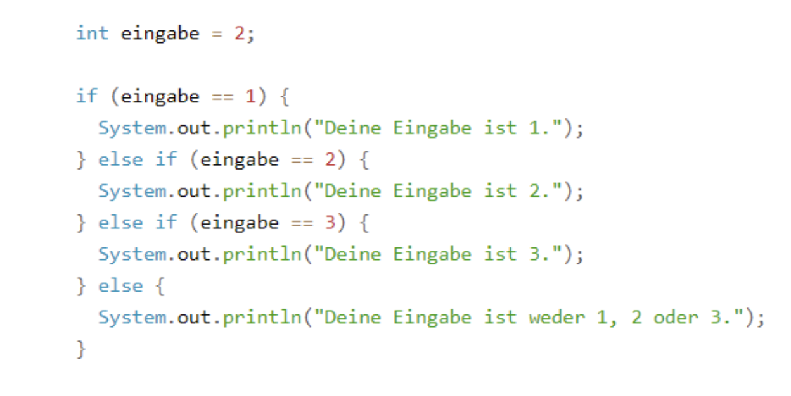
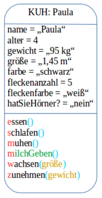
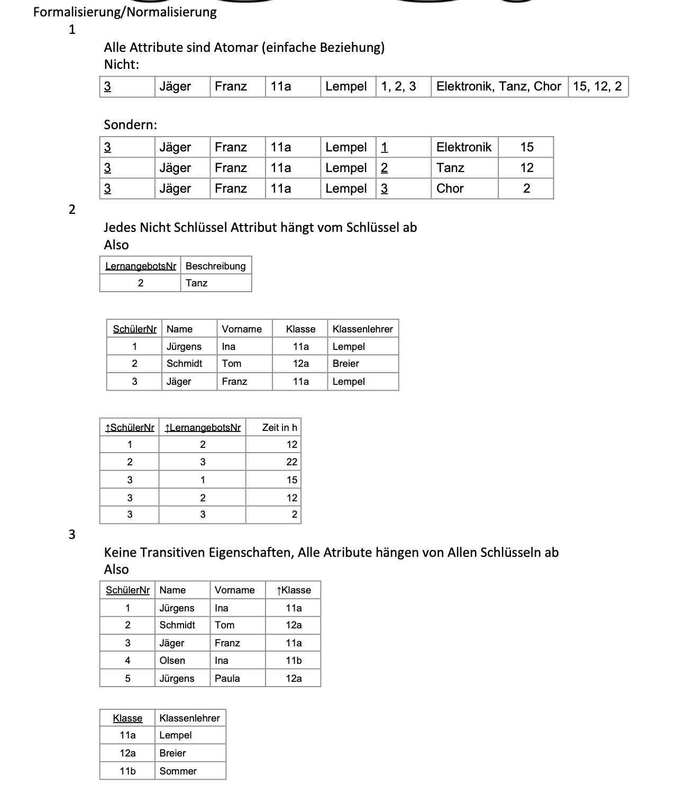
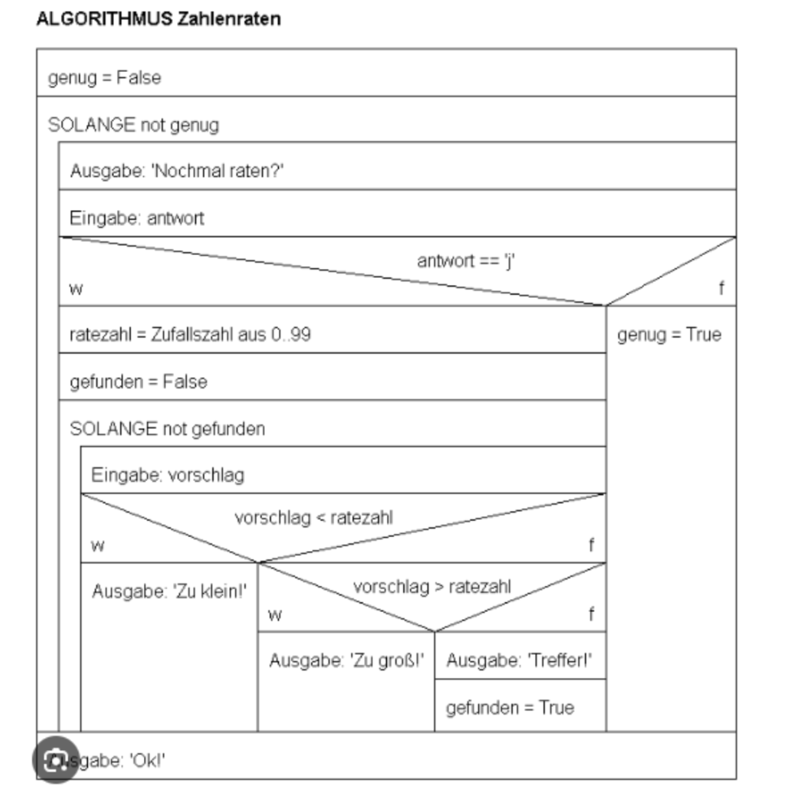

# Informatik Lernzettel

## Grundlagen der Algorithmik

- **Definition**: Ein Algorithmus ist eine systematische Vorgehensweise zur Lösung einer Klasse von Problemen, die in eine endliche Reihenfolge von Anweisungen ausgeführt werden kann.

- **Eigenschaften eines Algorithmus**:
    1. *Endliche Abfolge*: Der Algorithmus sollte in einer endlichen Anzahl von Schritten zu einem Ergebnis führen, ohne in eine unendliche Schleife zu geraten.
    2. *Deterministisch*: Der Algorithmus sollte für dieselben Eingabewerte immer dasselbe Ergebnis liefern. Das bedeutet, er sollte deterministisch sein und keine zufälligen Elemente enthalten.
    3. *Allgemeine Anwendbarkeit*: Der Algorithmus sollte für eine breite Palette von Eingaben oder Problemstellungen anwendbar sein und nicht nur für eine spezielle Situation.
    4. *Korrektheit*: Der Algorithmus sollte das gewünschte Ergebnis für alle gültigen Eingaben liefern und die Spezifikation oder das Problem korrekt lösen.

- **Qualitätskriterium:** (gut zu wissen, aber die oberen Eigenschaften sind die wichtigen, die auch in der Klausuren abgefragt werden)
    1. *Effizienz*: Ein guter Algorithmus sollte die Aufgabe in angemessener Zeit lösen. Effizienz kann anhand von Laufzeit und Speicherplatzverbrauch gemessen werden.
    2. *Verständlichkeit*: Der Algorithmus sollte so formuliert sein, dass er von anderen Entwicklern leicht verstanden und gewartet werden kann.
    3. *Optimierungsmöglichkeiten*: Ein guter Algorithmus sollte Raum für Optimierungen bieten, um die Effizienz weiter zu steigern, ohne die Korrektheit zu gefährden.

- **Datentypen, Methoden und  Beispiele für Algorithmen**

    Datentypen:
        boolean, int, double, float, char --> (primitiven Datentypen)
        Array, String --> (Objektreferenzen, also Klassen und keine primitiven Datentypen. Sie haben somit auch Methoden und alles andere wie eine Klasse)
        *public* ist überall Zugreifbar und *private* ist nur innerhalb wo es definiert ist.
    Methoden:
        `public int method(int variablen){`
        `Return variablen;`
        `}`

- Beispiele:

  ```java
    Fibonacci Rekusiv:
            public int fibonacci(int n) {
                if (n <= 1){
                return n;
                }
                return fibonacci(n - 1) + fibonacci(n - 2);
                }

    GGT rekusiv:
            public int ggt(int a, int b) {
                if (b == 0){
                return a;
                }
                return ggt(b, a % b);
                }

    Fakulität Rekuisv:
            public int fakultaet(int n) {
                if (n <= 1){
                return 1;
                }
                return n * fakultaet(n - 1);
                }

    ```

*Hint:*

- Effizienz von Algorithmen werden nach Anzahl der Operationen und Speicherbedarf beurteilt

### Kontrollstrukturen

- **Sequenz:** Eine Folge von Anweisungen, die nacheinander ausgeführt werden.

- **Schleifen:**


- **Verzweigungen**:



### Rekursion

  **Rekursion:** Rekursion ist ein Programmierkonzept, bei dem eine Funktion sich selbst aufruft. Ein klassisches Beispiel ist die Berechnung der Fibonacci-Folge oder der Fakultät einer Zahl.

1. **Abbruchbedingung:** Bedingung, unter der die Funktion aufhört, sich selbst aufzurufen, und stattdessen einen Wert zurückgibt. Dies verhindert unendliche Rekursion.

2. **Teilprobleme: (Teile)** ursprüngliche Problem in kleinere Teilprobleme aufgeteilt. Die rekursive Funktion ruft sich selbst auf, um diese Teilprobleme zu lösen.

3. **Zusammensetzen der Teilergebnisse: (herrsche)** Die Ergebnisse der Teilprobleme werden miteinander kombiniert, um das Gesamtergebnis zu erhalten.

*Hints:*

- Punkt zwei und drei ist die Erläuterung des Prinzips "Teile und herrsche".
- Für Beispiele siehe Algorithmen (Am einfachsten, Rekursion zu erklären bietet sich Fakultät)
- *Rekursion verbraucht viel Speicherplatz!* (Wichtig für die Beurteilung der Effizienz)

### Datenstrukturen

#### Reihungen (Arrays) in Java

##### Eindimensionale Arrays

```java
// Deklaration und Initialisierung
int[] zahlen = new int[5];  // Array mit 5 Elementen (Indizes 0-4)

// Alternative Initialisierung mit Werten
int[] werte = {10, 20, 30, 40, 50};  // Array mit 5 initialisierten Elementen

// Zugriff auf Elemente
zahlen[0] = 10;  // Erstes Element
zahlen[2] = 30;  // Drittes Element

// Länge eines Arrays ermitteln
int laenge = zahlen.length;  // Gibt 5 zurück

```

##### Mehrdimensionale Arrays

```java
// Deklaration und Initialisierung eines 2D-Arrays
int[][] matrix = new int[3][4];  // 3 Zeilen, 4 Spalten

// Alternative Initialisierung mit Werten
int[][] zahlenMatrix = {
    {1, 2, 3},
    {4, 5, 6},
    {7, 8, 9}
};

// Zugriff auf Elemente
matrix[1][2] = 42;  // Element in Zeile 1, Spalte 2

// Längeninformationen
int anzahlZeilen = matrix.length;        // Anzahl der Zeilen (3)
int anzahlSpaltenInZeile2 = matrix[2].length;  // Anzahl der Spalten in Zeile 2 (4)

// Inhalt vergleichen
boolean gleich = Arrays.equals(array1, array2);  // true, wenn alle Elemente gleich sind
```

##### Hinweise

- Arrays in Java haben eine feste Größe, die nach der Erstellung nicht mehr geändert werden kann.
- Arrays in Java haben eine feste Größe, die nach der Erstellung nicht mehr geändert werden kann.
- Die Indizierung beginnt immer bei 0, das letzte Element hat den Index `length - 1`.
- Arrays sind Objekte, daher wird bei `==` nur die Referenz verglichen, nicht der Inhalt.
- Für dynamisch größenveränderbare Datenstrukturen sollten `dynamische Reihung` wie im Dokument benutzt werden.

#### Stapel & Schlange

Stapel --> Abstrakte Datenstruktur, der nach dem Last-in-First-out (LIFO)-Prinzip funktioniert. Das bedeutet, dass das zuletzt hinzugefügte Element auch als erstes wieder entfernt wird. Neue Elemente werden oben auf den Stapel gelegt, und Operationen erfolgen auf dem obersten Element.

 Schlange --> Abstrakte Datenstruktur, die nach dem First-in-First-out (FIFO)-Prinzip arbeitet. Das bedeutet, dass das zuerst hinzugefügte Element auch als erstes wieder entfernt wird. Neue Elemente werden am Ende der Schlange hinzugefügt, und Operationen erfolgen auf dem Element, das sich am Anfang der Schlange befindet.

**Gemeinsamkeit**:

- Beide sind *abstrakte Datenstrukturen* (ADTs)
- Beide können nur auf *ein spezielles Element zugreifen* (begrenzte Zugriffsmöglichkeit)
- Beide merken sich eine *Reihenfolge* der eingefügten Elemente
- Beide bieten *konstante Zugriffszeit* O(1) für ihre Hauptoperationen
- Beide haben *keine feste Größe* und können dynamisch wachsen

#### Unterschiede

| **Eigenschaft**        | **Stapel (Stack)**       | **Schlange (Queue)**              |
| ---------------------- | ------------------------ | --------------------------------- |
| *Zugriffsprinzip*      | LIFO (Last-in-First-out) | FIFO (First-in-First-out)         |
| *Reihenfolgeerhaltung* | Kehrt Reihenfolge um     | Bewahrt ursprüngliche Reihenfolge |

*Beispiel für die Nutzung beide zusammen an einem Wort:*
Die Reihenfolge der ersten Hälfte der Zeichen des Klartextes bleibt beim Erstellen des Geheimtextes erhalten. Diese Zeichen befinden sich an den ungeraden Stellen im Geheimtext. Beim Entschlüsseln muss folglich die Reihenfolge weiterhin erhalten bleiben, was durch die Schlange gewährleistet wird. Beim Verschlüsseln der zweiten Hälfte des Geheimtextes wird die Reihenfolge der Zeichen umgekehrt: Das letzte Zeichen wird als erstes angehängt, das vorletzte als zweites und so weiter. Deswegen muss beim Entschlüsseln die Reihenfolge erneut umgekehrt werden, was durch einen Stapel realisiert werden kann.

#### Dynamische Reihung

Siehe Dokument mit Hinweise

#### Vergleichstabelle von Arrays, Stapel, Schlange und Dynamische Reihung

| **Eigenschaft**       | **Array**          | **Dynamische Reihung** | **Stapel**                   | **Schlange**                      |
| --------------------- | ------------------ | ---------------------- | ---------------------------- | --------------------------------- |
| *Größe*               | Fest               | Dynamisch              | Dynamisch                    | Dynamisch                         |
| *Zugriffsmuster*      | Wahlfreier Zugriff | Wahlfreier Zugriff     | LIFO                         | FIFO                              |
| *Zugriffsmöglichkeit* | Alle Elemente      | Alle Elemente          | Nur oberstes Element         | Nur vorderstes/hinterstes Element |
| *Einfügen/Entfernen*  | O(n)               | O(n)                   | O(1)                         | O(1)                              |
| *Speicherbedarf*      | Minimal            | Überschuss-Kapazität   | Variiert nach Implementation | Variiert nach Implementation      |
| *Implementierung*     | Grundlegend        | Basiert auf Array      | Kann Array oder Liste nutzen | Kann Array oder Liste nutzen      |

#### Binärbaum

Ein **Binärbaum** ist eine spezielle Form der hierarchischen Datenstruktur, bei der jeder Knoten höchstens zwei Nachfolger (Kinder) haben kann.

1. **Knoten**: Der Knoten ist ein Element in der Baumstruktur, das Daten speichert und Verwiese auf andere Knoten enthält. 
   - *In Bezug auf Verzeichnisse auf einer Festplatte wäre ein Knoten ein Verzeichnis oder eine Datei.*

2. **Wurzel**: Die Wurzel ist der oberste Knoten des Baumes, von dem aus alle anderen Knoten abzweigen. 
   - *Auf einer Festplatte wäre die Wurzel das Hauptverzeichnis oder das Stammverzeichnis, von dem aus alle anderen Verzeichnisse und Dateien abzweigen.*

3. **Blatt**: Ein Blatt ist ein Knoten ohne Nachfolger, also ein Endpunkt des Baumes. 
   - *In Bezug auf Verzeichnisse auf einer Festplatte wären Blätter Verzeichnisse, die keine Unterverzeichnisse enthalten, oder Dateien, die keine weiteren Dateien enthalten.*

4. **Vorgänger**: Der Vorgänger eines Knotens ist der Elternknoten, von dem aus der betrachtete Knoten abzweigt. 
   - *Auf einer Festplatte wäre der Vorgänger eines Verzeichnisses das übergeordnete Verzeichnis, in dem es sich befindet.*

5. **Nachfolger**: Die Nachfolger eines Knotens sind die Kinderknoten, die direkt von ihm abzweigen. 
   - *Auf einer Festplatte wären die Nachfolger eines Verzeichnisses die Unterverzeichnisse oder Dateien, die sich darin befinden.*

6. **Tiefe**: Die Länge des Pfades von der Wurzel zu diesem Knoten (Anzahl der Kanten). 
   - *Auf einer Festplatte würde die Tiefe eines Verzeichnisses angeben, wie viele Verzeichnisse sich zwischen diesem Verzeichnis und der Wurzel befinden.*

7. **Grad**: Die Anzahl der direkten Nachfolger (Kinder) eines Knotens.
   - *In Bezug auf Verzeichnisse auf einer Festplatte wäre der Grad eines Verzeichnisses die Anzahl der Unterverzeichnisse oder Dateien, die sich darin befinden.*
8. **Höhe:** maximale Tiefe aller Knoten.

##### Wichtige Eigenschaften von Binärbäumen

(*Gilt für gleichmäßige Ordnung des Baumes*)

- Jeder Knoten hat höchstens zwei Kinder (Grad ≤ 2)
- Die Kinder werden explizit als "linkes Kind" und "rechtes Kind" unterschieden
- Ein Binärbaum mit $n$ Knoten hat genau $n-1$ Kanten
- Die maximale Anzahl von Knoten auf Ebene $i$ ist $2^i$
- Die maximale Anzahl von Knoten in einem Binärbaum der Höhe $h$ ist $2^{h+1} - 1$
- In einem Binärbaum mit $n$ Knoten beträgt die minimale Höhe $log_{2}(n)$
- Bäume können nicht in Kreise laufen
- Bäume können richtig auch wenn sie falsch dargestellt sind, aber wenn man sie umdreht.


**Traversierungen**:
• **Preorder (VLR)**: Wurzel, linker Teilbaum, rechter Teilbaum.
• **Inorder (LVR)**: Linker Teilbaum, Wurzel, rechter Teilbaum.
• **Postorder (LRV)**: Linker Teilbaum, rechter Teilbaum, Wurzel.

- *Note: implementieren die verschiedenen Traversen durch verschieben der Print*

    ```java
    // Inorder-Traversierung
    public void inorder(BinTree node) {
        if (node != null) {
            inorder(node.getLeft());
            System.out.print(node.getItem() + " ");
            inorder(node.getRight());
        }
    }

    // Preorder-Traversierung
    void preorder(BinTree node) {
        if (node != null) {
            System.out.print(node.getItem() + " ");
            preorder(node.getLeft());
            preorder(node.getRight());
        }
    }

    // Postorder-Traversierung
    void postorder(BinTree node) {
        if (node != null) {
            postorder(node.getLeft());
            postorder(node.getRight());
            System.out.print(node.getItem() + " ");
        }
    }
    ```

### Objektorientierte Programmierung

 1. **Klassen:**
  - Eine Klasse ist eine abstrakte Vorlage oder ein Bauplan für Objekte.
  - Sie definiert die Struktur, den Zustand und das Verhalten, das alle Objekte dieser Klasse gemeinsam haben.
  - Klassen dienen dazu, Daten (Attribute) und Methoden (Funktionen), die auf diese Daten arbeiten, zu kapseln.

    **Beispel:**

    eine Klasse namens "Person" definieren. Die Klasse hat zwei Attribute (`name` und `alter`) und eine Methode (`alter_erhoehen`).

1. **Objekte:** Objekte sind (die) Instanzen von Klassen. Sie repräsentieren konkrete Elemente (Entität) und haben eigene Attribute und können Methoden, die von ihrer Klasse definiert sind, aufrufen. Zum Beispiel: Ein Objekt "VW Golf" hat eine bestimmte Farbe und kann die Methode "Beschleunigen" aufrufen.
2. **Methoden**: Funktionen, die zu einer Klasse gehören und auf deren (das) Attribute zugreifen können. Sie dienen die Klasse zu verwalten.
3. **Konstruktor:** Objekte der Klasse zu initialisieren.

- *Objektkarten*



  - 'Name der Klasse': 'Name des Objektes'
  - alles klein geschrieben.
  - werte für Methoden durch Attribute.
  - '=' für Zuweisung von Werte
  - Nicht eckigen Kasten

- *Klassenkarten*


    '+' -> public (Zugriff auf Attribute oder Methoden von außerhalb der Klasse oder wo es definiert ist, erlaubt)
    '-' -> private (Zugriff auf Attribute oder Methoden von außerhalb der Klasse oder wo es definiert ist, nicht erlaubt)
    Konstruktor nicht vergessen

- *Klassendiagrammen:*
  - **Aggregation:** Eine Beziehung zwischen zwei Entitäten, bei der beide Entitäten unabhängig existieren können. Eine Entität kann Teil von etwas Größerem sein, aber sie ist nicht zwingend von dieser übergeordneten Entität abhängig *(Linie mit leeren Route, wo der Route nach dem übergeordneten Entität zeigt)*.
  - **Assoziation:** Eine allgemeine Beziehung zwischen zwei oder mehreren Entitäten, bedeutet lediglich, dass es eine Verbindung zwischen den Entitäten gibt *(Linie)*.
  - **Komposition:** Eine Beziehung, bei der eine Entität Teil von etwas Größerem ist, jedoch nicht unabhängig existieren kann. Die Lebensdauer der Teile ist eng mit der Lebensdauer des Ganzen verknüpft; wenn das übergeordnete Element zerstört wird, werden auch die Teile zerstört *(Linie mit gefülltem Route, wo der Route nach dem übergeordneten Entität zeigt)*.
  - **Vererbung**: Eine Klasse kann Eigenschaften einer anderen Klasse erben *(Pfeil, zeigt nach dem übergeordneten Entität)*.

    

## Datenbanken

*Attribut* --> Spalte
*Datensatz* --> Zeile

### ER-Modelle

Modellierung der Datenbankstruktur durch Entitäten und Beziehungen.


Anwendung der Regeln an dem Beispiel mit dem Buch:


**Für Regel 2:**

Bei einer n:m-Beziehung zwischen zwei Entitätsmengen kann jedes Objekt der einen Seite mit mehreren Objekten der anderen Seite in Beziehung stehen – und umgekehrt. Eine direkte Speicherung dieser Mehrfachbeziehungen in nur einer Tabelle würde zu Redundanzen und Anomalien führen. Deshalb bilden wir eine zusätzliche Verknüpfungstabelle, in der die Primärschlüssel beider Entitätsmengen als Fremdschlüssel zur Bildung des gemeinsamen Primärschlüssel dieser Tabelle eingetragen werden.

**Für Regel 3:**

Bei einer 1:n-Beziehung zwischen zwei Entitätsmengen steht jedes Objekt der n-Seite mit genau einem Objekt der 1-Seite in Beziehung. Diese Beziehung lässt sich durch das „einfache“ Eintragen von Primärschlüssel der 1-Seite als Fremdschlüsseln in der n-Seite. Somit sind alle Fälle abgedeckt.

| **WHERE**                                                         | **HAVING**                                                   |
| ----------------------------------------------------------------- | ------------------------------------------------------------ |
| Filtert einzelne Datensätze, vor der Gruppierung                  | Filtert Gruppen von Datensätzen, nach der Gruppierung        |
| Wird vor GROUP BY ausgeführt                                      | Wird nach GROUP BY ausgeführt                                |
| Kann keine Aggregatfunktionen wie COUNT(), AVG(), SUM() enthalten | Wird speziell für Bedingungen mit Aggregatfunktionen genutzt |

Having kann also keine Selektion bzw. Filterung nach bestimmten Attributen, da sie schon gruppiert sind. (Kein Zugriff auf einzelne Attribute mehr) Es dient also nur die Selektion nach der Gruppierung anhand Aggregatfunktion.

### Normalformen

  Die **Normalisierung** in Datenbanken ist ein Prozess, bei dem Datenbanktabellen strukturiert werden, um:

  - **Redundanz**, **Anomalien** und **Inkonsistenzen** zu vermeiden.
  - **Anomalien** beim Einfügen, Aktualisieren und Löschen zu vermeiden
    - **Einfügeanomalie**: Schwierigkeiten beim Hinzufügen von Daten, ohne unnötige Duplikate zu erzeugen. (Problem etwas zu fügen, wenn etwas anders was sich wiederholt als Teil des Primärschlüssel ist. Z.b. Neue IPad Variante bei der Schule hinzufügen, aber noch keiner hat es gekauft oder ausgeliehen und es muss mindestens eine Person dies getan hat, um die neue Variante in die Datenbank aufzunehmen, da Z.B. Benutzername Teil des Schlüssels ist.)
    - *Löschanomalie*: Verlust wertvoller Daten beim Entfernen von Datensätzen.
    - **Änderungsanomalie**: Probleme bei der Aktualisierung von Daten in mehreren Datensätzen.
  - **Datenintegrität** sicherzustellen
  - **Flexibilität** & **schneller** Zugriff

  [Normalisierung.pdf](Materiellen/Normalisierung.pdf)

- **Erste Normalform (1NF)**
  - **Bedingung**: Alle Attributwerte müssen atomar (nicht weiter sinnvoll zerlegbar) sind.
  - **Beispiel**: Die Spalte Adresse ist nicht atomar, da es in PLZ, Straße, Hnr. aufgeteilt werden kann.
- *Vorgehen zur Erreichung der 1NF:
  - Jede Zelle darf nur einen Wert enthalten (keine Listen oder Mengen).
  - Identifizierung eines **Primärschlüssels**, der jeden Datensatz eindeutig identifiziert.
  - Durch Beachtung der **4 ER-Modell-Regeln** ist die Datenbank in der **1NF**.

- **Zweite Normalform (2NF)**
  - **Bedingung**: Die Tabelle muss bereits in 1NF sein und jedes Nicht-Schlüsselattribut muss **voll funktional abhängig** vom Primärschlüssel sein. (ist nur zu beachten bei zusammengesetzten Schlüsseln, da die Bedingung für alle anderen Tabellen automatisch erfüllt ist)
  - **Beispiel**: Wenn eine Tabelle einen zusammengesetzten Primärschlüssel hat und ein Nicht-Schlüsselattribut nur von einem Teil des Schlüssels abhängt, wird die 2NF verletzt.
- *Vorgehen zur Erreichung der 2NF:
  - Zerlege Tabellen, um sicherzustellen, dass alle Nicht-Schlüsselattribute nur vom gesamten Primärschlüssel abhängen. Die Tabelle in zwei Tabellen zerlegen, in eine Tabelle mit allem aber nur ein Schlüssel und eine zweite Tabelle mit den beiden Schlüsseln (Siehe Präsi)

- **Dritte Normalform (3NF)**
  - **Bedingung**: Die Tabelle muss in 2NF sein und kein Nicht-Schlüsselattribut darf transitiv von einem anderen Nicht-Schlüsselattribut abhängen.
  - **Beispiel**: Wenn die Tabelle die Attribute „Stadt“ und „Postleitzahl“ enthält, wobei „Postleitzahl“ transitiv von „Stadt“ abhängt, ist die 3NF verletzt.
- *Vorgehen zur Erreichung der 3NF:
  - Eliminiere transitive Abhängigkeiten, indem du die abhängigen Attribute in separate Tabellen aufteilst. (Also wie 2 Normal Form aber für nicht Schlüssel Attribute )

    
 

## Formale Sprachen und Automaten

### Automaten

#### Mealy-Automat (Endlicher Automat mit Ausgabe)

- **Definition**: Ein 6-Tupel $(Q, \Sigma, \delta, q_0, \Gamma, \omega)$
  - $Q$: Endliche Zustandsmenge
  - $\Sigma$: Eingabealphabet
  - $\delta: Q \times \Sigma \rightarrow Q$: Übergangsfunktion
  - $q_0 \in Q$: Startzustand
  - $\Gamma$: Ausgabealphabet
  - $\omega: Q \times \Sigma \rightarrow \Gamma$: Ausgabefunktion
- **Eigenschaften**:
  - Erweitert den DEA um eine Ausgabefunktion
  - Erzeugt bei jedem Zustandsübergang eine Ausgabe.

#### Deterministischer endlicher Automat (DEA)

- **Definition**: Ein 5-Tupel $(Q, \Sigma, \delta, q_0, F)$
  - $Q$: Endliche Zustandsmenge
  - $\Sigma$: Eingabealphabet
  - $\delta: Q \times \Sigma \rightarrow Q$: Übergangsfunktion
  - $q_0 \in Q$: Startzustand
  - $F \subseteq Q$: Menge der Endzustände
- **Eigenschaften**:
  - Deterministisch: Für jeden Zustand und jedes Eingabesymbol gibt es genau einen Folgezustand
  - Endlich: Begrenzte Anzahl an Zuständen
  - Erkennt reguläre Sprachen

*Anwendungsbeispiele:*

- Lexikalische Analyse
- Mustersuche
- Digitale Schaltkreise
- Zustandsgesteuerte Systeme

##### Einschränkung von DEAs

- DEAs können nur **reguläre Sprachen** verarbeiten
  - Also keine Verschachtelung oder eine kontextfreie Struktur
- keinen zusätzlichen Speicher
  - keine unendlichen Strukturen oder beliebig lange Abhängigkeiten innerhalb einer Eingabesequenz speichern, wie z.B. verschachtelte Klammern. Er kann also die Eingabe nicht vergleichen, um Abhängigkeiten zu erkennen. (Das bedeutet aber nicht, dass er „Vergleich“ Aufgaben nicht anders lösen kann. Er kann keine direkte Vergleiche durchführen, aber will man z.B. Anzahl der Siege und Niederlage Vergleichen, dann kann ein DEA es generell nicht machen, aber legt man eine kleine obere Grenze, wie Z.B. 3, dann wäre es möglich es mit einem DEA zu machen, da Mann für jede mögliche Kombination eignende Zustände schafft. Man erkennt, dass das äußerst unpraktisch ist und darum es ist theoretisch bei kleinen begrenzten Anzahlen an Z.B. Siegen möglich, aber da bei der Formulierung der Aufgaben normalerweise davon ausgegangen wird, dass der Automat die Aufgabe für unendliche Eingabe bewältigt muss, ist ein DEA nicht geeignet.)
- Keine Rückverfolgung oder Mehrdeutigkeit (deterministisch)
  - Ein DEA ist **deterministisch**, was bedeutet, dass es für jede Eingabe nur genau einen möglichen nächsten Zustand gibt. Er kann also keine **Rückverfolgung** durchführen.

z.B.


#### Kellerautomat

- **Definition**: Ein 7-Tupel $(Q, \Sigma, \Gamma, \delta, q_0, Z_0, F)$
  - $Q$: Endliche Zustandsmenge
  - $\Sigma$: Eingabealphabet
  - $\Gamma$: Kelleralphabet
  - $\delta: Q \times (\Sigma \cup {\varepsilon}) \times \Gamma \rightarrow Q \times \Gamma^*$: Übergangsfunktion
  - $q_0 \in Q$: Startzustand
  - $Z_0 \in \Gamma$: Anfangssymbol im Kellerspeicher
  - $F \subseteq Q$: Menge der Endzustände

- **Funktionsweise**:
  - Ein Kellerautomat ist ein spezieller Typ von endlichem Automaten, der einen **Keller** (Stack) hat, der als Speicher dient.
  - Der Keller kann Symbole **pushen** (hineinlegen) und **poppen** (entnehmen).
  - Akzeptiert ein Wort, wenn *Eingabe vollständig gelesen*, *Automat in Endzustand* und *Keller leer ist (oder nur Startsymbol enthält)*.
  - In dem Kellerspeicher können bei jedem Zustandsübergang kein oder beliebig viele Zeichen nacheinander auf einem Stapel abgelegt werden. Jeder Zustandsübergang ist abhängig vom aktuellen Zustand, dem Eingabezeichen und dem obersten Zeichen des Kellerspeichers. Nach einem Übergang wird der obersten Zeichen im Keller entfernt.

Er kann zu den folgenden Aufgaben benutzt wird:

- **Sprachverarbeitung**: Erkennung von Klammerungen (z.B. korrekte Veerschachtelung von Klammern in mathematischen Ausdrücken). Oder um die korrekte Syntax einer HTML-Seite zu überprüfen, da er den verschachtelten Aufbau von HTML-Tags durch seinen Stapelspeicher (Stack) nachvollziehen kann.
- **Parsing**: Basis für LR-Parser in Compilern zur syntaktischen Analyse von Programmiersprachen.
- **Palindrome-Erkennung**: Erkennung von Wörtern, die vorwärts und rückwärts gelesen gleich sind.

##### Grenzen

- **Deterministischer Kellerautomat (DPDA)**: Kann weniger Sprachen erkennen als ein nichtdeterministischer Kellerautomat (NPDA). Er ist weniger mächtig als ein NPDA. DPDA kann nur **deterministischen kontextfreien Sprachen** erkennen, wobei NPDA nicht diese Einschränkung haben, sind aber immernoch auf kontextfreie Sprachen beschränkt.
  - **Erkennungskomplexität**: Kann keine kontextsensitiven Sprachen erkennen, ist auf kontextfreie Sprachen beschränkt. Da er nur ein Speicher hat und somit nur zwei Symbole vergleichen kann und nicht mehr, was eine sensitive Sprache erfordert.
- **Begrenzter Speicherzugriff (nur LIFO)**
  - Der **Stack-Speicher** eines Kellerautomaten funktioniert nach dem **Last-In-First-Out (LIFO)**-Prinzip. Das bedeutet, dass nur das oberste Element auf dem Stack gelesen oder geändert werden kann. Er kann beliebig Information legen, aber keinen direkten Zugriff auf tiefere Ebenen.
  - Kellerautomaten sind in der Lage, **einfach verschachtelte** Strukturen zu erkennen, wie z. B. ausgeglichene Klammern in mathematischen Ausdrücken. Sie sind jedoch nicht in der Lage, **mehrstufige Abhängigkeiten**  zu verwalten, bei denen mehrere Ebenen von Informationen gleichzeitig gespeichert und verarbeitet werden müssen.
- **Keine universelle Berechnungsfähigkeit**: Kellerautomaten sind nicht Turing-vollständig.

z.B. 

#### DEA vs DKA

- Eine Sprache welche durch DEA formuliert kann auch durch DKA formuliert werden, da was ohne Keller funktioniert kann auch mit Keller funktionieren.
- Andersrum funktioniert es nicht, da bei unendlicher Eingabe unendliche Menge an Zustande erforderlich sind (im Gegenteil zu DKA, welches über Keller mit unendlichem Speicher verfügt.), da es nicht über einen Keller verfügt. Er hat keinen Keller um Informationen zwischenzuspeichern oder zu vergleichen.

#### Unterschied zwischen NEA & DEA


- **NEA-Eigenschaften**:
  - Kann mehrere oder keine möglichen Folgezustände für eine Eingabe haben
  - Intuitiver und flexibler in der Modellierung
  - exponentiell mehr Übergänge zu verfolgen, somit langsamer
- **DEA-Eigenschaften**:
  - Effizienter in der Ausführung
  - Jeder NEA kann in einen äquivalenten DEA umgewandelt werden.
  - Schneller

### Sprachen

Natürliche Sprachen

- sind komplexer in ihrem Aufbau
- haben keine strenge Grammatik
- sind mehrdeutig
- weisen zahlreiche grammatische Ausnahmen auf
- entwickeln sich weiter
- besitzen ein unendliches Alphabet

Formale Sprachen

- sind einfacher als natürliche Sprachen
- haben eine strenge Grammatik
- sind eindeutig
- haben keine Ausnahmen
- sind festgelegt
- besitzen ein begrenztes Alphabet

#### Grammatik einer Sprache (generell)

Eine **Grammatik** ist ein Regelwerk, das bestimmt, wie Wörter in einer Sprache gebildet werden können. Die von einer Grammatik erzeugte Sprache ist die *Menge aller Zeichenfolgen*, die durch wiederholte Anwendung der Produktionsregeln der Grammatik aus einem Startsymbol erzeugt werden können, bis nur noch Terminalsymbole übrig sind.

Eine Grammatik besteht typischerweise aus:


Beispiel dazu:


#### Reguläre Sprachen


*Eine Sprache ist genau dann regulär, wenn es einen DEA gibt, der diese Sprache erkennt. Und Andersrum eine vom DEA akzeptierte Sprache ist eine Reguläre Sprache*
    Ein endlicher Automat kann aus einer regulären Grammatik konstruiert werden, indem Zustände den Nicht-Terminale zugeordnet und Übergänge entsprechend den Produktionsregeln definiert werden.

—> *Daraus folgt, dass man unendliche Abhängigkeiten oder Verschachtelungen nicht mit einer regulären Grammatik darstellen kann. Da man analog zu einem DEA unendlich viele Nicht-Terminale braucht, um jede Verschachtelung darzustellen. (Z.B. jede sich öffnende Klammer braucht ein neues Nicht-Terminalsymbol). Eine beliebige Schachtelungstiefe lässt sich daher nicht mit einer endlichen Anzahl von Nichtterminalen umsetzen, daher auch nicht mit einer regulären Grammatik.*

*Hint:*

- eine nicht reguläre Grammatik bedeutet nicht, dass die Sprache nicht regulär ist! Man muss vorher untersuchen, ob diese nicht reguläre Grammatik in eine Reguläre Grammatik umgewandelt werden kann. Wenn das möglich, dann ist die Sprache regulär, denn es gäbe also eine denkbare reguläre Grammatik, die diese Sprache erzeugen kann.

Unterschied zu kontextfreie Sprachen ist einfach, dass bei Kontextfreien Sprachen mehr auf den rechten Seite erlaubt ist. Gemeinsamkeiten liegen auf der lenken Seite wo für beide Sprachen nur ein Nicht-Terminal zulässig ist, aber auf der rechten Seite eine beliebige Kombination von Terminale und NichtTerminale zulässig ist.

#### Kontextfreie Sprachen

- Kontextfreie Sprachen haben eine Einschränkung, und zwar, dass auf der linken Seite nur eine Nicht-Terminale zulässig ist. Ansonsten ist alles erlaubt. Also sie ist eine Reguläre Sprache, die links und rechts wachsen kann und nicht mit dem was auf der rechten Seite steht eingeschränkt ist.
- Eine Sprache ist genau dann kontextfreie, wenn es einen Kellerautomaten gibt, der diese Sprache erkennt.
- Jede reguläre Sprache ist auch kontextfrei, aber nicht umgekehrt.

Beispiel einer kontextfreien Sprache

Unterschied zur kontextsensitiv:

Kontext sensitiv ist ist also Kontextfreie aber auf der linken Seite darf mehrere Nicht-Terminale stehen, aber nicht mehr als das was auf der rechten Seite steht. (Nicht von Kellerautomaten erkennbar).

## Codierung und Übertragung von Daten

 Codierung ist die Umwandlung in Sequenzen von Zeichen oder Signalen für effiziente Übertragung, Speicherung *(Datenkompression)* oder Sicherheitszwecke.

*Allgemeine Hinweise:*

- Beim Codieren ist es Sinnvoll die Daten erst zu komprimieren und danach ein Fehlerkorrigierendes Verfahren zu nutzen, denn andersrum, kann *im Fall eines Fehlers die Komprimierung nicht oder nur fehlerhaft rückgängig gemacht werden*. Es ist davon auszugehen, dass der aus der Dekompression entstehende Code so fehlerbehaftet ist, dass die im Code enthaltene Fehlerkorrektur nicht mehr sinnvoll anwendbar ist.

### 1. Grundlegende Codierungen von Daten

#### 1.1 Analoge vs. Digitale Codierung

- **Analoge Codierung**:
  - Sprache
  - Morse-Code
  - Schrift
- **Digitale Codierung**:
  - Binärzahlen
  - ASCII-Zeichen
  - RGB-Farbcode
  - Videocodierung
  - Audiocodierung (z.B. MP3)
  - Barcodes
  - QR-Codes

#### 1.2 Dualzahlen (Binärsystem)

Das Binärsystem ist ein Zahlensystem, das nur die Ziffern 0 und 1 verwendet.

**Umrechnung von Dezimal nach Binär:**

1. Teile die Dezimalzahl fortlaufend durch 2
2. Notiere die Reste (0 oder 1)
3. Die binäre Darstellung ist die Folge der Reste von unten nach oben

Beispiel: Dezimalzahl 13 → Binärzahl 1101


13 ÷ 2 = 6 Rest 1
6 ÷ 2 = 3 Rest 0
3 ÷ 2 = 1 Rest 1
1 ÷ 2 = 0 Rest 1

**Umrechnung von Binär nach Dezimal:** Jede Stelle wird mit ihrer Wertigkeit (2^n) multipliziert und dann addiert.

Beispiel: Binärzahl 1101 → Dezimalzahl 13


1 × 2³ + 1 × 2² + 0 × 2¹ + 1 × 2⁰ = 8 + 4 + 0 + 1 = 13

#### 1.3 ASCII-Code

- 7-Bit-Code: $2^7$ = 128 Zeichen (0-127)
  - Beispiel: 'A' = 65 (Dezimal) = 1000001 (Binär)
  - Umfasst Großbuchstaben, Kleinbuchstaben, Ziffern, Sonderzeichen und Steuerzeichen
- 8-Bit-Erweiterungen (Extended ASCII): $2^8$ = 256 Zeichen (0-255)
  - Beispiel: 'ä' = 228 (Dezimal) = 11100100 (Binär)
  - Zusätzliche Zeichen wie Umlaute, Währungssymbole und grafische Symbole
- Jedes Zeichen hat einen eindeutigen numerischen Wert

#### 1.4 RGB-Farbmodell

- Additives Farbmodell für Bildschirme
- Jede Farbe setzt sich aus den Grundfarben Rot, Grün und Blau zusammen
- Jede Grundfarbe wird mit 8 Bit (0-255) codiert
- Notation: RGB(R,G,B)

Beispiele:

- Rot: RGB(255,0,0)
- Schwarz: RGB(0,0,0)
- Weiß: RGB(255,255,255)

### 2. Datenkompression

Datenkompression bezeichnet die Technik zur Reduzierung des Speicherbedarfs von Daten durch Entfernung redundanter oder unwichtiger Informationen.

#### 2.1 Arten der Datenkompression

##### 2.1.1 Verlustfreie Kompression

- Die Originaldaten können exakt wiederhergestellt werden
- Geeignet für Texte, Programme, Datenbanken
- Beispiele: ZIP, PNG, GIF
- Techniken: Wörterbuchmethode oder Lauflängenkodierung (RLE)

##### 2.1.2 Verlustbehaftete Kompression

- Teile der Information gehen unwiederbringlich verloren bzw. die Originaldaten können nicht exakt zurückgewonnen werden.
- Algorithmen versuchen, nur "unwichtige" Informationen zu entfernen. Dabei muss die menschliche Wahrnehmungsfähigkeit berücksichtigt werden, z.B. bei der Übermittlung von Nachrichten.
- Geeignet für Bilder (JPEG), Audio (MP3), Video (MP4)

#### 2.2 Kompressionsverfahren

##### 2.2.1 Lauflängenkodierung (Lauflängenkodierung, RLE)

Ein einfacher verlustfreier Kompressionsalgorithmus, der *Sequenzen identischer Symbole durch deren Anzahl und das Symbol ersetzt*.

**Funktionsweise:**

- Sequenzen identischer Zeichen werden als Paar (Anzahl, Zeichen) dargestellt.
- Beispiel: "AAAABBBCCDAA" → "4A3B2C1D2A"

**Vor- und Nachteile:**

- **Vorteile**:
  - Einfach zu implementieren
  - Schnelle Kompression und Dekompression
  - Effizient bei Bildern mit großen einfarbigen Flächen
- **Nachteile**:
  - Kann bei Daten ohne Wiederholungen mehr Speicherplatz als das Originale benötigen.

**Anwendungsgebiete:**

- Gut geeignet für:
  - Bilder mit großen einfarbigen Flächen
  - Schwarz-Weiß-Bilder
- Weniger geeignet für:
  - Farbbilder mit vielen verschiedenen Farben
  - Detailreiche Bilder (wegen kleine Farbflächen und weniger Wiederholungen)

**Effizienz:**

- Nach Farbmuster kann die Effizienz variieren.
- Bei Bildern ist oft zeilenweise effizienter (wegen horizontale (das) Muster bzw. Farbverläufe)
- Alternative Reihenfolgen (spaltenweise, Zickzack) können je nach Daten besser sein.

##### 2.2.2 Huffman-Kodierung

Ein verlustfreies Kompressionsverfahren, das auf der *Analyse der Häufigkeiten von Symbolen basiert*. *Häufige Symbole erhalten kurze Codes, seltene Symbole erhalten lange Codes.*

**Funktionsweise:**

1. Zählen der Häufigkeiten jedes Symbols
2. Erstellen eines binären Baums (Huffman-Baum)
    - Beginn mit den seltensten Symbolen als Blätter
    - Kombinieren der zwei seltensten Symbole zu einem neuen "Vater"-Knoten.
    - Wiederholen, bis ein einziger Wurzelknoten entsteht
3. Codeworte zuweisen
    - Linker Zweig = 0, rechter Zweig = 1
    - Codewort ist der Pfad von der Wurzel zum Blatt

**Vor- und Nachteile:**

- **Vorteile**:
  - *Effizient bei ungleicher Symbolverteilung*
  - *Präfixfrei* (kein Codewort ist Präfix eines anderen, dass stellt sicher, dass bei der Zerlegung der Nachrichten, kein zusätzliches Trennzeichen benötigt, da keine Codewörter voneinander abhängen)
  - *Variable Codewortlänge entsprechend dem Informationsgehalt* (Je häufiger desto kleinere Codierung)
  - *Verlustfrei*
  - *Universell anwendbar*
  - Huffman-Kodierung erzeugt unter allen verlustfreien, symbolweisen und präfixfreien Kodierverfahren den kürzestmöglichen Code, wenn die Symbolhäufigkeiten bekannt sind.
- **Nachteile**:
  - Weniger effizient bei gleichmäßiger Symbolverteilung
  - Huffman-Baum oder Codetabelle muss mitübertragen werden.

**Anwendungsgebiete:**

- Besonders effizient, wenn einige Symbole sehr häufig und andere sehr selten sind
- Verwendet in Kompressionsformaten wie ZIP, PNG, JPEG (als Teil des Prozesses)

#### 2.3 Beurteilung eines Kompressionsverfahrens

Bei der Beurteilung eines Kompressionsverfahrens sollten folgende Kriterien berücksichtigt werden:

1. **Kompressionsrate**: Wie stark werden die Daten komprimiert?
2. **Verlustfrei oder verlustbehaftet**: Gehen Informationen verloren? 
   - *Kompromiss zwischen verlorene Daten und Kompressionsrate*
3. **Komplexität**: Wie aufwändig ist die Implementierung?
   - *Kompromiss zwischen Kompressionsrate und Rechenleistung oder Speicherbedarf*
4. **Geschwindigkeit**: Wie schnell erfolgt die Kompression/Dekompression?
   - *Kompromiss zwischen Geschwindigkeit und Kompressionsrate* 
   - Schnell kann besser sein, wenn die Daten in Echtzeit verarbeitet werden müssen.
5. **Speicherbedarf**: Wie viel Arbeitsspeicher wird benötigt?
6. **Robustheit gegenüber Fehlern**: Wie gut kann das Verfahren mit Fehlern umgehen?

Merke:
*K*leine *V*ögel *K*önnen *G*anz *S*chnell *R*ennen

### 3. Datenübertragung und Internet Kommunikation

#### 3.1 Datenübertragung

Datenübertragung bezeichnet den Austausch digitaler Daten zwischen räumlich getrennten Absender und Empfänger. Dies kann über:

- Kabelgebundene Verbindungen (Ethernet, Glasfaser)
- Drahtlose Verbindungen (WLAN, Bluetooth, Mobilfunk)

#### 3.2 Zentrale Komponenten des Internets & des Informatiksystems

#### Client

- Endgerät eines Benutzers (Computer, Smartphone, Tablet)
- Stellt Anfragen an Server
- Empfängt und verarbeitet Antworten

#### Server

- Stellt Dienste, Daten oder Ressourcen zur Verfügung
- Bearbeitet Anfragen von Clients
- Verschiedene Arten: Webserver, Mailserver, Datenbankserver, etc.

**Router**

- Verbindet verschiedene Netzwerke miteinander
- Leitet Datenpakete zwischen Netzwerken weiter
- Bestimmt den optimalen Weg für Datenpakete

**DNS (Domain Name System)**

- Übersetzt Domainnamen (z.B. www.example.com) in IP-Adressen
- Ermöglicht die Nutzung benutzerfreundlicher Namen statt numerischer Adressen

**Dezentraler Aufbau des Internets**

- Kein zentraler Kontrollpunkt
- Verteilte Struktur mit vielen unabhängigen Netzwerken
- Vorteile:
  - Ausfallsicherheit (kein "Single Point of Failure")
  - Skalierbarkeit
  - Unabhängigkeit von einzelnen Organisationen oder Staaten

Ein Informatiksystem besteht aus:

- **Hardware** (z. B. Prozessor, RAM, Festplatte)
- **Software** (Betriebssystem, Programme)
- **Schnittstellen** (z. B. USB, Netzwerkadapter)
- **Daten** (z. B. Dateien, Datenbanken)

#### 3.3 Protokolle zur Datenübertragung (Nicht tief genug denke ich mal)

Ein Protokoll ist eine Vereinbarung, wie Daten zwischen Computern ausgetauscht werden.

**Protokollschichten (vereinfacht):**

1. **Anwendungsschicht**: HTTP, SMTP, FTP
2. **Transportschicht**: TCP, UDP
3. **Internetschicht**: IP
4. **Netzwerkzugangsschicht**: Ethernet, WLAN

**Beispiel für ein einfaches Protokoll:**

1. Client sendet Anfrage
2. Server empfängt und verarbeitet Anfrage
3. Server sendet Antwort
4. Client empfängt und verarbeitet Antwort
5. Bei Fehlern: Wiederholung oder Abbruch


#### 3.4 Sicherheit der Kommunikation im Internet

##### 3.4.1 Bedrohungen

- Abhören der Kommunikation (Sniffing)
- Man-in-the-Middle-Angriffe
- Denial-of-Service-Angriffe
- Spoofing (Identitätsfälschung)

##### 3.4.2 Sicherheitsmaßnahmen

- **Verschlüsselung**: TLS/SSL, HTTPS
- **Authentifizierung**: Passwörter, Zertifikate, Zwei-Faktor-Authentifizierung
- **Firewalls**: Filtern von Datenverkehr
- **VPN**: Sichere Tunnel durch unsichere Netze

### 4. Fehlererkennung und -korrektur

#### 4.1 Fehlererkennung

##### 4.1.1 Paritätsbits

- Ergänzungsbits zur Erkennung von Übertragungsfehlern
- **Gerade Parität (Even Parity)**: Anzahl der 1-Bits inklusive Paritätsbit ist gerade.
- **Ungerade Parität (Odd Parity)**: Anzahl der 1-Bits inklusive Paritätsbit ist ungerade.
- Kann nur Einzelbitfehler erkennen, aber nicht korrigieren, da die Position des Fehlers unbekannt ist.
- Beispiel:
  - Datenbits: 1010101
  - Paritätsbit = 0 (Gerade Parität)
- Mehrdimensionale Parität kann Einzelbitfehler erkennen und Korrigieren, ist aber komplexer. Es kann *teilweise* Mehrbitfehler erkennen.

**Verdopplung bzw. Verdreifachung**:
    Die einfache drei Fache der zu übertragenden Daten ist äußerst ineffizient und ermöglicht lediglich die Erkennung von Einzelbitfehlern. (Verdopplung ist nicht nützlich, da man nicht wusste was der Fehler ist, kann aber ein Fehler erkennen und seine Position wissen.)

##### 4.1.2 Prüfsummen und Prüfziffern

- **IBAN**: Zweistellige Prüfzahl, die elektronisch aufgrund eines bestimmten Schlüssels aus den übrigen Zeichen berechnet wird.
- **ISBN**: Gewichtete Summe der ersten 9 Ziffern (erste Ziffer mit eins, zweite mit zwei usw..), Der Divisionsrest von (Summe mod 11) ist die Prüfziffer. Falls der Rest 10 beträgt, ist die Prüf-"ziffer" ein "X".
  - **Beispiel: ISBN 3-446-19313**

        3·1 + 4·2 + 4·3 + 6·4 + 1·5 + 9·6 + 3·7 + 1·8 + 3·9 = 3 + 8 + 12 + 24 + 5 + 54 + 21 + 8 + 27 = 162
        162:11 = 14 Rest 8  ⇒ Prüfziffer: 8

- **EAN-13**: Gewichtete Summe der ersten 12 Ziffern (abwechselnd mit 1 & 3 multiplizieren), dann die Ergänzung zur nächsten Zehnerzahl ist die Prüfziffer.
  - **Beispiel: 978381582086**

        9·1 + 7·3 + 8·1 + 3·3 + 8·1 + 1·3 + 5·1 + 8·3 + 2·1 + 0·3 + 8·1 + 6·3  = 9 + 21 + 8 + 9 + 8 + 3 + 5 + 24 + 2 + 0 + 8 + 18 = 115
        115 + **5** = 120 ⇒ Prüfziffer: 5

#### 4.2 Fehlerkorrektur

##### 4.2.1 Hamming-Code

- Fehlerkorrigierender Code, der Einzelbitfehler erkennen und korrigieren kann
- Erkennt zwei Bit-Fehler, aber korrigiert dies fälschlicherweise als ein-Bit Fehler.
- **(7,4)-Hamming-Code**: 4 Datenbits werden mit 3 Paritätsbits zu 7 Bits codiert
- Paritätsbits stehen an Positionen $2^n$ (1, 2, 4, 8, ...) und deswegen gilt: Je länger der Code, desto weniger Paritätsbit werden benötigt.

**Funktionsweise:**

Der Sender berechnet die Paritätsbit und sendet dann die 7-Bits.


Der Empfänger berechnet 3 Bits zur Überprüfung (Syndrom und hat das Codewort: $S_2$ $S_1$ $S_0$).

- Bei einer fehlerlosen Übertragung sind alle s-Werte gleich null. (mit mod 2 natürlich)
- Ansonsten ergibt die Folge $S_{2} S_{1} S_{0}$ die Position des Fehlers.

Für tieferes Verständnis:
[https://youtu.be/X8jsijhllIA?si=lMlBIgFyK28eF57s](https://youtu.be/X8jsijhllIA?si=lMlBIgFyK28eF57s)

## Kryptologie und Datenschutz

### 1. Grundprinzipien der Verschlüsselung

#### 1.1 Transposition und Substitution

- **Transposition**: Buchstaben werden in ihrer Position verändert, aber nicht ersetzt.
  - Beispiel: "HALLO" → "LAHOL" (Vertauschen der Positionen)
  - Verhindert Rückschlüsse auf kurzer Wörter oder Buchstabengruppen im Kontext
  - feste Transposition ist nicht besonders sicher, da durch ihre Implementierung ohne Schlüssel, leicht rückgängig gemacht werden kann.
  - Durch rechtige Transposition mit Schlüssel, wie Dreieck Transposition werden einfach Verschlüsselung wie Caeser erschwert, da die ursprüngliche Abstände der Zeichen nicht mehr eingehalten werden, bzw. Die benachbarten Zeichen nich mehr voneinander abhängen. Es muss auch ein zweiter Schlüssel rekonstruiert werden und Häufigkeitsanalyse ist nicht mehr hilfreich. Da man also keine Gruppen die mit gleicher Schlüsselbuchstabe verschlüsselt wurden bilden kann.
- **Substitution**: Buchstaben werden durch andere Zeichen ersetzt.
  - **Monoalphabetisch**: Ein Zeichen wird immer durch dasselbe andere Zeichen ersetzt.
  - **Polyalphabetisch**: Ein Zeichen kann je nach Position durch unterschiedliche Zeichen ersetzt werden.

--> Beide gehören zu symmetrische Verschlüsselung

#### 1.2 Symmetrische vs. Asymmetrische Verschlüsselung

- **Symmetrische Verschlüsselung**: Sender und Empfänger verwenden denselben Schlüssel.
  - Vorteil: Schneller und weniger rechenintensiv
  - Nachteil: Schlüsselaustausch ist ein (das) Sicherheitsrisiko
  - Können Monoalphabetisch oder Polyalphabetisch sein.
  - Beispiele: Caesar, Vigenère, AES, DES
  - *Anwendungsbereiche:*
    - Verschlüsselung großer Datenmengen
    - Echtzeit-Kommunikation
    - Datei- und Datenbankverschlüsselung

- **Asymmetrische Verschlüsselung**: Verwendung von Schlüsselpaaren (öffentlich/privat).
  - Öffentlicher Schlüssel zum Verschlüsseln (für jeden zugänglich)
  - Privater Schlüssel zum Entschlüsseln (nur dem Empfänger bekannt und der Empfänger erzeugt das Schlüsselpaar und kann nachher den öffentlichen Schlüssel veröffentlichen)
  - Vorteil: Kein unsicherer Schlüsselaustausch nötig
  - Nachteil: Rechenintensiver und langsamer
  - Sie arbeiten mit mathematischen Operationen.
  - Beispiel: RSA (Sicherheit: Beruht auf der Schwierigkeit der Primfaktorzerlegung großer Zahlen)
  - *Anwendungsbereiche:*
    - Schlüsselaustausch für symmetrische Verfahren
    - Digitale Signaturen
    - Authentifizierung
    - Sichere Kommunikation ohne vorherigen Schlüsselaustausch

### 2. Monoalphabetische Verfahren

Eine einzige, feste Ersetzungstabelle bzw. *für jede Buchstabe wird dieselbe Verschiebung oder Substitution verwendet*.

#### 2.1 Caesar-Verschlüsselung

- Jede Buchstabe wird um eine feste Anzahl von Positionen im Alphabet verschoben.
- Schlüssel: Die Anzahl der verschobenen Positionen (z.B. 3)
- Beispiel mit Schlüssel 3: "A" → "D", "B" → "E", "Z" → "C" (zyklische Verschiebung)

**Code:**

```java
public String caesar(String text, int shift) {
    String encrypted = "";
    for (int i = 0; i < text.length(); i++) {
        char c = text.charAt(i);
        if (c >= 'A' && c <= 'Z') {
            char shifted = (char) ((c - 'A' + shift + 26) % 26 + 'A');
            encrypted += shifted;
        } else {
            encrypted += c; // keine Änderung bei Sonderzeichen
        }
    }
    return encrypted;
}
```

#### 2.2 Häufigkeitsanalyse

- Methode um Informationen über den Inhalt einer verschlüsselten Nachricht durch Untersuchung der Häufigkeit von Zeichen im Text zu erhalten.

- Buchstaben in natürlichen Sprachen haben charakteristische Häufigkeitsverteilungen. Im Deutschen z.B.: E, N, I, S, R, A sind die häufigsten Buchstaben.

- **Allgemeine Vorgehensweise ohne Kenntnis des Schlüssels:** Man vergleicht einige häufige Buchstabe im Geheimtext mit der aus der charakteristischen Häufigkeitsverteilung, um einige häufige Buchstaben zuzuordnen und dann durch „intelligentes Raten“ bzw.. durch Betrachtung kurzer Wörter oder Buchstabengruppen (wie sch, ing) ordnet man den Rest der Zeichen.


- **Bestimmung des Schlüssels:** Man teilt die Zeichen in 26 Gruppen, sodass jede Gruppe durch den selben Schlüsselteil verschlüsselt wurde. Dann durch Häufigkeitsanalyse kann man der häufigste Zeichen zu der häufigste Buchstabe der betrachteten Sprache zuordnen (bei Deutsch, wäre es E). Der Differenz ist dann sehr wahrscheinlich der Schlüssel für diese Gruppe und somit für alle Gruppen.
  - Z.B. die Häufigste Buchstabe ist *O* und es handelt sich um einen deutsch sprachigen Text (*E* ist die Häufigste Buchstabe). Dann könnte der Schlüssel O - E = 15 - 4 = 11 sein.


- **Voraussetzungen:**
  - Sprache des Textes muss bekannt sein.
  - Je länger der Text, desto besser funktioniert die Analyse
  - Funktioniert nur bei einfachen Verschlüsselungen, da die anderen die Häufigkeit stark verändern, dass es nicht mehr die Häufigkeit des Klartextes relativ beibehält.

#### 2.3 Sicherheitsbeurteilung monoalphabetischer Verfahren

- Sehr geringe Sicherheit
- Bei Caesar nur 25 mögliche Schlüssel (Alphabetgröße - 1)
- Leicht durch Brute-Force oder Häufigkeitsanalyse zu brechen

### 3. Polyalphabetische Verfahren

Mehrere wechselnde Ersetzungstabellen bzw. *für jede Buchstabe wird eine verschiedene Verschiebung oder Substitution verwendet.*

#### 3.1 Vigenère-Verschlüsselung

- Verwendet ein Schlüsselwort zur Bestimmung der Verschiebung
- Jeder Buchstabe des Klartextes wird mit einem anderen Buchstabe des Schlüsselwortes verschlüsselt
- Position des Schlüsselwortbuchstabens im Alphabet bestimmt die Verschiebung
- Beispiel:
  - Klartext: "HALLO"
  - Schlüsselwort: "KEY" (wird wiederholt: "KEYKE")
  - Verschiebung: K=10, E=4, Y=24
  - Verschlüsselung: H+K=R, A+E=E, L+Y=J, L+K=V, O+E=S
  - Geheimtext: "REJVS"

**Code:**

```java
String vigenereEncrypt(String text, String key) {
    String encrypted = "";
    int keyIndex = 0;

    for (int i = 0; i < text.length(); i++) {
        char c = text.charAt(i);

        if (c >= 'A' && c <= 'Z') {
            char k = key.charAt(keyIndex % key.length());
            int shift = k - 'A';
            char shifted = (char) ((c - 'A' + shift) % 26 + 'A');
            encrypted += shifted;
            keyIndex++;
        } else {
            encrypted += c;
        }
    }

    return encrypted;
}
````

>[!INFO:]
>Beim Vigenère-Verfahren (*oder generell polyalphabetische Verfahren*) muss die Schlüssellänge zunächst ermittelt werden, um Gruppen zu bilden. Anschließend ist eine Häufigkeitsanalyse pro Gruppe erforderlich, da die Gruppen unabhängig voneinander sind. Diese Methode ist jedoch nur praktikabel, wenn die Schlüssellänge deutlich kürzer als der Klartext ist.

#### 3.2 Sicherheitsbeurteilung polyalphabetischer Verfahren

- Höhere Sicherheit als monoalphabetische Verfahren
- Häufigkeitsanalyse erschwert, aber nicht unmöglich, da je nach Schlüsselwort die Häufigkeit des Geheimtextes relativ zum Klartext unterschiedlich oder ähnlich sein kann.
- Sicherheit abhängig von der Schlüsselwortlänge
- One-Time-Pad: Perfekte Sicherheit, wenn Schlüsselwort zufällig und gleich lang wie der Klartext ist

### 4. Moderne Symmetrische Verfahren (Blockchiffren)

- Verschlüsseln Daten in Blöcken fester Länge (64-Bit, 128-Bit)
- Bei nicht passender Länge wird eine Füllung (Padding) verwendet
- Grundlegende Operationen:
  - **Konfusion**: *Jedes Bit* des Chiffretextes *hängt von vielen Bits des Schlüssels ab*.
  - **Diffusion**: *Änderungen am Klartext oder Schlüssel beeinflussen viele Bits des Chiffretextes*.
- Beispiele moderner symmetrischer Verfahren
  - *AES (Advanced Encryption Standard)*:
    - Der Klartext wird in Blöcke feste Länge aufgeteilt.
    - Jeder Block wird unabhängig mit einem Schlüssel in mehreren Runden durch einen verschlüsselungsalgorithmus bearbeitet, wobei in jeder Runde der Schlüssel verändert wird und andere mathematischen Operationen auf dem Text erfolgen z.B. (Substitution, Permutation).
    - Das Ergebnis ist dann die Zusammensetzung aller Geheimtextblöcke.

### 5. Digitale Signaturen und Zertifikate

#### 5.1 Digitale Signaturen

1. **Hashing**:
    - Anwendung einer Hashfunktion auf das Dokument
    - Erzeugung eines eindeutigen Hashwerts fester Länge
2. **Verschlüsselung mit privatem Schlüssel**:
    - Hashwert wird mit dem privaten Schlüssel des Absenders verschlüsselt
    - Erzeugt die digitale Signatur
3. **Verifikation**:
    - Empfänger berechnet Hashwert des erhaltenen Dokuments
    - Entschlüsselt die Signatur mit dem öffentlichen Schlüssel des Absenders
    - Vergleicht beide Hashwerte
4. **Anwendungen**:
    - **Authentifizierung**: Bestätigung des Ursprungs der Nachricht.
      Der private Schlüssel ist dafür ein Indikator für die Authentizität, denn wer den privaten Schlüssel für einen öffentlichen Schlüssel kennt, ist der richtige Person. 
    - **Integrität**: Nachweis der Unverändertheit der Daten
      durch Vergleich beide Hashwerte.
    - **Nicht-Abstreitbarkeit**: Sender kann Signatur nicht leugnen
  5. **Beispiele:**
    - **Sichere Transaktionen:** Einsatz in Verträgen, Finanztransaktionen.
	- **Dokumentenverifikation:** Authentizität von digital signierten Dokumenten.


### Man-in-the-Middle-Angriff und die Rolle von Zertifikaten

Ein **Man-in-the-Middle-Angriff** tritt auf, wenn ein Angreifer (Eve) die Kommunikation zwischen zwei Parteien (Alice und Bob) abfängt und manipuliert. Hier ist ein typisches Szenario:

1. **Alice möchte Bob eine Nachricht senden.**
2. **Eve (Angreifer) manipuliert den öffentlichen Schlüssel:** Sie übergibt Bob ihren eigenen öffentlichen Schlüssel, gibt jedoch vor, dass es der echte öffentliche Schlüssel von Alice ist.
3. **Bob wird getäuscht:** Bob erhält eine Nachricht (tatsächlich von Eve), denkt aber, dass sie von Alice stammt. Er versucht, die Nachricht zu überprüfen.
4. **Falsche Authentifizierung:** Da Bob den manipulierten Schlüssel von Eve hat, wird die Nachricht als authentisch angesehen. Bob glaubt fälschlicherweise, dass die Nachricht von Alice kommt, obwohl sie tatsächlich von Eve stammt.

#### Problem:
Das Hauptproblem liegt in der **Manipulation der öffentlichen Schlüssel**. Ohne eine Möglichkeit, die Echtheit eines öffentlichen Schlüssels zu überprüfen, kann ein Angreifer wie Eve die Kommunikation kompromittieren.

#### Lösung:
Die Lösung für dieses Problem sind **Zertifikate**. Zertifikate werden von **Zertifizierungsstellen (Certificate Authorities, CA)** ausgestellt. Diese vertrauenswürdigen Stellen bestätigen, dass ein öffentlicher Schlüssel tatsächlich einer bestimmten Person oder Entität gehört. 

- Mit einem Zertifikat kann Bob sicherstellen, dass der öffentliche Schlüssel, den er von Alice erhält, echt ist und nicht von einem Angreifer manipuliert wurde.
- Zertifikate schaffen Vertrauen und verhindern, dass Angreifer wie Eve erfolgreich einen Man-in-the-Middle-Angriff durchführen können.

**Merke:** Zertifikate sind ein zentraler Bestandteil der sicheren Kommunikation im Internet und werden in Protokollen wie HTTPS verwendet.

#### 5.2 Zertifikate

- Digitale Dokumente, ausgestellt von vertrauenswürdigen Zertifizierungsstellen (CA) und bestätigen die Zugehörigkeit eines öffentlichen Schlüssels zu einer bestimmten Identität.
- Enthalten:
  - Informationen über den Eigentümer
  - Öffentlichen Schlüssel des Eigentümers
  - Digitale Signatur der Zertifizierungsstelle
- Lösen das Problem der Authentifizierung öffentlicher Schlüssel

### 6. Datenschutz

#### 6.1 Rechtliche Rahmenbedingungen

- **Informationelle Selbstbestimmung**: Grundrecht, über die Preisgabe und Verwendung persönlicher Daten selbst zu bestimmen.
- **Datenschutz-Grundverordnung (DSGVO)**: EU-weite Regelung zum Schutz personenbezogener Daten
- **Datenschutzrichtlinien**: Regeln für Unternehmen und Organisationen zum Umgang mit personenbezogenen Daten

#### 6.2 Automatisierte Datenanalyse

**Chancen**:

- Personalisierte Dienste und Angebote
- Erkennung von Mustern und Trends
- Fördert die Wissenschaftliche Forschung und Entwicklung

**Risiken**:

- Verlust der Privatsphäre
- mögliche Diskriminierung durch z.B. KI
- Fehlinterpretation von Daten
- Möglicher Kontrollverlust über eigene Daten
- Sicherheitsrisiken durch Datenlecks

## Hinweise

##### Ergänzende Hinweise (Operationen und Datenbankabfragen.... etc.)

[INF_Ergaenzende-Hinweise_GO_2021.pdf](Materiellen/INF_Ergaenzende-Hinweise_GO_2021.pdf)

a.compareTo(b)

- wenn < 0, dann a kommt vor b
- wenn > 0, dann a kommt nach b

ASCII-Werte:

- **a** = 97
- **z** = 122
- **A** = 65
#### Struktogramme & Tracetabellen

##### Trace Tabelle


##### Grundelemente


Text ist frei wählbar

- Halbwegs Erkennbar sein
- Wenn in der Aufgabe "Methode oder Funktion steht -> muss ein Kopf erstellt (Siehe unteren Beispiel).

##### Struktogramm einer iterativen Operation


##### Struktogramm einer rekusiven Operation

.png)

##### Zahlenraten (Als Beispiel)



##### Aufgaben mit Lösungen


##### Aufgaben mit Lösungen

[Struktogramme-Loesungen.pdf](Materiellen/Struktogramme-Loesungen.pdf)

