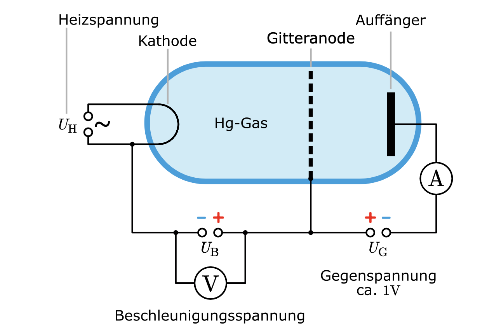

## Lineares Potenzialtopf-Modell
#### Einführung 
- **Wellenfunktion ($\Psi$)**:  
- Wahrscheinlichkeitsinterpretation: **Kopenhagener Deutung** von Bohr und Heisenberg.  
	- Das Elektron ist *nicht* auf einer *Bahn als Punkt* zu sehen, sondern muss als *Quantenobjekt* vielmehr als eine *Welle* betrachtet werden, die über den *ganzen Raum des Atoms verteilt* ist. Diese Welle wird als  $\psi$ genannt.
	- Die Wellenfunktion $\psi$ an sich hat *keine physikalische Bedeutung*, aber ihre *Quadrat* ist ein *Maß für die Wahrscheinlichkeit*, ein *Quantenobjekt in einem bestimmten Ortsvolumen oder Intervall der Länge $\Delta X$  anzutreffen.*  

  - Normalisierung:  
$$ \int |\Psi|^2 \, dV = 1 $$  
	-> Das besagt, dass die Wahrscheinlichkeit, das das Elektron in dem Raum wo er insgesamt aufhalten kann, eins betragen soll.

---

#### Definition:  

  - Potenzialverlauf: Zwischen $x = 0$ und $x = a$ liegt konstante Energie.  
  
  - Wände bei $x = 0$ und $x = a$: Potenzial $V(x) \to \infty$ (Potentielle Energie gegen unendlich bei den Wände).  
  - *Innerhalb des Topfs* wird das *Elektron* mit Hilfe der *Wellenfunktion einer stehenden Welle* (breitet sich also mit einer ganzzahliges vielfaches der halben Wellenlänge) beschrieben, wobei die *Energie* durch die *verschiedenen Schwingungen* *dargestellt* werden kann (Grundschwingung und Oberschwingungen, siehe Foto).
	  
	  -> Mit diesem Modell können wir also die *verschiedenen Energiezustände eines Elektrons durch verschiedenen $|\Psi(x)|^2$ Graphen darstellen.* Daraus ergibt sich, dass die *unterschiedlichen Energiezustände zu unterschiedlichen Wahrscheinlichkeitsverteilungen* führen. 
	  
	  Aus dem Bild sieht mann, dass das Energiezustand mit $n = 1$ wahrscheinlicher in der Mitte ist und bei $n = 2$ liegt die Wahrscheinlichkeit ehr weiter vom Mitte entfernt.

#### Annahmen:
  - *Keine Kräfte auf das Elektron innerhalb des Topfes ($V(x) = 0$).*  
	  - Die gesamte Energie besteht nur aus kinetische Energie mit der Formel
	  $$E_{gesamt}=E_{kin}+E_{pot}=\frac12\cdot m\cdot v^2+0$$
  - *Elektronen können den Topf nicht verlassen ($V(x) \to \infty$).*
	  - Die Wände des Potentialtopfs sind nur eine Vereinfachung, die unendlich lang sind und darum wird unendliche kinetische Energie nötig, um die zu überwinden (Ziel: undurchgänglich für das Elektron zu sein)
  - *Im Bereich $a$ sind die Elektronen delokalisiert.*
	  - Aber Elektronen werden hier bei dieser Schreibweise innerhalb eines bestimmten Molekül als Lokalisiert aufgefasst, wobei dies die Realität nicht entspricht (Siehe Foto: Cyanin-Farbstoff).
	  

---

#### Energiezustände (Formeln)
  $$ \lambda = \frac{2a}{n} $$
  Dies liegt daran, dass stehenden Wellen immer bei ganzzahliges vielfaches der halben Wellenlänge auftreten.
  - Anmerkung: Anzahl der halben Wellenlängen im Topf entspricht $n$. Und Anzahl der Knoten steigt mit der Energie.  

- **Energieniveaus**:  $$ E_n = \frac{n^2 h^2}{8m a^2}, \quad n = 1, 2, 3, \dots $$
- **Wechsel zwischen Zuständen $\Delta E$:**$$ \Delta E = \frac{h^2}{8m a^2} \left( n_2^2 - n_1^2 \right) $$Energiezustände sind quantisiert (diskret).  
	- Wenn $\Delta E$ positiv -> Absorption
	- Wenn $\Delta E$ negativ -> Emission
	- *Anregungen können nur vom obersten besetzten Zustand ausgehen und durch Pauli Prinzip besetzen je 2 Elektronen einen Energiezustand.*
		- z.B. Bei 3 Elektronen kann ich von ersten auf zweiten oder auf dritten oder auf vierten sogar, aber vom 3 anfangen auf 4tem geht nicht, da es keine Elektronen im dritten gibt. (Siehe Seite 219 Lösung von Aufgabe a)

---

##### Beispiel: Cyanin-Farbstoff
- **Molekülstruktur**:  
  - Konjugierte Doppelbindungen (abwechselnd Einfach- und Doppelbindungen).  
  - Elektronen in diesen Bindungen delokalisiert.  

- **Elektronenzustände**:  
  - Länge des Systems: $a = 840 \, \text{pm}$.  (Länge einer Konjugierten Doppelbindungen * Anzahl dieser Bindungen)
  - $8$ Elektronen: Besetzen Zustände $n = 1$ bis $n = 4$.  (Übergänge nur von 4 ausgehen)

- **Übergang $n = 4 \to n = 5$**:  
  - Berechnung:  
$$ \Delta E = 7.69 \times 10^{-19} \, \text{J} $$  
  - Wellenlänge des absorbierten Lichts:  
$$ \lambda = \frac{hc}{\Delta E} $$

 *Wenn ein Farbstoff vor eine Lichtquelle gestellt wird, kann eine Verringerung der gemessenen Lichtintensität beobachtet werden. Dies liegt daran, dass das vom Farbstoff reemittierte Licht in alle Richtungen gestreut wird, anstatt gezielt in die ursprüngliche Richtung der Lichtquelle weiterzuleiten. Zudem kann durch Prozesse wie Fluoreszenz das Licht mit einer veränderten, meist längeren Wellenlänge emittiert werden, wodurch es nicht mehr zur ursprünglichen Intensität beiträgt.* 
	 - Die absorbierte Farben zeigen sich als Lücken in dem kontinuierlichen Spektrum und werden als Absorptionslinie bezeichnet. 
	 - Wegen der nötige Übereinstimmung der Energie der absorbierten Photonen und die nötige Energie um ein Atom auf ein höheres Energieniveaus zu wechseln spricht man von Resonanzabsorption.

 --- 
 

## Bohr'sches Atommodell
### Probleme des Rutherford Atommodell

1. Stabilität ist nicht erklärt, da die kreisenden Elektronen eine beschleunigte Bewegung haben müssen und somit irgendwann absturzen 

2. Es kann die quantenhafte Emission und Absorption nicht erklären

### Postulate des Bohrschen Atommodells (Zur Lösung dieser Probleme ist auch die Aussage Kraft dieses Modell, falls das in einer Aufgabe so formuliert wurde) 

1. **Erstes Postulat: (Diskrete Energiestufen)**
Die Energie eines Elektrons im Atom kann nur diskrete Werte $E_n$ annehmen
2. **Zweites Postulat: (Lichtemission)**
Die Frequenz der ausgesandten elektromagnetischen Strahlung ergibt sich aus der Energiedifferenz zwischen dem Ausgangs- und dem Endzustand.
	Ein Elektron gibt Energie in Form von Licht ab, wenn es von einer höheren Bahn $m$ auf eine tiefere Bahn $n$ wechselt. Die Energieänderung $\Delta E$ ergibt sich aus den Energieniveaus: $$\Delta E = E_m - E_{n}= h \cdot f $$
3. **Drittes Postulat: (Quantenbedingung)**
Der Umlauf der Elektronen erfolgt nur auf bestimmten diskreten Bahnen. Auf diesen Bahnen wird keine Energie abgestrahlt (kurzer formuliert: *Der Drehimpuls wird gequantelt*). Die Bahnen müssen die folgende Quantenbedingung erfüllen:
$$m_{e}\cdot r_{n}\cdot v_{n}=\frac{n\cdot h}{2\cdot\pi}$$
	Durch Umformung erkennt mann, dass umfang $u_n$ ein ganzzahliges vielfaches der Wellenlänge sein soll mit $u_{n}= n \cdot \lambda$ (Dieses Postulat ist aber heute nicht mehr richtig, da er klassische Bahnvorstellung mit der Wellenlänge verbindet)

### Energie der Elektronenschalen
1. Die Energie eines Elektrons in der $n$-ten Schale lautet: $$E_{n}=-\frac{1}{8}\cdot\frac{m_e \cdot e^4}{\varepsilon_0^2 \cdot h^2}\cdot\frac{1}{n^2}=-13,6ev\cdot\frac{1}{n^2}=-h\cdot f_{Ry}\cdot\frac{1}{n^2}$$
• $m_e$: Elektronenmasse
• $e$: Elementarladung
• $\varepsilon_0$: Elektrische Feldkonstante
• $h$: Plancksches Wirkungsquantum
• $n$: Quantenzahl (Schale)

2. Die Energieänderung $\Delta E$ beim Wechsel von $n$ nach $m$ ist: ($m$ $>$ $n$ )$$\Delta E=h\cdot f=-\frac{1}{8}\cdot\frac{m_e \cdot e^4}{\varepsilon_0^2 \cdot h^2}\cdot\left(\frac{1}{m^2}-\frac{1}{n^2}\right)=h\cdot f_{Ry}\cdot\left(\frac{1}{m^2}-\frac{1}{n^2}\right)$$
• **Rydberg-Konstante $f_{Ry}$** = $3,29 \cdot 10^{15} \text{Hz}$ (Nur für Wasserstoff)
• $m$ steht für den verschiedenen Serien 
• $n$ steht für die Übergänge innerhalb einer Serie mit ($n>= m+1$ ) -> (Also vom $n$ zu $m$)
 
  

3. Für die Frequenz gilt $\frac{E}{h}$  und das bedeutet, dass es genau die obige Formel sein wird, außer $h^2$ wird $h^3$ und der Vorfaktor der Formel mit $h^3$ nennt man Rydberg-Konstante und somit ist die Frequenz: $$f = f_{Ry} \cdot \left( \frac{1}{m^2} - \frac{1}{n^2} \right)$$
   Dies ist die Frequenz der Spektrallinien (Linienspektrum und ist charakteristisch für jedes Atom und die verschiedenen Linien werden gruppiert und als Serie bezeichnet und darum gibt es verschiedenen Serien) des Wasserstoffatoms. Mithilfe das Atommodell von Bohr können dann jede Spektrallinie einer Energiedifferenz zweier Energieniveaus.
   
  

### Grenzen dieses Modell

1. Ignoriert Wechselwirkung zwischen mehreren Teilen, also zwischen Elektronen oder Atome.
2. Eindimensionale Betrachtung, was die Realität nicht entspricht.
3. Kann quantitative Beschreibung nur für das Wasserstoffatom oder anderen Ein Elektron-Systeme liefern und nur qualitative Aussagen für anderen Atome, was bedeutet, dass es für die anderen Atome nur die Postulate gelten und keine Berechnungen möglich sind. (Wegen 1.)
4. Die Unbestimmtheitsrelation ist in diesem Modell berücksichtigt, *aber muss noch schauen warum.*

## Resonanzfluoreszenz, Fluoreszenz und Phosphoreszenz:

### Resonanzfluoreszenz:
Atome wie Natriumatome in einer Natriumdampflampe emittieren aufgrund energetischer Anregung Licht mit einem Linienspektrum. Die Natriumatome im Dampf, die durch den Gasbrenner erzeugt wird, absorbieren nur die Photonen mit genau der Wellenlänge, die die Energie besitzt, um die Natriumatome auf ein höheres Energieniveau anzuheben. Nach einer kurzer Zeit von etwa $10^{-8}$ Sekunden emittieren die Atome diese Photonen wieder in alle Richtungen, während sie in den Grundzustand zurückkehren (Resonanzabsorption: Atome absorbieren genau jene Energiequanten $E = h \cdot f$, die sie auch wieder emittieren). Diese Emission in alle Richtungen führt dazu, dass hinter der Flamme ein erheblicher Teil der Lichtintensität fehlt, wodurch ein Schatten entsteht. 

Im zweiten Experiment können die Natriumatome im Dampf, der durch den Gasbrenner erzeugt wird, die Photonen der Quecksilberdampflampe nicht absorbieren, da die Quecksilberdampflampe ein anderes Linienspektrum besitzt, das keine Photonen mit den exakt benötigten Wellenlängen zur Anregung der Natriumatome enthält. Somit findet keine Resonanzabsorption statt, das Licht der Lampe passiert die Flamme ungehindert, und es entsteht kein Schatten auf dem Schirm, da die ursprüngliche Lichtintensität nicht vermindert wird.

- Ein Beispiel für Resonanzfluoreszenz:
	Das Licht der Sonne besitzt ein kontinuierliches Spektrum, das jedoch beim Messen viele Absorptionslinien zeigt. Dies liegt daran, dass bestimmte Wellenlängen von Gasen in der Erdatmosphäre und der Sonnenatmosphäre absorbiert werden.
#### Zusammenfassung:

**Erstes Experiment: Schattenbildung durch Natriumdampflampe**

• Natriumatome emittieren Licht mit einem charakteristischen Linienspektrum.

• Die Atome absorbieren nur Photonen mit genau der Energie, die zur Anregung benötigt wird ($E = h \cdot f$).

• Nach Anregung fällt das Atom innerhalb von $10^{-8}$ Sekunden in den Grundzustand zurück und re-emittiert die Photonen in alle Richtungen.

• Die Emission in alle Richtungen reduziert die Lichtintensität hinter der Flamme.

• Verminderte Lichtintensität führt zu einem sichtbaren Schatten.

  

**Zweites Experiment: Kein Schatten bei Quecksilberdampflampe**
• Quecksilberdampflampe besitzt ein anderes Linienspektrum als Natriumatome.

• Photonen der Quecksilberdampflampe haben nicht die richtige Energie zur Anregung von Natriumatomen.

• Keine Resonanzabsorption: Das Licht passiert die Flamme ungehindert.

• Keine Verminderung der Lichtintensität → Kein Schatten auf dem Schirm.
### Fluoreszenz:

**Fluoreszenz** tritt auf, wenn ein Molekül Licht einer bestimmten Wellenlänge (kurzwellig und energiereich) absorbiert und Licht mit einer längeren Wellenlänge (langwelliger und energieärmer) emittiert. Fluoreszierende Stoffe besitzen viele dicht beieinanderliegende Energieniveaus. Nach der Anregung erfolgt ein Energieverlust durch **strahlungslose Übergänge**, wie molekulare Schwingungen und Rotationen. Der Übergang in den Grundzustand erfolgt daher von einem tieferen Energieniveau als dem ursprünglich angeregten Zustand. Dies führt dazu, dass das emittierte Photon energieärmer ist und somit eine größere Wellenlänge aufweist.

Ein anschauliches Beispiel ist **Tonic Water**, das UV-Licht absorbiert und blaues Licht emittiert.

Dieses Phänomen findet praktische Anwendung in **Leuchtstoffröhren** und **weißen LEDs**:

• **Leuchtstoffröhren**: Sie enthalten Quecksilberdampf, der unsichtbares UV-Licht aussendet. Die Innenwand ist mit fluoreszierenden Stoffen beschichtet, die das UV-Licht absorbieren und sichtbares Licht abgeben.

• **Weiße LEDs**: Der LED-Chip emittiert blaues Licht, das von fluoreszierenden Stoffen in gelbes und rotes Licht umgewandelt wird. Durch die geeignete Mischung der Farben entsteht Licht, das wir als **weiß** wahrnehmen.

--> *Dieser Prozess betrifft Moleküle oder Verbindungen und nicht einzelne Atome wie bei der Resonanzabsorption.*

### Phosphoreszenz

**Phosphoreszenz** ist ein ähnliches Phänomen wie *Fluoreszenz, jedoch mit einer verzögerten Lichtemission*. Ein Molekül absorbiert Licht einer bestimmten Wellenlänge (kurzwellig und energiereich) und *gibt es erst nach einer längeren Zeitspanne in Form von Licht mit einer größeren Wellenlänge* (langwelliger und energieärmer) wieder ab.  Dies liegt daran, dass die *Elektronen zu einem metastabilen Zustand* gelangen, wo der *Übergang zu dem Grundzustand sehr langsam abläuft*.

Ein Beispiel für Phosphoreszenz sind **leuchtende Sterne** auf Kinderzimmerdecken oder **Notausgangsschilder**, die im Dunkeln nachleuchten. Diese Materialien speichern Lichtenergie (z. B. Sonnenlicht oder Licht von Lampen) und geben sie langsam in Form von Licht ab.

--> *Dieser Prozess betreffen Moleküle oder Verbindungen und nicht einzelne Atome wie bei der Resonanzabsorption.*

## Franck-Hertz-Versuch

Versuchsskizze: ([Simulation](https://www.kippenbergs.de/de/mint-franckhertz))

$U_G$ : Gegenspannung, um den Stromfluss zu verringern
Die Geschwindigkeit durch das Gleichsetzen von $E_{kin}$ & $E_{el}$ 
Gitter dient als Anode

### Beobachtung

Durch die Erhöhung der Spannung steigt die Stromstärke auch an. Bis zu einer bestimmten Spannung, dann sink sie wieder und dabei entsteht eine Anregungszone zwischen den Gitter und der Kathode, aber nah am Gitter. Erhöht man weiter die Spannung dann steigt die Stromstärke weiter und die Anregungszone verschiebt sich Richtung Kathode, bis eine zweite Senkung der Stromstärke sich ergibt. und dabei bildet sich die zweite Anregungszone, die wiederrum nah am Gitter. Die Maxima der Stromstärke sind gleich voneinander entfernt und die Anregungszonen bilden sich erst durch Absinken der Stromstärke bis einen Minimum erreicht wurde, dann wandern sie sich Richtung Kathode bis einen Maximum der stromstärke erreicht wird. 

### Erklärung

- **Elastische Stöße**, bei denen das Elektron praktisch keine Energie verliert, so dass es im Regelfall genügend Energie besitzt um die kleine Gegenspannung zur Anode zu überwinden. $E_{kin}= h*f < E_{2}- E_1$ 
$E_1$ = Energie des Atoms in dem Grundzustand
$E_2$ = Energie des Atoms in dem angeregten Zustand

- **Inelastische Stöße**, bei denen das Elektron genau die Anregungsenergie des Atoms abgibt. Hinterher reicht die Restenergie des Elektrons nicht mehr aus um zur Anode zu gelangen, wenn die Beschleunigungsenergie nur knapp über der Anregungsenergie (oder einem Vielfachen davon) war $E_{kin}= h*f = E_{2}- E_1$. Je nach Beschleunigungsspannung wandern die Anregungszonen vom Gitter hin zur Kathode $E_{kin}= h*f > E_{2}- E_1$. Ist die letzte Anregungszone in der Nähe des Gitters sinkt der Auffängerstrom ab. (Kein platz bzw. Zeit zum gewinnen vom Energie durch den Elektrischen Feld)

- $U_G$ ist eine Gegenspannung, um den Stromfluss zu verringern. 
	- $E_{kin}=E_{el}$ und nicht $E_{kin}=E_{B}$ und diese Gleichsetzung hat nicht mit $U_G$ zu tun. $E_{kin}=E_{el}$ gilt lediglich, da die kinetische Energie der Elektronen von dem elektrischen Feld kommt.
- Gitter dient lediglich als Anode
- Schreib die Lösung zur Geschwindigkeit oder etwas anders mit "=" und nicht "beträgt"
- Wenn der Abstand zwischen den Atomen größer wird, dann haben die Elektronen mehr Platz, um Energie aufzunehmen. Somit erreichen die Elektronen den Atom mit mehr Energie. Als Folge kann z.B. sofort ein höherer Energieniveau als zuvor erreicht wird. 

  

• **Bereich I**:
(vllt. davor das mit dem Raumladungszone und Elektronen Emission ? Ja, falls gefördert in der Aufgabenstellung, die Entstehung der Elektronen zu erklären) Mit wachsender Beschleunigungsspannung $U_B$ werden immer mehr Elektronen pro Zeiteinheit gegen das Gegenfeld zur Anode hin beschleunigt. Dabei stoßen die Elektronen auf Neon-Atome, besitzen jedoch nicht genügend Energie, um die Neon-Atome auf ein höheres Energieniveau anzuheben. Daher findet keine Energieabgabe statt.

• **Bereich II**:
Nach Erreichen des ersten Maximums haben die Elektronen genügend Energie, um in Wechselwirkung mit den Neon-Atomen zu treten. Dabei nimmt die Anzahl der Elektronen, die pro Zeiteinheit die Anode erreichen, stark ab, bis ein Minimum der Stromstärke erreicht ist. Dies liegt daran, dass die Elektronen durch inelastische Stöße ihre komplette Energie an die Neon-Atome abgegeben haben und das Gegenfeld nicht mehr durchqueren können. Dadurch bildet sich eine erste Anregungszone unmittelbar vor dem Gitter.

• **Bereich III**:
Erhöht man $U_B$ weiter, verschiebt sich die Anregungszone in Richtung Kathode, da die Elektronen nun örtlich früher genug Energie haben, um die Neon-Atome anzuregen. Die Elektronen gewinnen durch das elektrische Feld wieder Energie, sodass zunehmend mehr Elektronen pro Zeiteinheit die Anode erreichen. In diesem Bereich ist die Energie jedoch noch nicht hoch genug, um ein zweites Neon-Atom anzuregen. Die Stromstärke steigt daher wieder an.

• **Bereich IV**:
Nach Erreichen des zweiten Maximums befindet sich die erste Anregungszone etwa in der Mitte zwischen Kathode und Gitter. Die Elektronen können nun vor dem Gitter genügend Energie durch das elektrische Feld gewinnen, um ein zweites Neon-Atom anzuregen. Es findet eine zweite Anregung statt. (Siehe deine Lösung zu der Vorabi Klausur)

  

  - **Daraus ergibt sich:**
  1- Die Energiebeträge, die das Atom aufnehmen kann, sind charakteristisch für das betreffende Atom. 
  2- Spannungsdifferenzen zwischen den Maxima sind gleich.
  3- Nicht alle Elektronen stoßen mit den Atome und geben ihre ab. Deswegen geht es nicht ganz auf null zurück.  
  4- Die Minima der Stromstärke liegen nicht auf der gleichen Höhe, weil:
  -  mit zunehmender Beschleunigungsspannung **$U_B$** gewinnen die Elektronen mehr Energie und können nicht nur Anregung der Atome durchführen, sondern auch ionisation, was neue Elektronen schafft.
  - Mehr Energie lässt auch dasselbe Elektron mehrmals Atome anregen, wodurch mehr Elektronen ohne Anregung die Auffängerelektrode erreichen. 
  - Die Stromstärke sinkt nicht vollständig auf den gleichen Wert wie bei vorherigen Minima. 
  5- Unterschiede zwischen der Anregung mit Photonen und Elektronen im Frank-Hertz-Versuch:
  

## Röntgenstrahlung - Charakteristische Strahlung mit Linienspektrum

### Entstehung

Die charakteristische Strahlung entsteht, wenn ein Elektron mit genügend Energie die Atomhülle eines Atoms der Anodenmaterial trifft und dabei ein Elektron aus der innere Schale (z.B. K-Schale) entfernt (Ionisation). Daraufhin springt ein Elektron aus einer höheren Schale bzw. Energieniveaus  (z. B. der L-Schale) in die entstandene Lücke und gibt durch dieses Prozess eine elektromagnetische Strahlung bzw. ein Photon der Energie $E = h \cdot f = E_{\text{höhere Energieniveau}} - E_{\text{tiefere Energieniveau}}$ mit einer bestimmten Wellenlänge, die charakteristisch für das Anodenmaterial ist, ab. Diese Strahlung hat ein **diskretes Energiespektrum** mit charakteristischen Energien, die vom Material abhängen, da die emittierten Photonen nur bestimmte Wellenlängen haben, die den Energiedifferenz beide Energieniveaus bzw. den Sprung der Elektron entsprechen .Aus welche Schale ist je nachdem welcher Übergang energetisch günstiger ist.

Beispiele für Übergänge: (muss man erwähnen bei einer detaillierten Erklärung)
• **K$_\alpha$-Strahlungslinie**: Übergang von der L-Schale zur K-Schale.

• **K$_\beta$-Strahlungslinie**: Übergang von der M-Schale zur K-Schale.

### wichtige Hinweise:
- Die Energie der K$_\alpha$-Strahlung ist kleiner als die der K$_\beta$-Strahlung, da die K$_\alpha$-Linie bei einer größeren Wellenlänge liegt, was größere Winkel bedeutet. (Über die Beziehung $n \cdot \lambda = 2d \cdot \sin(\theta)$)
- Die Peaks an sich sind unterschiedlich was die höhe angeht. Da je höher die Spannung ist, desto mehr Elektronen im Material haben genug Energie, um die tiefen K-Schalen-Elektronen herauszuschlagen.
- Höhere Spannung führt zu höhere maximale Energie und somit bei inelastische Stoße können Elektronen mehr Energie abgeben bzw. Photonen mit kleineren Wellenlänge emittieren (Kurzwellige Grenze rutscht nach links).
- Höhere Spannung führt aber auch zu höhere Energie der Elektronen und somit können die Elektronen mehrmals von Atomen abgebremst und mehrmals Photonen abgeben. Dadurch steigt die Zählrate.
- Die charakteristischen Peaks bleiben bei erhöhter Spannung an der gleichen Position, weil sie ausschließlich durch die inneren Elektronenübergänge im Material bestimmt werden. Unterschiedliche Materialien haben jedoch Peaks an unterschiedlichen Positionen, da sie unterschiedliche Kernladungszahlen besitzen. Eine höhere Kernladungszahl führt zu einer stärkeren Coulomb-Anziehung, wodurch die inneren Elektronen stärker gebunden werden. Das bedeutet, dass für den Übergang, beispielsweise vom L- in den K-Bereich, eine höhere Energie erforderlich ist. Diese größere Energiedifferenz bewirkt, dass das ausgesendete Photon (z. B. die $K_\alpha$ -Linie) eine höhere Energie – also eine kürzere Wellenlänge – aufweist. Somit bestimmen die spezifische Kernladung und die daraus resultierende Bindungsenergie der inneren Elektronen die exakte Position der charakteristischen Peaks im Röntgenspektrum.
- Wenn auf der X-Achse die Photonen Energie steht, dann wechseln beide Linien ihre Positionen. $k_{\alpha}$ zuerst und dann  $k_{\beta}$ in diesem Fall.
- $k_{\alpha}$ Linie hat eine höhere Intensität, da der Übergang von L zu K energetisch günstiger ist und somit häufiger als $k_{\beta}$ Linie (Übergang von M zu K) vorkommt.
- Mann nutzt Filtern wie Aluminiumfilter in der Medizin, um den Teil der Strahlung der nicht nützlich für die Untersuchung der Patienten, aber schädlich ist, herauszufiltern, sodass nur Strahlung zum Körper gelangen, die auch nützlich für die Untersuchung sind (nur die hoch genug Energie habende Strahlung also).
- Beim Einsatz eines Filters: Die Energie der Röntgenstrahlung reicht aus, um in Zirkon Atome zu ionisieren. Die Röntgenstrahlung wird dann absorbiert, und es wird ein Abfall der transmittierten Strahlung als Absorptionskante sichtbar.

  

### Gesetz von Moseley:
Das Gesetz von Moseley beschreibt den Zusammenhang zwischen der Energie der charakteristischen Röntgenstrahlung und der Kernladungszahl $Z$ des Anodenmaterials:

$$\Delta E=13.6,\text{eV}\cdot(Z-1)^2\cdot\left(\frac{1}{n_1^2}-\frac{1}{n_2^2}\right)$$

Hierbei sind:
• $n_1$: Quantenzahl der inneren Schale (z. B. $n_1 = 1$ für die K-Schale).

• $n_2$: Quantenzahl der äußeren Schale (z. B. $n_2 = 2$ für die L-Schale).

• $Z$: Kernladungszahl des Anodenmaterials.
	Coole Feststellung: bei dem gleichen Übergang kriegt mann für höhere Z Werte, größere Energie, was bedeutet, dass *Atome mit mehr Protonen* und entsprechend Elektronen, *Photonen mit höhere Energien und kleinere Wellenlängen für den gleichen Übergang emittieren*. 

• Der Wert $13.6 , \text{eV}$ entspricht der Bindungsenergie des Wasserstoffatoms, modifiziert für andere Elemente.

## Erweiterung des Atommodells, Orbitale, Pauli-Prinzip (nicht so wichtig)

Wir müssen nur bis Seite 4 können, ist aber generell sehr unwahrscheinlich..versuch aber dazu Aufgaben in den Abi Aufgaben zu finden.
### Orbitale und Nachweiswahrscheinlichkeiten

- Bereiche mit hoher Aufenthaltswahrscheinlichkeit für Elektronen und werden durch $|\psi|^2$ beschrieben.
- Die Helligkeit in Bildern wie in _Bild B2_ zeigt, wie wahrscheinlich es ist, das Elektron an einem bestimmten Ort zu finden.
- Die Form der Orbitale wird durch Quantenzahlen bestimmt. 
	- Hauptquantenzahl -> $n$ 
	- Nebenquantenzahl -> $l$ (bestimmt der räumliche Struktur der Orbitale)
	- magnetische Quantenzahl -> $m$ (bestimmt der räumliche Struktur der Orbitale)
	Wobei gilt $(m <= l <= n-1)$

### Erweiterung des Potentialtopfmodells: (Sehr unwahrscheinlich in der Abitur)

- Elektron ist in einem Würfel mit Kantenlänge $a_{x}=a_{y}= a_{z}= a$ eingeschlossen.

- Die stehenden de-Broglie-Wellen entstehen in drei Raumrichtungen:$$\lambda_x = \frac{2a}{n_x}, \lambda_y = \frac{2a}{n_y}, \lambda_z = \frac{2a}{n_z}$$
- **Quantenzahlen:** $n_x, n_y, n_z \geq 1$ beschreiben die Schwingungsmoden in jeder Richtung. (Sie sind von einander unabhängig)

- Die Geschwindigkeitskomponenten des Elektrons sind:$$v_x = \frac{h}{2am_x}, \, v_y = \frac{h}{2am_y}, \, v_z = \frac{h}{2am_z}$$
- Gesamtenergie des Elektrons:$$E = \frac{h^2}{8ma^2}(n_x^2 + n_y^2 + n_z^2)$$

#### Beispiel Anwendung:

Maximale Anzahl der Elektronen im Potentialtopf (bis $n = 2$)
- Für $n = 1$: $n_x = n_y = n_z = 1$ $\rightarrow$ 1 Zustand.

- Für $n = 2$: $(2, 1, 1), (1, 2, 1), (1, 1, 2)$ $\rightarrow$ 3 Zustände.

--> Insgesamt: 4 mögliche Zustände. Jedes Orbital kann aber 2 Elektronen enthalten ($s = +\frac{1}{2}, -\frac{1}{2}$), wobei $s$ für den Spinquantenzahl steht. Es ergibt sich:
$\text{Maximale Elektronenanzahl} = 4 , \text{Zustände} \cdot 2 , \text{Elektronen} = 8 , \text{Elektronen.}$

  

### Das Pauli-Prinzip

Zwei Elektronen in einem Atom dürfen nicht in allen vier Quantenzahlen ($n, \ell, m, s$) übereinstimmen.

