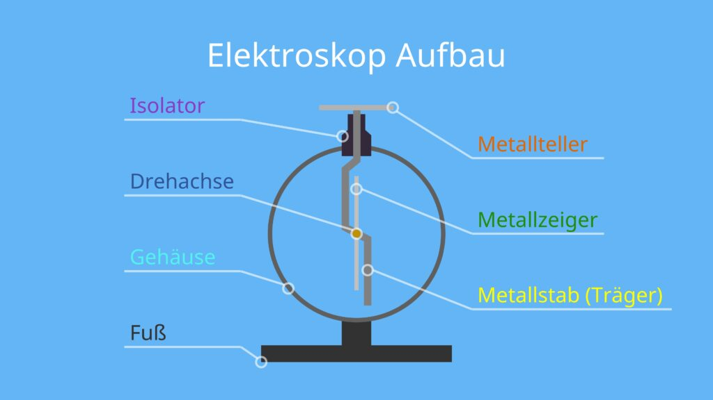
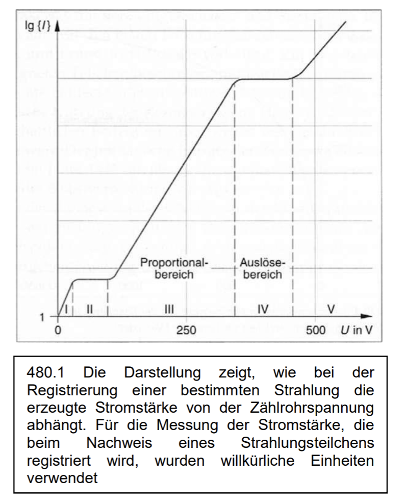
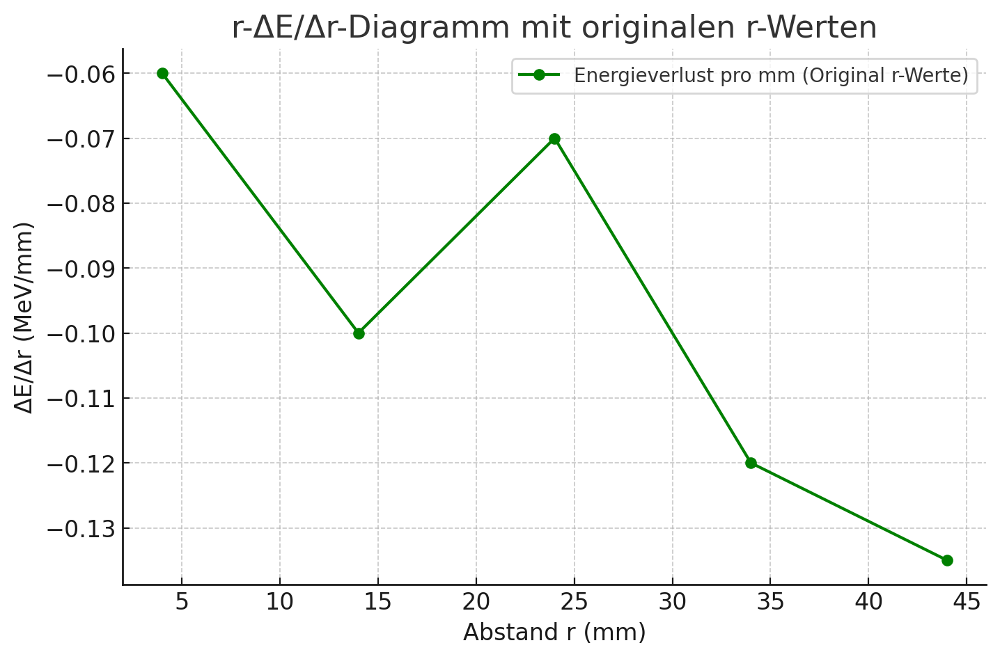

## Einführung

Polonium strahlt Alphateilchen in Form von Heliumkernen aus. Diese Partikel haben eine *hohe Ionisierungsenergie*, was bedeutet, dass sie *sehr effizient Moleküle ionisieren und damit Gewebe schädigen* können. Obwohl *Alphastrahlung* von einfachen Materialien wie Papier *leicht abgeschirmt* werden kann, ist sie bei direktem Kontakt mit lebendem Gewebe *äußerst schädlich*. Die *DNA* wird durch das *Brechen chemischer Bindungen geschädigt*, was durch die *Energieübertragung der Alphateilchen verursacht* wird und zu *fehlerhaften Zellfunktionen* oder *Zelltod* führen.

> [!INFO]
> **Ionisation:** Ionisation tritt also auf, wenn radioaktive Strahlung auf neutrale Atome trifft und dabei ein Elektron aus der Atomhülle entfernt (es entsteht ein positives Ion). Bei genügend Energie kann dieses Elektron wieder Atome ionisieren.

### Das Elektroskop

#### Beobachtung von Radium am Elektroskop

Sobald die *Radiumprobe in die Nähe des Tellers* gebracht wird, kann man beobachten, dass sich *das positiv oder negativ geladene Elektroskop langsam oder schnell entlädt, je nach Intensität der Strahlung*. Dies zeigt den Verlust der elektrischen Ladung, unabhängig davon, ob sie positiv oder negativ ist.

#### Erklärung

Die *Strahlung* radioaktiver Stoffe *überträgt Energie auf Atome* und Moleküle, wodurch sie *ionisiert* werden. Dabei werden *Elektronen aus den Atomhüllen herausgelöst*.

• **Bei einem positiv geladenen Elektroskop**: Die freigesetzten Elektronen aus der Luft bewegen sich aufgrund der elektrostatischen Anziehung zur positiv geladenen Elektroskopkugel. Dadurch wird die positive Ladung des Elektroskops teilweise neutralisiert, was zum Schließen der Metallblätter führt.

• **Bei einem negativ geladenen Elektroskop**: Die positiv geladenen Ionen in der Luft werden durch die elektrostatische Anziehung zur Elektroskopkugel gezogen. An der Oberfläche der Kugel können diese Ionen Elektronen aufnehmen (Rekombination), wodurch die negative Ladung des Elektroskops reduziert wird. Auch hier führt dies dazu, dass sich die Metallblätter schließen.

- Jeder Atomkern ist aus Z positiv geladenen Protonen und N neutralen Neutronen aufgebaut. Z heißt Kernladungszahl, N Neutronenzahl. Ein Kern (Nuklid) $X^{A}_{Z}$ wird durch Z und die Nukleonenzahl $A = Z +N$ gekennzeichnet.
- Isotope eines Elements sind Atome mit gleicher Kernladungszahl Z, aber unterschiedlicher Neutronenzahl N. Z ist auch die Ordnungszahl im Periodensystem und gibt zudem die Zahl der Elektronen in der Atomhülle.

## Das Geiger-Müller-Zählrohr

### Aufbau

Das Geiger-Müller-Zählrohr wird zur Detektion ionisierender Strahlung (z. B. Alpha-, Beta- oder Gamma-Strahlung) eingesetzt. Die Funktion basiert auf der *Ionisation eines Füllgases, wodurch elektrische Impulse entstehen, die gezählt werden können*.

*(Das obere Zeichnen können ist wichtig)* 

• **Anode:** Ein positiv geladener Draht in der Mitte des Zählrohrs.

• **Kathode:** Der negativ geladene Zylinder, der die Außenwand (Metallmantel) des Zählrohrs bildet.

• **Füllgas:** Typischerweise Edelgase wie Argon oder Neon, oft ergänzt durch ein Löschgas (z. B. Alkoholdampf).

### Funktionsweise

#### Prozesse im Geiger-Müller-Zählrohr

- **Primärionisation**
	- Einfallende ionisierende *Strahlung* (z. B. Alpha-Teilchen) trifft auf das *Füllgas* und *löst Elektronen aus den Atomen*. Dabei entstehen:
		- Freie Elektronen (negativ geladen)
		- Positive Ionen (das zurückbleibende Atom oder Molekül)

- **Sekundärionisation** (Stoßionisation)
	- Die durch Primärionisation erzeugten Elektronen werden im elektrischen Feld zwischen Anode und Kathode beschleunigt.
	- Diese beschleunigten Elektronen erhalten im elektrischen Feld Energie. Wenn diese Energie die Ionisationsenergie der Gasmoleküle übersteigt, können sie bei einem Zusammenstoß ein Elektron aus dessen Atomhülle schlagen und somit dieses Gasmolekül ionisieren. Dabei entsteht:
		- Ein weiteres freies Elektron.
		- Ein weiteres positives Ion
	- Die Folge dieses Sekundärionisation: Ein *lawinenartiger Ionisationsprozess (إنهيار جليدي)*, bei dem viele Elektronen erzeugt werden, die zur Verstärkung des Signals beitragen.

- **Bewegung der Ladungsträger**
	- Die erzeugten Elektronen und Ionen bewegen sich zu ihren jeweiligen Elektroden:
		- Elektronen: Wandern *schnell* zur Anode.
		- Positive Ionen: Wandern *langsamer* zur Kathode.
	- *Ergebnis:* Ein messbarer elektrischer Strom, der proportional zur Anzahl der erzeugten Elektronen ist.
  
- **Edelgase und Verhinderung der Elektronenbindung**
	- Edelgase haben volle Außenschalen und bilden keine chemischen Bindungen.
	- Freie Elektronen können daher nicht an Edelgasatome binden, wodurch keine *negativen Ionen* entstehen.
	- Negative Ionen würden den Prozess verlangsamen, da sie schwerer und träger als freie Elektronen sind.

- **Entladung und Löschung bzw. Totzeit**
	- Die langsamen positiven Ionen *schwächen das elektrische Feld* und somit wird die *Stoßionisation* *beendet*:
		- Schwächung des elektrisches Feld führt dazu, dass die Elektronen nicht genug Energie haben, um die Atome zu ionisieren. Genau hier fängt die Totzeit   $10^-4 s$ an, wenn hier ein neues Strahlungsteilchen eintrifft, wird es nicht registriert, da die Stoßionisation nicht möglich sind. Dies ist auch die Zeit, die die positiven Ionen für ihre Wanderung zur Kathode brauchen. Hier hilft auch das Löschgas dabei die Entladung zu beenden.
  

#### Zählrohrcharakteristik – Kennlinie
*(Rede lieber von Elektronen)*

Die Kennlinie zeigt die Stromstärke in Abhängigkeit von der Zählrohrspannung.

  
1. **Bereich I: Rekombination**

- Bei niedriger Spannung rekombinieren viele der erzeugten Ionen, bevor sie die Elektroden erreichen. (Spannung ist also nicht hoch genug, um die Elektronen und Ionen getrennt zu halten)
- Der Strom ist gering, da nicht alle Ladungsträger registriert werden.
- Je höher die Spannung, desto mehr Elektronen gelangen pro Zeiteinheit zur Anode, was die Stromstärke erhöht.
  

2. **Bereich II: Sättigungsstrom**

- Im *Sättigungsbereich (zweiter Bereich)* erreichen alle primär erzeugten Elektronen die Anode, was zu einem konstanten Strom (Sättigungsstrom) führt.
- *Sekundärionisation findet hier nicht statt*, da die Spannung zu niedrig ist und somit ist das elektrische Feld schwach, um die freigesetzten Elektronen genug kinetische Energie zu verleihen, damit sie weitere Atome ionisieren können.
- Um die *Anzahl der einfallenden Strahlungsteilchen* *unabhängig von deren Energie zu messen*, benötigen wir eine *standardisierte Entladung*. Diese sorgt dafür, dass unabhängig von der Energie des Strahlungsteilchens jedes Ereignis eine gleich starke Auswirkung (einen einheitlichen Impuls) hat. Dadurch kann die reine Anzahl der Ereignisse gezählt werden, was eine korrekte Korrelation zur Anzahl der Strahlungsteilchen ermöglicht. Theoretisch könnte mann in diesem Bereich auch der Anzahl einfallenden Strahlungsteilchen zählen, ohne dass der Anzahl durch die verschiedenen Energien der Strahlungsteilchen beeinflusst wird, aber hier ist die Stromstärke einfach zu gering, um die zu messen. Darum sind die Sekundärelektronen wichtig, damit die Werte der Stromstärke hoch genug wird, dass es auch messbar wird.

3. **Bereich III: Stoßionisation**

- Die Spannung ist hoch genug und somit das elektrische Feld ist stärker, dass durch Primärionisation erzeugten Elektronen genug Energie haben durch Sekundärionisation weitere freie Elektronen erzeugen.
- Da die Elektronen nicht alle die gleiche Geschwindigkeit und Orientierung haben, werden immer mehr Elektronen pro Zeiteinheit genug Energie durch das elektrische Feld gewinnen, dass sie Atome ionisieren und zur Anode gelangen. Somit steigt der Strom an.
- *Die durch Sekundärionisation erzeugte Elektronen ist proportional zur primär erzeugten Elektronen, die von der Energie der Strahlung abhängt* (gilt nur hier, denn hier können durch Sekundärionisation erzeugten Elektronen keine weitere Gasmoleküle ionisieren) = das bedeutet einfach: mehr Energie bei der Strahlung ist proportional zur erzeugten Elektronen durch Primärionisation und dann die Sekundärionisation ist proportional zur Primärionisation da nur der Anzahl der Primärionisation, Sekundärionisation erzeugen können. 
  

4. **Bereich IV: Auslösebereich (Geiger-Bereich)** (Das wichtigste)
- Die Spannung ist hoch genug, um durch Sekundärionisation eine *lawinenartige Vermehrung* von Elektronen ausgelöst wird. Hier werden auch Photonen freigegeben (aber auch davor im vorherigen Bereich) wie bei der charakteristischen Röntgenstrahlung freigegeben, die auch Atome anregen und somit erzeugt die Ionisationslawine eine Entladung im gesamten Rohr.

- Hier ist die entscheidende Eigenschaft: *Die Entladung ist immer gleich groß, unabhängig von der Energie des Strahlungsteilchens.*

1. **Bereich V: Dauerentladung**
- Zu hohe Spannung führt zu unkontrollierter Stoßionisation, einem Photonenregen und einem Versagen des Löschmechanismus.
- Es entsteht eine Dauerentladung, die das Zählrohr irreversibel beschädigt.
- Dauerentladung wird verhindert, indem das Zählrohr **im Auslösebereich (IV)** betrieben wird, wo die Entladung kontrolliert gestoppt werden kann.

**Fazit**
Das Geiger-Müller-Zählrohr wird im Auslösebereich (IV) betrieben, da es hier zuverlässig Strahlung zählt, ohne von der Energie der Teilchen abzuhängen. Alle anderen Bereiche sind entweder ineffizient oder schädlich für das Zählrohr.

## Strahlungsarten

Durch die kosmischen, Erdinneren oder dem Qualm von Zigaretten ergibt sich eine natürliche *Strahlenbelastung (Nullrate)*.  Die sogenannte Nullrate wird von diesem natürlichen Strahlung hervorgerufen und muss bei Messungen von dem erhaltenen Messwert abgezogen werden. 

> [!INFO]
> **Nullrate:** Die Nullrate wird durch mehrmals messen und dann durchschnitt bilden bestimmt und anschließend von der zu berechnenden Strahlungsmenge eines Stoffs abgezogen

### Vergleich der Strahlungsarten

> **💡 Klicken Sie auf eine Strahlungsart, um Details anzuzeigen**

<strong>🔴 Alpha-Strahlung (α)</strong>

**Teilchenart / Welle:**
- Zweifach positiv geladener Heliumkern (2 Protonen, 2 Neutronen), also ohne Elektronen
- *Nuklidkarte:* Zwei nach unten und zwei nach links

**Ladung und Lenkung durch Felder:**
- **Ladung:** +2
- In Richtung der negativen Platte (Kathode) bei elektrischen Feldern abgelenkt
- Aufgrund der großen Masse weniger abgelenkt als Beta-Teilchen
- Im magnetischen Feld entgegengesetzt zu Beta-Minus abgelenkt
- In der Nebelkammer: kurze und dicke Spuren

**Zerfallsreaktion und Beispiele:**
$$ ^A_ZX \to ^{A-4}_{Z-2}Y + ^4_2He $$
$$ ^{238}_{92}U \to ^{234}_{90}Th + ^4_2He $$

**Durchdringungsfähigkeit:** Sehr gering (einige cm Luft, wenige µm in Gewebe)

**Abschirmung:** Papier, Haut, Kleidung

**Wirkung auf Materie:** Hohe Ionisationskraft, gefährlich bei Aufnahme in den Körper

**Besondere Hinweise:**
- Wird von magnetischen und elektrischen Feldern entgegengesetzt zu Beta-Minus abgelenkt
- Alpha-Teilchen haben wohl definierte Energieniveaus aufgrund der Energieerhaltung
- Bei Abschirmung: Graph verschiebt sich nach links, Peaks werden breiter, Verlauf wird flacher

<strong>🔵 Beta-Minus-Strahlung (β⁻)</strong>

**Teilchenart / Welle:**
- Elektron
- *Nuklidkarte:* Ein nach oben und ein nach links

**Ladung und Lenkung durch Felder:**
- **Ladung:** -1
- In Richtung der positiven Platte bei elektrischen Feldern abgelenkt
- Wird stark abgelenkt (Drei-Finger-Regel bei magnetischen Feldern)
- In der Nebelkammer: lange und dünne Spuren

**Zerfallsreaktion und Beispiele:**
$$ ^A_ZX \to ^A_{Z+1}Y + e^- + \bar{\nu}_e $$
$$ ^{14}_6C \to ^{14}_7N + e^- + \bar{\nu}_e $$

**Durchdringungsfähigkeit:** Mittlere Reichweite (cm bis m in Luft, mm in Gewebe)

**Abschirmung:** Aluminiumfolie, Plexiglas

**Wirkung auf Materie:** Mittlere Ionisationskraft, kann tiefere Gewebeschichten schädigen

**Besondere Hinweise:**
- Neutron wandelt sich in Proton und Elektron um
- Kontinuierliches Energiespektrum durch Energieverteilung auf drei Teilchen
- Nuklidkarte gibt die maximale Energie an

<strong>🟦 Beta-Plus-Strahlung (β⁺)</strong>

**Teilchenart / Welle:**
- Positron (β⁺)
- *Nuklidkarte:* Ein nach unten und ein nach rechts

**Ladung und Lenkung durch Felder:**
- **Ladung:** +1
- In Richtung der negativen Platte bei elektrischen Feldern abgelenkt
- Wird stark abgelenkt

**Zerfallsreaktion und Beispiele:**
$$ ^A_ZX \to ^A_{Z-1}Y + e^+ + \nu_e $$
$$ ^{11}_6C \to ^{11}_5B + e^+ + \nu_e $$

**Durchdringungsfähigkeit:** Mittlere Reichweite (cm bis m in Luft, mm in Gewebe)

**Abschirmung:** Aluminiumfolie, Plexiglas

**Wirkung auf Materie:** Positronen-Annihilation erzeugt Gammastrahlung (Gefahr durch Sekundärstrahlung)

**Besondere Hinweise:**
- Proton wandelt sich im Kern in Neutron und Positron um
- Wird von magnetischen und elektrischen Feldern abgelenkt

<strong>🟢 Gamma-Strahlung (γ)</strong>

**Teilchenart / Welle:**
- Elektromagnetische Welle (Photon)

**Ladung und Lenkung durch Felder:**
- **Ladung:** 0 (keine Ladung)
- Keine Ablenkung durch elektrische oder magnetische Felder

**Zerfallsreaktion und Beispiele:**
$$ ^A_ZX^* \to ^A_ZX + \gamma $$
$$ ^{60}_{27}Co^* \to ^{60}_{27}Co + \gamma $$
(nach Alpha- oder Betazerfall)

**Durchdringungsfähigkeit:** Sehr hoch (mehrere cm Blei, Meter in Beton)

**Abschirmung:** Dicke Bleischicht (رصاص), Beton (خرسانه)

**Wirkung auf Materie:** Geringe Ionisationskraft, aber hohe Durchdringung, schädigt DNA tief im Körper

**Besondere Hinweise:**
- Energetisch angeregter Kern sendet elektromagnetische Strahlung aus
- Geschieht meist innerhalb von Sekundenbruchteilen als Folgeprozess
- Hat diskrete Energieniveaus

- Durch gezielte Abschirmung kann man zwischen den Strahlungsarten unterscheiden, da sich die Zählrate bei Verwendung unterschiedlicher Materialien (z. B. Papier, Aluminium, Blei) signifikant ändert.
- Alpha- und Betastrahlung können zusätzlich mittels elektrischer und magnetischer Felder untersucht werden, da sie unterschiedliche Ladungen besitzen und deshalb verschieden abgelenkt werden.
- Eine Zerfallsreihe beschreibt den stufenweisen Zerfall eines instabilen Nuklids in mehrere Tocher(nuklide), bis ein stabiles Endprodukt erreicht ist.
- Gamma-Strahlung entsteht häufig im Anschluss an Alpha- oder Betazerfälle, wenn angeregte Kerne in ihren Grundzustand übergehen und dabei Photonen emittieren
- Für alle Zerfallsarten gilt:
	- **Hochenergetische Teilchen verlieren pro Strecke weniger Energie:** 
	  da sie schneller sind und somit einen kürzeren Wechselwirkungsdauer pro Atom. Dadurch verringert sich die Energieübertragung pro Wechselwirkung bei höheren Geschwindigkeiten. 
		- Dies erklärt das Minimum im Bragg-Kurve (Energieverlust pro Strecke), das für geladene Teilchen charakteristisch ist.
	- **Materialien mit höherer Ordnungszahl (Z) führen zu einem stärkeren Energieverlust:** 
		- Mehr Elektronen pro Atom → höhere Wahrscheinlichkeit für Wechselwirkungen mit dem durchfliegenden Teilchen.
		- Höhere Materialdichte → mehr Atome pro Volumen → mehr Kollisionen auf einer bestimmten Strecke.

## Zerfallsgesetz und alles was dazu gehört

Über *Radioaktiver Zerfall* können wir nur eine *zeitliche statistische Zerfallswahrscheinlichkeit angeben*. Die Zählrate ist proportional zur Anzahl der vorhandenen Kerne und da jedes Kern mit einer Wahrscheinlichkeit unabhängig von den anderen Atomen zerfällt, ergibt sich eine exponentielle Abnahme.

Wir können also nicht sagen wann genau ein Atom von 10 Atome zerfällt oder wann genau die Hälfte bleibt. Wir könnten aber sagen, dass es wahrscheinlich ist, dass nach bestimmter Zeit (Halbwertszeit) 5 von 10 Atome vorhanden sein werden. Wie alle statistische Wahrscheinlichkeiten, ist die Aussage genauer mit Mehr Messwerte.

### Mathematisches Zerfallsgesetz

Das Zerfallsgesetz beschreibt die zeitliche Abnahme der Anzahl an radioaktiven Kernen in einer Probe. Es lautet:$$ N(t) = N_0 \cdot e^{-\lambda t} $$
**Erläuterung der Größen:**

• $N(t)$: Anzahl der noch vorhandenen radioaktiven Kerne zum Zeitpunkt $t$
• $N_0$: Anfangsanzahl der radioaktiven Kerne bei $t = 0$
• $\lambda$: Zerfallskonstante (Einheit: $\text{s}^{-1}$)
• $t$: Zeit

Die Zerfallskonstante $\lambda$ gibt an, *mit welcher Wahrscheinlichkeit ein Kern pro Zeiteinheit zerfällt.* Eine größere $\lambda$ bedeutet einen schnelleren Zerfall.

**Zusammenhang zwischen Halbwertszeit und Zerfallskonstante**

Die Halbwertszeit $t_H$ ist die Zeit, nach der die Hälfte der ursprünglich vorhandenen Kerne zerfallen ist. Mathematisch gilt:

- $N(t_H) = \frac{N_0}{2}$
- $\frac{N_0}{2} = N_0 \cdot e^{-\lambda t_H}$
- $e^{-\lambda t_H} = \frac{1}{2}$
- $-\lambda t_H = \ln{\left(\frac{1}{2}\right)}$

Somit gilt die Formel:
$$\lambda = \frac{\ln{2}}{t_H}$$

**Linearisierung des Zerfallsgesetzes**

Um das Zerfallsgesetz in eine lineare Form zu bringen, nimmt man den natürlichen Logarithmus:$$ \ln (N(t)) = \ln (N_0) - \lambda t $$
Dies ist die Gleichung einer Geraden der Form $y = mx + b$, mit:

- $y = \ln (N(t))$
- $m = -\lambda$ (die Steigung der Geraden)
- $x = t$
- $b = \ln (N_0)$ (der Achsenabschnitt)

Durch Auftragung von $\ln N(t)$ gegen $t$ ergibt sich eine Gerade mit der Steigung $-\lambda$.

> [!INFO]
> **Linearisierung:** Linearisierung tritt bei Aufgaben auf, indem man die y-Achse mit $\ln()$ darstellt. Da der ursprüngliche Zusammenhang exponentiell ist, erhält man eine lineare Funktion, deren Steigung $\lambda$ ist.

> [!INFO]
> **Methode:** Man kann $\lambda$ auch direkt durch Regression der exponentiellen Funktion bestimmen. Falls eine Linearisierung gefordert ist, sollte die Herleitung der Formel (Anwenden von $\ln()$ auf beide Seiten) nicht vergessen werden.

> [!INFO]
> **Graphische:** Zur graphischen Bestimmung der Halbwertszeit sollten mindestens drei Werte genommen und der Durchschnitt gebildet werden.

##### **Aktivität** & **Zählrate**

Hinweise:
- Zählrate ist kleiner da nicht jeder Zerfall erfasst wird wegen (Messverluste, Abschirmung, Detektoreffizienz)
- Formel für Zählrate $Z(t) = \varepsilon \cdot A(t)$
- Andere Formel für Aktivität: $A(t) = A_0 \cdot e^{-\lambda t}$

### Absorptions-, Abstand- und Zerfallsgesetz Vergleich

> **💡 Klicken Sie auf ein Phänomen, um Details anzuzeigen**

<strong>🛡️ Absorption von Strahlung</strong>

**Formel:**
$$ I(d) = I_0 e^{-\mu d} $$

**Einheiten und Bedeutung der Größen:**
- $I(d)$: Intensität nach Durchgang durch das Material (Bq)
- $I_0$: Anfangsintensität (Bq)
- $\mu$: Absorptionskoeffizient (cm⁻¹, m⁻¹)
- $d$: Schichtdicke des absorbierenden Materials (cm, m)

**Zusätzliche Abhängigkeiten:**
- **Halbwertsschichtdicke** $d_{1/2}$: 
  $$ d_{1/2} = \frac{\ln(2)}{\mu} $$
- Je größer $\mu$, desto kleiner $d_{1/2}$

**Vernachlässigte Effekte:**
- Streuung
- Sekundärstrahlung
- Energieabhängigkeit von $\mu$

**Linearisierung:**
$$ \ln (I(d)) = \ln (I_0) - \mu d $$

**Bedeutung der Linearisierung:**
Durch Auftragung von $\ln I$ gegen $d$ ergibt sich eine **lineare Gerade** mit der Steigung **$-\mu$**, woraus $\mu$ bestimmbar ist.

**Hinweise:**
- Energieverlust könnte man ausrechnen, indem man zwei Graphen (ohne Abschirmung und mit) bekommt und dann den gleichen Peak betrachtet und Energie-Differenz bildet
- Bei Absorption muss man die Halbwertsdicke noch mit der Dicke einer Schicht nehmen, da die Halbwertsdicke nur ein Faktor ist

<strong>📐 Abstandsgesetz</strong>

**Formel:**
$$ I(r) = I_0 \frac{1}{r^2} $$

**Einheiten und Bedeutung der Größen:**
- $I(r)$: Intensität in Abstand $r$ (Bq)
- $I_0$: Anfangsintensität (Bq)
- $r$: Abstand zur Strahlungsquelle (m, cm)

**Zusätzliche Abhängigkeiten:**
- **Reichweite der Strahlung**: Hängt von Strahlungsart und Medium ab

**Vernachlässigte Effekte:**
- Streuung
- Reflexion
- Inhomogene Strahlungsquellen

**Linearisierung:**
$$ \ln (I(r)) = \ln (I_0) - 2 \ln (r) $$

**Bedeutung der Linearisierung:**
Auftragung von $\ln (I)$ gegen $\ln (r)$ ergibt eine **Gerade mit der Steigung -2**, woraus die **quadratische Abhängigkeit** erkennbar wird.

**Hinweise:**
- Die Strahlungsintensität nimmt mit dem Quadrat des Abstands ab, da sich die Strahlung *kugelförmig ausbreitet*

<strong>⚛️ Radioaktiver Zerfall</strong>

**Formel:**
$$ N(t) = N_0 e^{-\lambda t} $$

**Einheiten und Bedeutung der Größen:**
- $N(t)$: Anzahl der verbleibenden radioaktiven Kerne (keine Einheit, da Anzahl)
- $N_0$: Anfangsanzahl der Kerne (keine Einheit)
- $\lambda$: Zerfallskonstante (s⁻¹, min⁻¹, h⁻¹)
- $t$: Zeit (s, min, h)

**Zusätzliche Abhängigkeiten:**
- **Halbwertszeit** $t_H$: 
  $$ t_H = \frac{\ln(2)}{\lambda} $$
- Je größer $\lambda$, desto kürzer $t_H$

**Vernachlässigte Effekte:**
- Einfluss von Umweltfaktoren auf Zerfall
- Sekundärreaktionen

**Linearisierung:**
$$ \ln (N(t)) = \ln (N_0) - \lambda t $$

**Bedeutung der Linearisierung:**
Auftragung von $\ln N$ gegen $t$ ergibt eine **lineare Gerade mit der Steigung -$\lambda$**, woraus $\lambda$ und $t_H$ bestimmbar sind.

**Hinweise:**
- Die Anzahl der radioaktiven Kerne folgt einem exponentiellen Zerfall, was die Halbwertszeit beschreibt

## Halbleiterdetektor und Energiespektren

### Funktionsweise des Halbleiterdetektor 

- **Diode:** Ein elektronisches Bauelement, das den Strom in nur eine Richtung leitet.
- **Sperrrichtung:** Zustand, in dem die Diode den Stromfluss blockiert, da die p-Seite an Minus und die n-Seite an Plus liegt.
- **Halbleiter:** Ein Halbleiter ist einfach ein Material dessen elektrische Leitfähigkeit zwischen der von Leitern (wie Metallen) und Nichtleitern (Isolatoren) liegt. Halbleiter können unterschiedlich dotiert werden. Dotierung bedeutet, gezielte Beimischung von Fremdatomen, wodurch **n-typ-Halbleiter** entstehen (Überschuss an Elektronen) oder **p-Typ-Halbleiter** (Überschuss an "Löchern" bzw. fehlende Elektronen). 

---  

Wenn eine Diode in *Sperrrichtung* geschaltet wird, entsteht eine breite *ladungsträgerfreie Schicht* (Sperrschicht), in der kein Strom fließt, aber das elektrische Feld bleibt dennoch unblockiert. Wenn *ionisierende Strahlung* in dieser Schicht eindringt, erzeugt sie *Elektronen und Löcher*, die im elektrischen Feld zu den Elektroden abfließen. Dadurch entsteht ein *kurzzeitiger Strom*, der als *Spannungsimpuls* nachgewiesen wird. Die Spannungsimpulse werden von einem Spannungshöhen Analysator aufgenommen und eine Energiekanal zugeordnet.

- Je höher die Energie des einfallenden Teilchens, desto höher ist die registrierte Spannung. (höhere Energie --> mehr Elektronen-Lochpaare)
- Unterschiedliche Materialien benötigen unterschiedliche Energien zur Erzeugung von *Elektron-Loch-Paaren*.  
- Da die Dichte eines Halbleiterdetektors hoch ist, können *Teilchen mit hoher Energie* vollständig abgebremst werden.  
- Aufgrund des *geringen Energieverlusts pro Elektron-Loch-Paar* besitzen Halbleiterdetektoren eine *hohe Energieauflösung* und können *geringe Energieunterschiede genau registrieren*.  
- Mithilfe von Halbleiterdetektoren kann ein *Energie-Häufigkeits-Diagramm* sehr detailliert erstellt werden.  

---

### Energiespektrum

(Der Graph zu den Zerfalls Produkte bei der Kalibrierung gehört einen bestimmten ZerfallsNuklid und die Produkte aber es zeichnet dann nur eine bestimmte Zerfallsart. Also wenn es um die Alpha Zerfällen einer Nuklid geht, dann kann ich die Beta Zerfälle nicht am Graph sehen und darum dann bei der Zerfallsreihe interessiert mich nur die Alpha Zerfälle und deren Energiewerte.)

Die Energie Achse zeigt nicht direkt die Energie eines Zerfalls Produkt, sondern nur die Nummer eines Kanals. (Analogievergleich zu Röntgenröhre Lambda-n Graph) Wir müssen also die Energie pro Kanal bestimmen (Kalibrierung).
- Jeder Kanal bestimmt einen Energiebereich durch $E=E_{proKanal}\cdot Kanal_{\operatorname{nummer}}$.
- Der Spannungshöhen Analysator ordnet dann jeder Spannungsimpuls einen bestimmten Kanal zu und die zählt wie oft diesen Spannungsimpuls registriert wurde.
- Höherer Kanalnummer bedeutet höhere Energie.

| Eigenschaft                     | Hochenergetisches α-Teilchen       | Niedrigenergetisches α-Teilchen   |
| ------------------------------- | ---------------------------------- | --------------------------------- |
| **Interaktion mit Luft**        | Weniger Wechselwirkungen am Anfang | Mehr Wechselwirkungen am Anfang   |
| **Geschwindigkeit**             | Höher                              | Niedriger                         |
| **Reichweite**                  | Größer (dringt weiter ein)         | Kleiner (wird schneller gestoppt) |
| **Wer wird zuerst abgebremst?** | Später                             | Früher                            |

**Bestimmung des Energiewerts eines Kanals:**
2. Bestimme die Zerfallsprodukte von dem Element (verfolge das was wahrscheinlicher ist) und notiere die Energiewerte der Alpha-Zerfälle (falls es um Alpha-Zerfälle geht.)
3. Ordne Zerfallsenergie den Peaks in E-N-Diagramm zu. (höhere Energie --> höhere Kanalnummer).
4. (Energieunterschied zweier Peaks)/ (Kanalunterschied) rechnen, um den Offset zu vermeiden.
5. Überprüfe die Energiewerte anderer Nuklide durch $E=E_{proKanal}\cdot Kanal_{\operatorname{nummer}}$
6. Falls große Abweichung nach Überprüfung der Wert pro Kanal entstehen, dann könnte die Abschirmung durch Aluminium oder etwas anders oder Messungenauigkeiten die Ursache sein.

#### Bragg-Kurve:

**Beschreibung:**
- *Zuerst geringer Energieverlust*: Am Anfang verliert das Teilchen *wenig Energie pro Strecke*.
- Mit zunehmender Strecke steigt die *Ionisationsdichte*, da die Teilchen langsamer werden und somit mehr Energie pro Strecke abgeben können.
- Dann wird ein Maximum *Bragg-Peak* gegen Ende der Reichweite erreicht.
 - Danach wird das Teilchen schnell abgebremst und gibt keine Energie mehr ab. 

**Einfluss der Ioneneigenschaften auf die Behandlungstiefe:**
- Langsamere Teilchen ionisieren stärker, da sie länger in der Nähe der Elektronen verweilen.
- Um Tumore in *tieferen Gewebeschichten* zu erreichen, muss man die *Energie der Ionenstrahlen erhöhen*. Dies kann mann durch:
	- Höhere Kernladungszahl -> höhere Ladung -> mehr Energie bei gleicher Beschleunigung
	- Teilchenbeschleuniger
	- magnetische Ablenkung, sodass sie im Beschleunigungsfeld länger bleiben

*Praxis:* Das gesunde umliegende Gewebe wird weitgehend geschont, da der größte Teil der Strahlungsenergie erst im Tumor freigesetzt wird. In der Tumorbehandlung kann man die Energie der Teilchen genau so einstellen, dass der Bragg-Peak im Tumor liegt.

## Quantisierung der Gesamtenergie von Nukleonen im eindimensionalen Potenzialtopf

### Grundlagen des eindimensionalen Potenzialtopfmodells

- **Kernmodell**: Ein quantenmechanisches Modell, das den Atomkern als einen Potenzialtopf beschreibt. Er stellt die potenzielle Energie in Abhängigkeit vom Abstand $r$ zum Kernmittelpunkt dar. $R$ ist der Kernradius.
- **Nukleonen** (Protonen und Neutronen) werden als Quantenobjekte durch Wellenfunktionen beschrieben
- **Kernkräfte** beschränken den Aufenthaltsbereich der Nukleonen auf den Kern (Durchmesser ca. $10^-14 m$)
- Unterschied zwischen Protonen- und Neutronenpotenzialtopf:
	-  Innerhalb des Kerns dominiert die anziehende Kernkraft. Außerhalb des Kerns dominiert die abstoßende Coulombkraft für Protonen. Die Grenze ist durch "Coulombwall" gegeben.
    - *Protonen*: Innerhalb des Kerns ist der Potenzial der Protonen weniger tief, da Coulombkraft (abstoßende elektrische Kraft) die Bindung verringert.
    - *Neutronen*: Sind fester gebunden als Protonen.

### Energieniveaus im Kern

- **Pauli-Prinzip**: Jedes Energieniveau kann mit maximal 2 Nukleonen besetzt werden & Neukleonen nehmen nur diskrete Energiezustände.
- In stabilen Atomkernen müssen die obersten besetzten Energieniveaus bei Protonen und Neutronen etwa gleich hoch liegen, ansonsten könnte ein Neutron sich in ein Proton (oder umgekehrt) durch $\beta$-Zerfall umwandeln und dabei Energie abgeben. 
- Da das Potenzial der Neutronen tiefer als das von der Protonen, sind in der Regel mehr Neutronen als Protonen im Kern zu finden.

#### Abschätzung der Energiewerte im Atomkern (nur schauen)

- Formel für die Energiewerte des eindimensionalen Potenzialtopfs: $E_{n,\text{Kern}} = \frac{h^2 \cdot n^2}{8 \cdot m_p \cdot L_K^2}$
- Größenordnungen:
    - Protonenmasse ist ca. 2000-mal größer als Elektronenmasse: $\frac{m_p}{m_e} \approx 10^3$
    - Kerndurchmesser ist ca. fünf Größenordnungen kleiner als Atomdurchmesser: $L_{\text{Kern}} \approx 10^{-5} \cdot L_{\text{Atom}}$
- Abschätzung der Energiewerte: $E_{n,\text{Kern}} \approx 10^7 \cdot E_{n,\text{Atom}}$
- Energieniveaus im Atomkern liegen im Bereich von 10 MeV (statt 1 eV wie bei der Atomhülle).

### Kernbindungsenergie und Massendefekt

- **Massendefekt**: $\Delta m = m_K - (Z \cdot m_P + N \cdot m_n)$
    - Die Gesamtmasse des Kerns ist kleiner als die Summe der Massen seiner Bestandteile
    - Die Masse geht nicht verloren, sondern wird durch die Gleichung $E = \Delta mc^2$ in Energie bzw. (*Kernbindungsenergie*) umgewandelt bzw. freigesetzt. Sie stellt die nötige Energie, um einen Atomkern in seine einzelnen Protonen und Neutronen zu zerlegen. De *Bindungsenergie pro Nukleon* gibt an, wie stark die einzelnen Nukleonen im Kern gebunden. 
    - *Höhere Bindungsenergie pro Nukleon und nicht insgesamt bedeutet einen stabileren Kern und einen größeren Massendefekt.*

### Radioaktive Zerfallsarten im Potenzialtopfmodell

#### α-Zerfall

Alpha-Teilchen sind Quantenobjekte und unterliegen daher der Heisenbergschen Unschärferelation, die in ihrer Energie-Zeit-Form als $Δt · ΔE ≥ \frac{h}{8\cdot \pi}$ ausgedrückt wird. Diese Beziehung besagt, dass für sehr kleine Zeitspannen die Energiewerte eines Teilchens nicht genau bestimmt werden können – es entsteht eine Energieunschärfe. Diese Unschärfe ermöglicht es, dass Alpha-Teilchen kurzzeitig Energiewerte annehmen können, die deutlich über ihrer mittleren Energie liegen. Dadurch können sie den Coulombwall überwinden, obwohl ihre durchschnittliche Energie von typischerweise $2$ - $7 MeV$ deutlich unter der klassisch erforderlichen Energie von mehreren $10 MeV$ liegt. Während des Tunnelprozesses ist die Energie des Alpha-Teilchens nicht exakt definiert. Durch den Wellennatur der Alpha-Teilchen als Quantenobjekte, haben Alpha-Teilchen eine Aufenthaltswahrscheinlichkeit $(\psi)^2$, die auch außerhalb des "Coulombwall" nicht null ist. Somit kann es den Coulombwall mit einer gewissen Wahrscheinlichkeit "durchtunneln". Je höher die Energie des Alpha-Teilchens ist, desto wahrscheinlicher wird das Durchtunneln. Dies liegt daran, dass die effektive Breite und Höhe der Barriere geringer wird, was mathematisch zu einer höheren Tunnelwahrscheinlichkeit führt.

*Hint*: Kerne mit zu hoher Neutronenzahl neigen zum α-Zerfall

#### β-Zerfall

- **Ursache**: Neutronentopf ist höher besetzt als Protonentopf
- Ein Neutron wandelt sich in ein Proton unter Aussendung eines Elektrons und eines Antineutrinos um
- Energieverteilung ist kontinuierlich (0-1 MeV)
- Kern geht in einen energetisch günstigeren Zustand über

## Aufgaben

##### **Analyse eines Zerfalls mit zwei Nukliden unterschiedlicher Halbwertszeiten**

Wenn eine Probe zwei radioaktive Nuklide mit unterschiedlichen Halbwertszeiten enthält, kann man dies im Zerfallsgesetz und in der grafischen Darstellung der Messwerte erkennen.

**Woran erkennt man das?**
- Im $t$-$\ln N$-Diagramm zeigt sich ein **Abknicken der Geraden** ab einem bestimmten Zeitpunkt.
- Dies geschieht, weil das **kurzlebige Nuklid zerfallen ist**, und ab diesem Zeitpunkt nur noch das langlebige Nuklid zur gemessenen Aktivität beiträgt.

**1. Bestimmung der Halbwertszeit des langlebigen Nuklids**
7. Wähle die Messwerte ab dem Zeitpunkt, an dem nur noch das langlebige Nuklid existiert.
8. Erstelle das $t$-$N$- oder das $t$-$\ln N$-Diagramm mit diesen Daten.
9. Bestimme die Steigung $-\lambda$ der linearen Anpassung im $t$-$\ln N$-Diagramm. (oder direkt durch $t$-$N$-Diagramm)
10. Berechne die Halbwertszeit mit:$$ t_H = \frac{\ln 2}{\lambda} $$

**2. Bestimmung der Halbwertszeit des kurzlebigen Nuklids**
1. Berechne für jede Zeit $t$ die Anzahl der Kerne des langlebigen Nuklids mit der zuvor bestimmten Zerfallskonstante.
2. Subtrahiere diesen Wert von den ursprünglichen Messwerten, um die Anzahl der Kerne des kurzlebigen Nuklids zu erhalten.
3. Erstelle das $t$-$N$- oder das $t$-$\ln N$-Diagramm für das kurzlebige Nuklid.
4. Bestimme die Steigung $-\lambda$ der linearen Anpassung im $t$-$\ln N$-Diagramm. (oder direkt durch $t$-$N$-Diagramm)
5. Berechne die Halbwertszeit mit:$$ t_H = \frac{\ln 2}{\lambda} $$
[[Materiellen/Zerfallsgesetz 2021SuS.pdf]] (Beispiel Aufgabe mit Lösung dazu ganz am Ende)

##### **Zerfallsreihe mit Reaktionsgleichung**

##### **Erläutere, warum die Zählrate auch ohne Absorption mit zunehmender Entfernung vom Präparat geringer wird**

- *mit größerer Entfernung verteilt sich die Strahlung auf immer größere Fläche*, wodurch das Präparat immer weniger betroffen wird. Dies liegt daran dass die Strahlung sich *Kugelförmig ausbreitet*. Dies geschieht mit der Beziehung:
$Z(r)$ proportional mit $\frac{1}{r^2}$ und mit dieser Formel kann man auch wie viel von der ursprünglichen Strahlungsmenge noch vorhanden ist. z.B. bei 360 Zähle pro Minute kann mann bei Vervierfachung des Abstands die noch vorhandene Zählrate auf 360/4^2 = 22,5 Zähle pro Minute schätzen.

- Aufgrund des größeren Abstands geben die Strahlungsteilchen einen Teil ihrer Energie an die Luftmoleküle ab. Mit größere Entfernung treffen Teilchen auf mehr Luftmoleküle und dadurch verringert sich die Anzahl der Strahlungsteilchen, die den Detektor erreichen, mit zunehmender Entfernung. Da Teilchen mit geringeren Energie ihre komplette Energie abgeben, bevor sie den Detektor erreichen.
##### **Absorptionsaufgabe (nicht Einfach)**

https://www.leifiphysik.de/kern-teilchenphysik/radioaktivitaet-fortfuehrung/aufgabe/absorption-von-gammastrahlung-abitur-1995-lk-a5-1

##### **Aufgaben zu Absorption und Abstand aus dem Unterricht**

[[Materiellen/AB Absorption 2023.pdf]]

[[Materiellen/AB Abstandsgesetz 2023.pdf]]

##### **Energiespektrum von Alphastrahlung**

- Die Energie nimmt mit steigendem Abstand ab, da die α-Teilchen auf ihrem Weg Energie durch Wechselwirkungen mit dem Medium (Luft oder anderes Material) verlieren. 
- Wenn sich die Energie null nähert, erreichen die α-Teilchen ihre Reichweite, daher deren gesamte Energie wird an die Luft Moleküle übertragen.

Delta E/Delta r kommen aus zwei aufeinanderfolgender Werte der jeweiligen Größe.

|                |                            |
| -------------- | -------------------------- |
| Abstand r (mm) | Delta E/ Delta r  (MeV/mm) |
| 4              | -0.060                     |
| 14             | -0.100                     |
| 24             | -0.070                     |
| 34             | -0.120                     |
| 44             | -0.135                     |

Deutung:
 - Energieverlust pro Längeneinheit an.
 - Energieabnahme ist großer da die Teilchen langsamer werden also mehr Energie pro mm abgeben und dann sinkt es wieder, da es weniger Energie insgesamt hat. Obwohl langsamer, aber nicht genug Energie gerade hat, um es abzugeben.

Unterschiedliche Energiewerte bei gleichem Zerfallsprodukt können aus die unterschiedlichen Folien die auf dem Gerät aufgesetzt sind (Abschirmung).