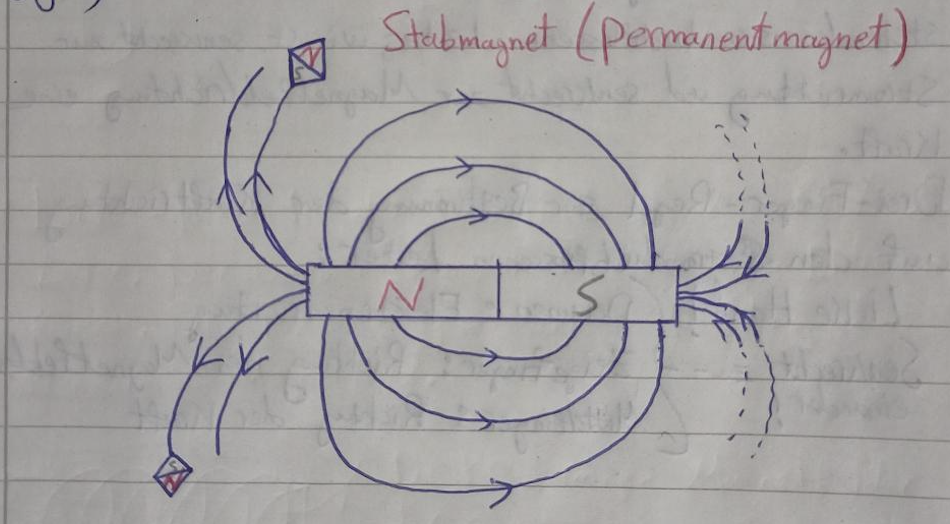
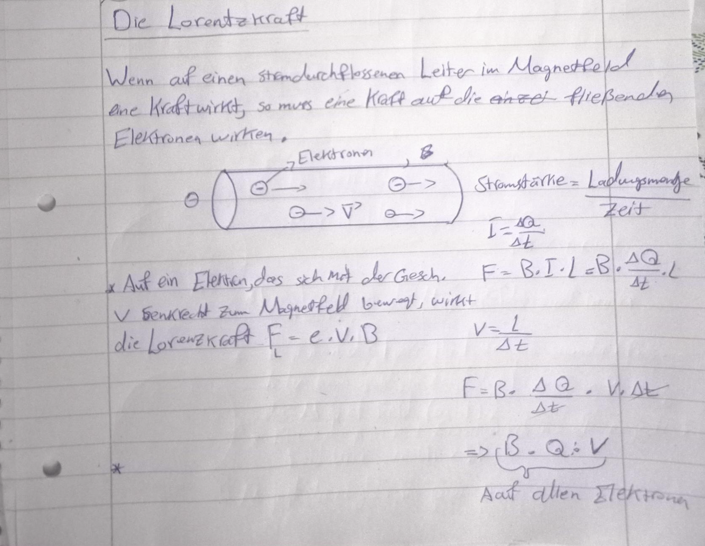
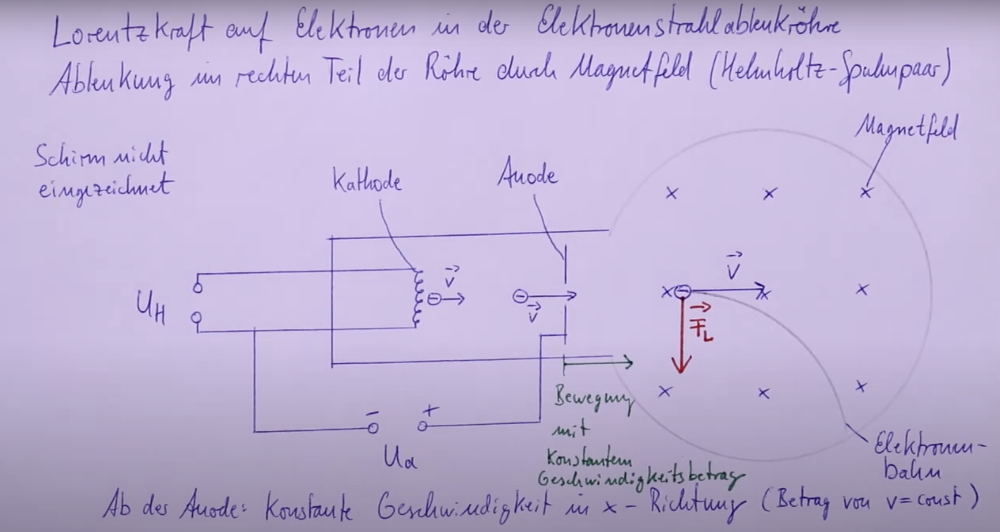
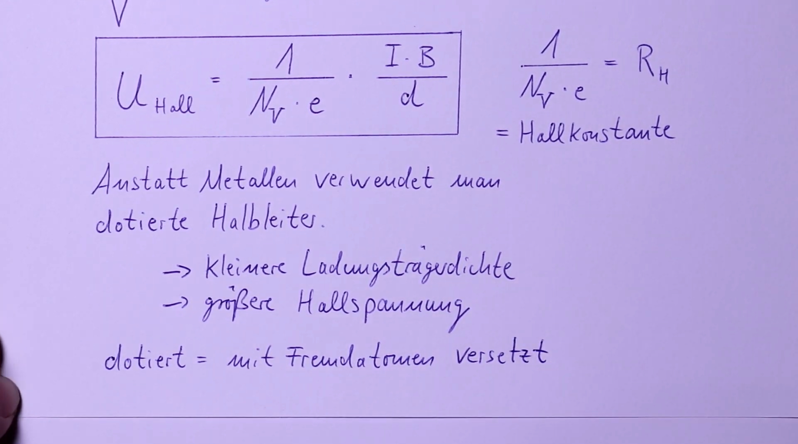
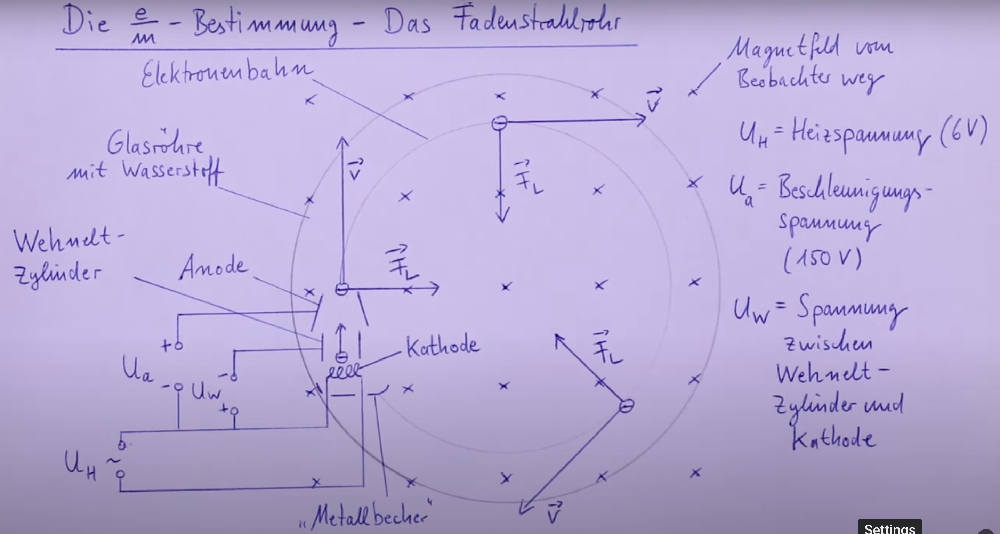
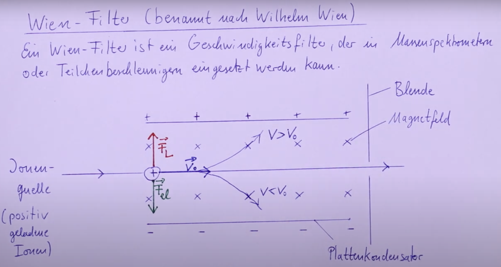

Die Erde besitzt ein Magnetfeld. Der magnetische Südpol liegt (etwa am geographischen Nordpol, der magnetische Nordpol (etwa) am geographischen Südpol.

Ein frei drehbares Magnet ist ein Kompass. Der Pole der zum geographischen Nordpol zeigt, heißt Nordpol (Rot), der nach Süden zeigt, heißt Südpol (grün).
**Elektrischer Strom erzeugt ein Magnetfeld, aber ein sich bewegendes Magnetfeld kann elektrischen Strom erzeugen**

Keine Ahnung, ob das wichtig ist.
	- Das Magnetfeld der Erde verläuft vom geographischen Südpol zum geographischen Nordpol, da der geographische Nordpol ein magnetischer Südpol ist. 
	- Das Magnetfeld der Erde kann unterteilt werden in eine horizontale und eine vertikale Komponente mit einem „normalen“ Kompass messen wir immer nur die horizontale Komponente des Erdmagnetfeldes. Beide Komponenten werden als sogenannter Inklinationswinkel bezeichnet. Diese beträgt in unserem Breite 62* - 70*
	Planung zur Messung der horizontal Komponente des Magnetfeldes der Erde
	1. Ausrichtung eine Spule in West-Ost Richtung
	2. Kompass in Spule einbringen. Die Kompassnadel zeigt in Nord-Süd-Richtung
	3. Der Stromfluss anderer Spule wird so eingestellt, dass ein Kompassnadel in Nord-West und Süd-Ost-Richtung zeigt.
	4. Mit dem Daten der Spule (n=68 und l=0,27m) und der Stromstärke durch die Spule kann Bh bestimmt werden.
	Bh = M0 * I * (n/l)

## Magnetfelder

1. **Additive Überlagerung (Nordpol an Südpol):** Wenn der Nordpol eines Magneten dem Südpol eines anderen Magneten angenähert wird, addieren sich die Magnetfelder. In diesem Fall verstärken sie sich gegenseitig, wodurch die kraft zwischen den Magneten zunimmt.

2. **Subtraktive Überlagerung (Nordpol an Nordpol oder Südpol an Südpol):** Wenn der Nordpol eines Magneten dem Nordpol eines anderen Magneten oder der Südpol dem Südpol angenähert wird, subtrahieren sich die Magnetfelder. In diesem Fall schwächen sie sich gegenseitig ab, wodurch die kraft zwischen den Magneten verringert wird.

---
- Feldlinien veranschaulichen die Richtung und Stärke des Magnetfelds. Sie *zeigen* in die *Richtung* des Nordpols einer Kompassnadel.
- gradlinige und parallele Feldlinien deuten auf einem homogenen Feld.
- Je größer die Dichte der Feldlinien ist, desto höher ist die magnetische Feldstärke. 

## Elektrische Strom erzeugen ein Magnetfeld (Draht & Spule)

- Wenn Strom durch einen Leiter fließt, bildet sich um ihn herum ein magnetisches Feld, dessen Feldlinien geschlossene Kreise um den Leiter herum bilden.

- Wird ein Draht spiralförmig um einen Zylinder gewickelt und von Strom durchflossen, entsteht um jede Windung gemäß der **Linken-Faust-Regel** ein Magnetfeld. Die Magnetfelder zwischen den Windungen heben sich gegenseitig auf, während sie oberhalb und unterhalb der Windungen in die gleiche Richtung zeigen. Dadurch entsteht **homogenes Magnetfeld** axial durch die Spule hindurch, dessen Stärke und Orientierung von der **Stromflussrichtung und der Wicklungsart** des Drahtes bestimmt werden kann.

## Hufeisenmagnet (Leiterschaukelversuch)

Auf einem im Magnetfeld senkrecht zu den Feldlinien stehenden stromdurchflossenen Leiter, wirkt senkrecht zur Stromrichtung und senkrecht zur Magnetfeldrichtung eine Kraft. 
- Die Kraft ist maximal, wenn die Elektronen Richtung senkrecht zu den magnetischen Feldlinien steht. 
- Die Kraft ist nicht vorhanden, wenn der Leiter parallel zu der Feldlinien steht.

*Drei-Finger-Regel*: 
+ Daumen: Elektronenrichtung oder die Ursache (bei menschlicher Bewegung des Magnets oder des Leiters ist die Ursache die Bewegungsrichtung)
+ Zeigefinger: Magnetfeldrichtung
+ Mittelfinger: Kraftrichtung

## Magnetische Feldstärke und Flussdichte

#### Die magnetische Flussdichte $B$ 

Während die elektrische Feldstärke $E$ die Kraft pro Ladungseinheit beschreibt, gibt die magnetische Flussdichte $B$ die Kraft an, die auf einen Leiter mit Stromstärke  $I$ und Länge $l$ im Magnetfeld wirkt.
$$ B = \frac{F}{I \cdot l} $$wobei
- $B$ : magnetische Flussdichte in $\frac{N}{A \cdot m} = T$ (Tesla)
- $F$ :Kraft auf den Leiter in $N$ (Newton)
- $I$ :Stromstärke in $A$ (Ampere)
- $l$ : Leiterlänge im Magnetfeld in $m$ (Meter)

#### Magnetfeld einer langen Spule

Das Magnetfeld innerhalb einer langen Spule hängt von der Stromstärke, der Windungszahl und der Spulenlänge ab: $$ B = \mu_0 \cdot \mu_r \cdot I \cdot \frac{N}{l} $$
oder alternativ: $$ B = \mu_0 \cdot \mu_r \cdot n \cdot I $$wobei:
- $N$ : Anzahl der Windungen
- $l$ : Länge der Spule in $m$
- $n = \frac{N}{l}$ :Windungsdichte in $\frac{1}{m}$
- $\mu_0 = 1,257 \cdot 10^{-6} \frac{Vs}{Am}$ : magnetische Feldkonstante
- $\mu_r$ : relative Permeabilität (Das Material der Spule, wobei für Luft $\mu_r = 1$ ist. Vergleichbar mit $\varepsilon_r$ von der Kondensator)

## Die Stromwaage & Lorentzkraft $F_{L}$

**Funktion der Stromwaage**
Die Stromwaage misst die Kraft, die auf einen stromdurchflossenen Leiter in einem Magnetfeld wirkt.

**Versuchsaufbau**
- Ein Leiter wird in ein homogenes Magnetfeld $B$ zwischen die Pole eines Elektromagneten gebracht.
- Der Leiter ist Teil eines geschlossenen Stromkreises, durch den eine einstellbare Stromstärke $I$ fließt.
- Die durch das Magnetfeld auf den Leiter ausgeübte Kraft wird mit der Waage gemessen.
- Zur Untersuchung der Abhängigkeit der Kraft werden $I$ und die Leiterlänge $l$ variiert.

*Beobachtung*: 
- Erhöht man die Stromstärke $I$, steigt auch die auf den Leiter wirkende Kraft.
- Die Richtung der Kraft hängt von der Orientierung des Magnetfeldes und der Stromrichtung ab.

*Erklärung*: 
Ein stromdurchflossener Leiter erzeugt ein eigenes Magnetfeld gemäß der **Linken-Faust-Regel**. Befindet sich der Leiter im Magnetfeld eines Elektromagneten, so überlagern sich die beiden Magnetfelder. Wenn die Magnetfelder in die gleiche Richtung zeigen, stoßen sie sich ab, wodurch der Leiter nach oben gedrückt wird. Sind die Magnetfelder entgegengesetzt ausgerichtet, ziehen sie sich an, und der Leiter wird nach unten gezogen.

*Auswertung*:
	 

*Merke*: Ist ein stromdurchflossenen Leiter senkrecht zu einem Magnetfeld ausgerichtet, so wirkt auf diesem Leiter eine Lorentzkraft. 

$$F_{L}=B\cdot I\cdot l$$
oder:
$$F_{L}=e\cdot v\cdot B$$

wobei:
$B$ = magnetische Feldstärke
$I$ = stromstärke
$l$ = die Länge des im Magnetfeld befindlichen Leiters.
$e$ = Ladung eines Elektrons
$v$ = Geschwindigkeit eines Elektrons

Für einen rechteckigen, stromdurchflossenen Leiter gilt:
- *Effektive Leiterlänge und Form:* Die Form der Leiterschleife spielt für die resultierende Kraft nur eine Rolle, wenn sie die effektive Leiterlänge in der Richtung beeinflusst, die senkrecht zum Magnetfeld steht. Solange die gesamte horizontale Leiterlänge gleich bleibt, bleibt auch die resultierende Kraft gleich.
- *Vertikale Leitersegmente:* Die vertikalen Abschnitte der Schleife erfahren nach der Drei-Finger-Regel der linken Hand entgegengesetzte Kräfte, da der Strom in entgegengesetzte Richtungen fließt. Diese Kräfte heben sich gegenseitig auf, sodass keine resultierende horizontale Kraft entsteht.
- *Horizontale Segmente:* Die Lorentzkraft wirkt nur auf die horizontalen Abschnitte der Schleife. Die Kraft auf diese Abschnitte zeigt nach oben oder unten, je nach Stromrichtung. Je länger die effektive horizontale Leiterlänge, desto stärker ist die resultierende Kraft.

### Elektronenstrahlablenkröhre
Dies dient zur Nachweis von Lorentzkraft und der Elektronenbahn. 

## Der Halleffekt
### Beobachtung

- Auf ein Germanium Hallplättchen wird ein Magnet gestellt und ein Strom fließt durch das Plättchen. Eine Spannung ist messbar.
- Je höher die Stromstärke, desto höher ist die Spannung, bei gleicher B-Feldstärke.
- Je höher die B-Feldstärke, desto höher die Spannung bei gleicher Stromstärke. 
- Bei Umkehrung des B-Feldes, wird die Polung der Spannung umgekehrt.

### Messung (Nicht wichtig)
**Erste Messung** 
I in mA    0     10.   20.   30.   40.   50. 
U in mV.  0.   25.   53    91.    131.  158. 
*B -> 400 mT*

f(x) = 3.27X - 5.52
U = 3.27I * (mV/mA) - 5.52mV

**zweite Messung**
B in mT    70     100.   300.   400. 
U in mV.  32.     41.      85.      140.
*I =Konstant -> 50 mA*

f(x) = 0.3X + 8.32
U = 0.3B * (mV/mT) - 8.32mV

### Erklärung

Wenn Strom durch ein **Hall-Plättchen** fließt und ein Magnetfeld senkrecht zur Stromrichtung wirkt, erfahren die Elektronen eine Ablenkung aufgrund der **Lorentzkraft**. Diese Ablenkung bewirkt, dass sich die Elektronen auf einer Seite der Platte ansammeln, was eine **Ladungstrennung** und somit eine **Hall-Spannung** $U_H$ erzeugt. Die Richtung der Ablenkung lässt sich mit der **Drei-Finger-Regel der linken Hand** bestimmen. 
Durch eine höhere Stromstärke oder ein stärkeres Magnetfeld wird die erzeugte Hall-Spannung größer, da beide Faktoren die Ablenkung der Elektronen verstärken (nur Magnetfeld vergrößert die Ablenkung. Stromstärke erhöht der Anzahl der abgelenkten Elektronen). Diese Ladungstrennung erzeugt ein elektrisches Feld $E_H$, das eine entgegengesetzte **elektrische Kraft** auf die Elektronen ausübt.

Sobald die **Lorentzkraft** und die **elektrische Kraft** im Gleichgewicht sind, bleibt die Hall-Spannung $U_H$ konstant.

### Formeln

1. **Allgemeine Formel für die Hall-Spannung:** $$U_H = B \cdot b \cdot v$$
wobei:
- $U_H$: Hall-Spannung
- $B$: Magnetische Flussdichte
- $b$: Abstand zwischen den Kontakten, an denen die Hall-Spannung gemessen wird
- $v$: Geschwindigkeit der Elektronen

1. **Formel unter Verwendung des Stroms:** $$U_H = B \cdot b \cdot \frac{I \cdot l}{N \cdot e}$$
wobei:
- $I$: Elektrischer Strom
- $l$: Länge des Leiters parallel zur Magnetfeldrichtung
- $N$: Anzahl der Ladungsträger pro Volumeneinheit
- $e$: Elementarladung (Ladung eines Elektrons)

1. **Formel unter Verwendung der Hall-Konstanten:** $$U_H = R_H \cdot \frac{I \cdot B}{d}$$
wobei:
- $R_H$: Hall-Konstante (Materialabhängig)
- $d$: Dicke des Leiters parallel zur Magnetfeldrichtung


### Formeln in Bildern mit Herleitung (Formel für Volumen) (Nicht wichtig)

### Übung
[[Materiellen/Halleffekt-Übung.excalidraw]]

## Fadenstrahlrohr 

### Skizze

*Hints:*
- Je größer die spezifische Ladung, desto stärker wird das Teilchen durch elektromagnetische Felder beeinflusst.
- Eine größere spezifische Ladung führt zu einer engeren Kreisbahn.
### Erklärung der Entstehung der Bahnkurve beim Fadenstrahlrohr.

Durch den *glühelektrischen Effekt* werden Elektronen aus der Kathode emittiert und durch das elektrische Feld zur Anode hinbeschleunigt. Der *Elektronenstrahl* entsteht in einem gasgefüllten Kolben, der von zwei *Helmholtz-Spulen* umgeben ist. Durch den Stromfluss in den Spulen wird ein *homogenes Magnetfeld* erzeugt.
Beim Eintritt in dieses Magnetfeld erfahren die Elektronen in jedem Punkt der Bahn die *Lorentzkraft*, die senkrecht zur Bewegungsrichtung der Elektronen und zur Magnetfeldrichtung steht. Die Richtung der Lorentzkraft kann mit der *Drei-Finger-Regel der linken Hand* bestimmt werden. Die Lorentzkraft wirkt als eine Zentripetalkraft und führt zur *kreisförmigen Bewegung*, wobei die Kraft stets zum Mittelpunkt der Kreisbahn zeigt. 

Der Elektronenstrahl wird durch *Stoßprozesse mit den Gasatomen* im Kolben sichtbar gemacht. Ab der Anode bleibt der *Betrag der Geschwindigkeit der Elektronen konstant*, da keine weiteren Beschleunigungen durch das elektrische Feld erfolgt. Somit ist der Betrag der Lorentzkraft gleich.

#### Zu beobachten ist die Veränderung der Kreisbahn:

1. Wird die Beschleunigungsspannung geringer, so wird der Kreis kleiner.
2. Wird die Magnetfeldstärke geringer, so wird der Kreis größer, da die Lorentzkraft kleiner wird und somit ist der Ablenkungsbahn größer.
3. Wird die Röhre gedreht, sodass de Elektronenstrahl nicht genau senkrecht zu den Magnetfeldlinien steht, entsteht eine schraubenbahn. 

**Erklärung zu 1**: Die Elektronen haben dann eine geringere Geschwindigkeit und bei gleicher B-Feldstärke werden sie mit der selben Kraft abgelenkt. Aber sie fliegen in der gleichen Zeit weniger Strecke und damit werden sie pro Streckenabschnitt stärker abgelenkt. 

**Erklärung zu 2**: Die Elektronen werden geringer abgelenkt, da eine geringere B-Feldstärke eine kleinere Lorentzkraft bewirkt. Somit werden die Elektronen weniger abgelenkt.

**Erklärung zu 3:**  Da die Elektronen weder senkrecht (Kreisförmigen Bahn), noch parallel (gradlinig in Einschussrichtung bzw. parallel zur Feldlinien). Die Elektronen bewegen sich in einer Mischform mit beiden Bahnen zusammen. 

*Hint:* Bei positiven Teilchen ist die Richtung der Ablenkung entgegengesetzt zur Ablenkung der Elektronen. Und bei schweren Teilchen ist der Kreisbahn größer, da die Teilchen schwerer abgelenkt werden.

### Formlen

$U_a$ : Beschleunigungsspannung
- Die Geschwindigkeit wird durch gleichsetzten von $E_{kin}$ und $E_{pot}$ ($\frac12\cdot m\cdot v^2=e\cdot U_{a}$), da die Beschleunigung der Elektronen ihre potentielle Energie in kinetische Energie umwandelt. Somit erhält man $\sqrt{\frac{2\cdot e\cdot U_{a}}{m}}$ 

$\frac{e}{m}$ Bestimmung:

$$F_{L}=F_{Z}$$
 $$e\cdot v\cdot B=\frac{m\cdot v^2}{r}$$
 $$\frac{e}{m}=\frac{v}{B\cdot r}$$
 $$\frac{e}{m}=\frac{\sqrt{\frac{2\cdot e\cdot U_{a}}{m}}}{B\cdot r}$$
 $$\frac{e^2}{m^2}=\frac{\frac{2\cdot e\cdot U_{a}}{m}}{B^2\cdot r^2}$$
$$\frac{e}{m}=\frac{2\cdot U_{a}}{B^2\cdot r^2}$$

#### Herleitung der Radius

Für die Bahnkurve der Elektronen stellt die Lorentzkraft die Zentripetalkraft, somit gilt:

$$F_{\text{Lorentz}} = e \cdot v \cdot B$$
$$F_{\text{Zentripetal}} = \frac{m \cdot v^2}{r}$$

$$e \cdot v \cdot B = \frac{m \cdot v^2}{r}$$

$$e \cdot B = \frac{m \cdot v}{r}$$
$$r = \frac{m \cdot v}{e \cdot B}$$


### Aufgabe

## Wienfilter

### Skizze

### Erklärung

Die Ionen passieren den *Wien-Filter* (auch Geschwindigkeitsfilter genannt), der aus einem *Plattenkondensator* und einem senkrecht dazu gerichteten *Magnetfeld* besteht. Während die Ionen den Wien-Filter durchqueren, wirken zwei entgegengesetzte Kräfte auf sie: Die *Lorentzkraft* durch das Magnetfeld lenkt die Ionen in eine Richtung. Die *elektrische Kraft* durch das Feld des Plattenkondensators wirkt in die entgegengesetzte Richtung.
Nur Ionen mit einer *bestimmten Geschwindigkeit* erfahren ein Kräftegleichgewicht, bewegen sich *geradlinig* weiter und passieren den Filter ungehindert. Alle anderen werden abgelenkt und herausgefiltert.

### Formeln

Für die Teilchen, die den Filter mit der Geschwindigkeit $V_0$ gerade durchfliegen, muss gelten:
$F_{el} = F_L$
$$q\cdot E=q\cdot V_0\cdot B$$
$$V_0=\frac{E}{B}$$
- ist $V > V_{0}$ dann dominiert die $F_L$
- ist $V < V_{0}$ dann dominiert die $F_{el}$
- Mann kann die Geschwindigkeit $V_0$ durch die Einstellung von dem Quotient $\frac{E}{B}$. 

