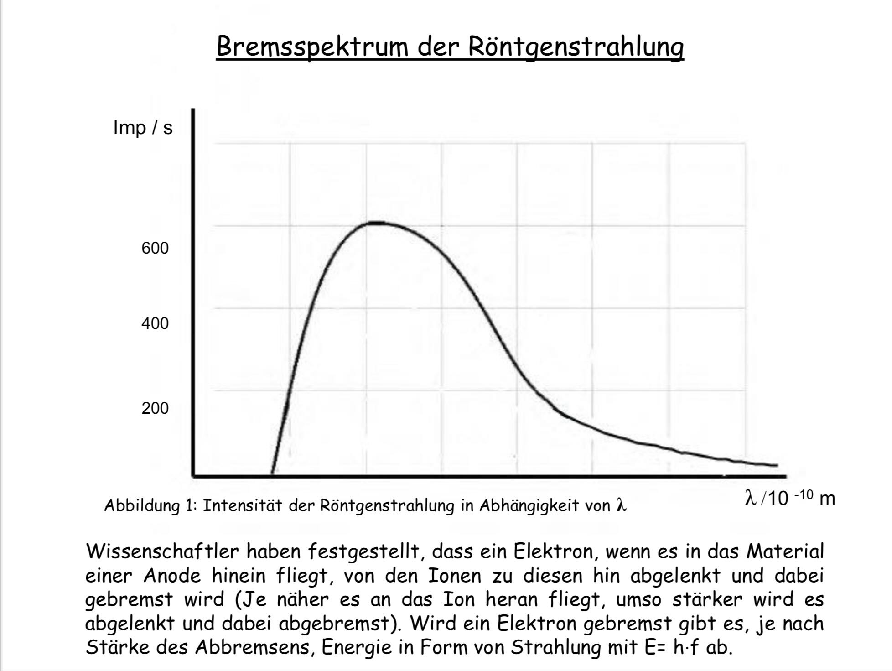
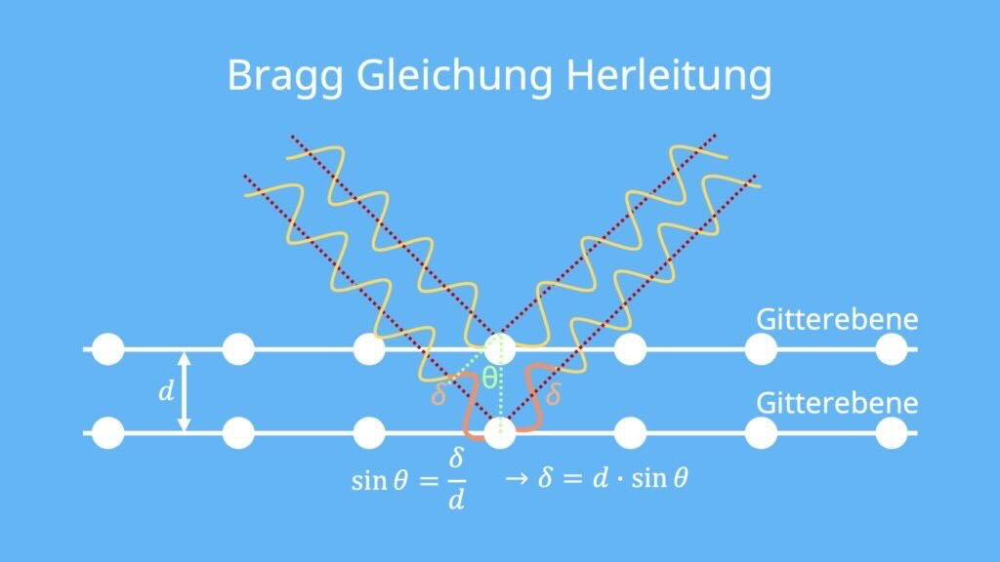
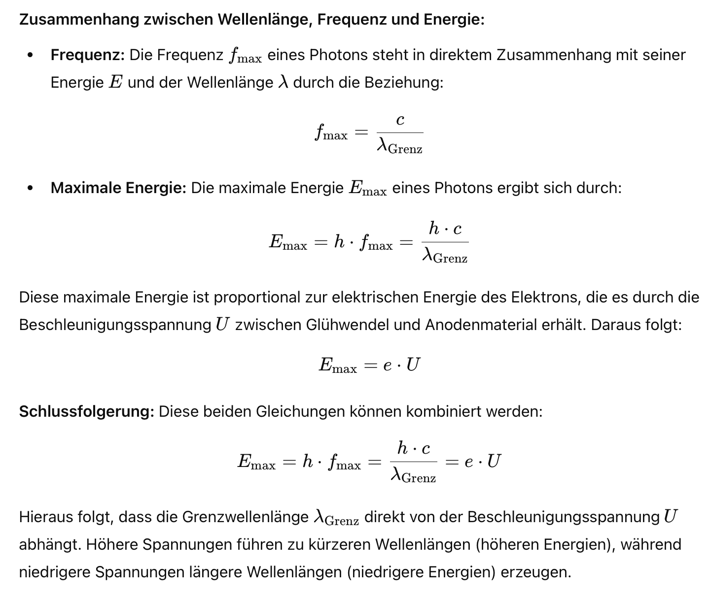

Alles was so  *Beispiel*  geschrieben ist, ist eine der Kernaussagen!!
#### Vorwissen

- **Zink als unedles Metall:** Zink ist ein unedles Metall, was bedeutet, dass es leicht Elektronen abgibt. Elektronen werden durch das energiereiche UV-Licht aus dem Zink gelöst, da die Bindung zwischen den Atomen schwächer ist als beispielsweise bei Kupfer.

- **Ionisation durch Licht:** Wenn Licht mit einer geeigneten Wellenlänge auf ein Material trifft, kann es Elektronen aus den Atomen herauslösen, indem es das Atom ionisiert. Die Wellenlänge des Lichts muss ausreichend kurz sein, um genug Energie zu übertragen, um die Elektronen zu lösen.
#### 2. Erläuterung des Graphen zur Elektronenemission
(Photonen werden von der Lampe emittiert und gelangen zur Zn-Platte)

Verlauf der Stromstärke nach Einwirkung von Licht

**Teil 1: Beschleunigung der Elektronen**
- Elektronen werden von der Kathode in verschiedene Richtungen und mit unterschiedlichen Geschwindigkeiten emittiert. Bei einer erhöhten Spannung werden pro Zeiteinheit mehr Elektronen zur Anode gelangen. Dies geschieht, weil die Geschwindigkeits- und Orientierungsunterschiede durch die höhere Energie bei höhere Spannung ausgeglichen werden.

**Teil 2: Zusammenhang zwischen Photoelektronen und Stromstärke**
 - Bei Spannungen ab etwa 20V gleichen sich die Unterschiede in Geschwindigkeit und Richtung aus, sodass alle emittierten Elektronen effizient zur Anode gelangen. Somit ist der Anzahl der durch Licht ausgelösten Photoelektronen proportional zur Stromstärke. Bzw. es bleiben keine anderen Elektronen, die nicht zur Anode effzent sich bewegen. Stromstärke ist also maximal.

#### 3. Versuche mit unterschiedlichen Lichtquellen

- **Fotostromstärke proportional zur Beleuchtungsstärke:** Die Stärke des Fotostroms ist proportional zur Zahl der einfallenden Photonen. Das bedeutet, dass eine höhere Beleuchtungsstärke zu einem stärkeren Fotostrom führt.

- **Zusammenhang zwischen Wellenlänge und Fotostrom:** 
  - Kürzere Wellenlängen (z.B. UV-Licht) sind energiereicher und führen zu einem höheren Fotostrom.
  - Eine höhere Lichtintensität (mehr Photonen) führt ebenfalls zu einem höheren Fotostrom (mit Einschränkung)
    
- **Wellentheorie Widerspruch**
	Nach der Wellentheorie sollten Elektronen im Metall von der einfallenden Lichtwelle zu Schwingung angeregt.
	Bei höherer Intensität -> stärkere Schwingung -> größere Amplitude bei Schwingung -> Leichter abgelöst -> sollten mehr Elektronen herausgelöst werden.
	Bei niedriger Intensität -> schwächere Schwingung -> kleinere Amplitude bei Schwingung -> schwerer abgelöst -> sollte UV-Licht keine Elektronen herauslösen. 
	oder Einfacher: Es sollte zumindest *bei höher Intensität, die wellen konstruktive interferieren um die Austrittsarbeit zu erreichen und dabei Fotostrom zu erzeugen*..... dies ist aber nicht der Fall!

	- Bei diesem Versuch (Hallwachs) wurde erkannt, dass rotes licht kein Fotostrom erzeugen kann, unabhängig von der Lichtintensität!
		- Dies führt zur Einsteins *Teilchenvorstellung*:
			- *Licht besteht aus Photonen, die Energiepakete darstellen. Ein Elektron kann immer nur die Energie eines einziges Photons aufnehmen, wenn es vom Photon gestoßen wird.*
			- *Höhere Intensität kann nur mehr Elektronen lösen, wenn die Energie eines Photons ausreichend ist, um ein Elektron auszulösen*. 
		- Dies bedeutet, dass die Photonen bei rotem Licht nicht genug Energie übertragen, um die Elektronen freizusetzen (Austrittsarbeit) und damit Fotostrom zu erzeugen.
		- Sichtbares Licht bzw. liegt zwischen 380nm und 780nm.
#### 4. Experimentelle Überprüfung des Photoelektrischen Effekts

- **Versuch mit umgekehrter Feldrichtung:** Um die Energie der emittierten Elektronen zu überprüfen, kann ein Experiment durchgeführt werden, bei dem das elektrische Feld so eingestellt wird, dass es den Elektronen entgegenwirkt. Nur die energiereichsten Elektronen erreichen die Anode. Das dient als Filter zu den energiereichen Elektronen und somit können wir wirklich überprüfen, ob Blaues Licht wirklich energiereicher als grünes oder rotes ist.

*Sehr guter Versuch um Energie der Wellenlängen zu untersuchen oder Geschwindigkeit der Elektronen zu bestimmen*

Licht gelangt zur Kathode und löst dabei Elektronen die zur Anode bewegt werden. Dabei wird eine Gegenspannung erhöht bis der Photostrom Null erreicht. 

- **Ergebnis:** Je kleiner die Wellenlänge des Lichts, desto höher muss die entgegengesetzte Spannung sein, um den Stromfluss zu blockieren. Dies zeigt, dass *kürzere Wellenlängen mehr Energie (haben) oder (auf die Elektronen übertragen können)*.
	- Dies bestätigt die vorherige Vermutungen aus 3. und besagt, dass es *eine bestimmte Grenzfrequenz gibt, ab der ein Photonen genug Energie hat, um ein Elektron auszulösen. Diese Grenzfrequenz ist vom Material abhängig. Beim verlassen des Materials wird eine Energie die vom Material abhängig benötigt, um Stoße im Material zu überwinden. Dies wird als die Material abhängige Austrittsarbeit $W_{a}$ bezeichnet.* 
		
			**X-Achsenabschnitt:**
				  - Der Schnittpunkt der Geraden mit der X-Achse gibt die sogenannte **Grenzfrequenz** an. Diese Frequenz ist die mindest Frequenz des einfallenden Lichts, bei der gerade noch Elektronen aus der Oberfläche des Materials herausgelöst werden können. Bei Frequenzen unterhalb dieser Grenzfrequenz reicht die Energie der Photonen nicht aus, um Elektronen zu emittieren. 
				  - Mathematisch entspricht dies der Bedingung, bei der die kinetische Energie null ist, d.h.
				  - $$ E_{\text{kin}} = h \cdot f - W_a = 0$$
				  - $$h\cdot f=E_{kin} + W_{a}$$
		    **Y-Achsenabschnitt:**
			  - Der Schnittpunkt der Geraden mit der Y-Achse stellt die Austrittsarbeit dar. Dies ist die Energie, die benötigt wird, um ein Elektron aus dem Material herauszulösen.
			  - Je höher der Y-Achsenabschnitt (weiter vom Nullpunkt entfernt), desto größer ist die Austrittsarbeit des jeweiligen Materials. Dies zeigt sich in der Verschiebung der Geraden für verschiedene Metalle wie Cs, Na, Mg, Zn und W.

#### 5. Erklärung des Zusammenhangs und der Einstein-Formel

- **Einstein-Formel:** ($h$ -> planckschen Konstante ($6,626 * 10^-34 Js$) , $f$-> Frequenz, $W_{a}$ -> Austrittsarbeit, $E_{kin,max}$ -> Energie eines Photons)
$$E_{\text{kin, max}} = h \cdot f - W_a$$
  - Wenn monochromatisches Licht auf die Kathode strahlt, erhalten die Elektronen die Energie:
  $$E = h \cdot f$$
  - Ein Teil dieser Energie wird benötigt, um das Elektron aus dem Material herauszulösen (Auslösearbeit). Die restliche Energie wird als kinetische Energie des Elektrons verwendet.
#### 6. Bestimmung der Planckschen Konstante $h$ und kinetische Energie $E_{kin}$

##### Gegenfeldmethode Mit Kondensator

- **Gegenfeldmethode (mit Kondensator):** Durch das einfallende Licht auf die Kathode werden durch den *Photoeffekt Elektronen freigesetzt*, die Richtung Anode hin beschleunigt werden. Dort führen sie zur *Ladungstrennung im Kondensator*, wodurch sich eine Spannung aufbaut. Mit längerer Bestrahlung der Kathode *steigt die Kondensatorspannung* weiter an und erzeugt eine Gegenspannung. Diese *Gegenspannung* wirkt dem Elektronenstrom entgegen und erhöht sich, bis sie der *maximalen kinetischen Energie der Elektronen* entspricht. Sobald diese *Grenzspannung* erreicht ist, wird der Photostrom null.

- **Berechnung der kinetischen Energie:** Die kinetische Energie der schnellsten Elektronen kann dann durch
$$E_{\text{kin}}=e\cdot U_{gegenspannung}=h\cdot f-W_{a}$$
bestimmt werden. Diese Energie kann dann verwendet werden, um die Geschwindigkeit der Elektronen zu berechnen durch die folgende Gleichung: (*E* -> Kinetische Energie (in Joule), *m* -> Masse des Elektrons in Kg beträgt 9.109 * 10^-31, *v* -> Geschwindigkeit des Elektrons)
$$E_{\text{kin}} = \frac{1}{2} m_e v^2$$

##### Umkehrung des Fotoeffekts in Leuchtdioden

Eine *LED* besteht aus einem *Halbleitermaterial*. Sie beginnt ab einer bestimmten *Schwellspannung $U_{schwelle}$ zu leuchten*. Dabei *rekombinieren* im Halbleiter ein *Elektron* und ein *Loch*, wodurch ein *Photon (ein Energiepaket und hier zum Leuchten) ausgesendet wird*. Die Energie dieses Photons hängt von der Bandlücke des Halbleitermaterials ab, die wiederum die Schwellspannung bestimmt.  somit gilt:
$$E_{elektr}=e\cdot U_{schwelle}$$

wir wissen aber dass die Energie eines Photons:
$$E_{photon}=f\cdot h$$

*Somit gilt (andere h-Formel):*
$$e\cdot U_{schwelle}=h\cdot f$$

Die Geschwindigkeit des Lichtes (Photonen): (Frequenz-Wellenlänge umrechnen)
$$c=\lambda\cdot f$$

In dieser Abbildung gibt's zwei Wege zur H-Bestimmung (Hier ist die allgemeine Energie gemeint und nicht die maximale kinetische Energie!)

- **Einheitenumrechnung:** Um die Energie in Joule umzurechnen, muss $E_{kin}$ mit (1,6 * 10^-19) multipliziert werden.

#### 7. Röntgenstrahlung - Bremsspektrum mit kontinuierlichen Spektrum und h-Bestimmung mit kurzwelliger Grenze

Reine Entstehung ohne Erklärung wieso entstehen Röntgenstrahlung 
(Polung muss umgedreht bei $U_H$)

##### Erklärung

**Einführung in die Röntgenstrahlung:**
- Röntgenstrahlung entsteht, wenn hochenergetische Elektronen in einem Material stark abgebremst werden. Dieses Bremsen führt zur Emission von Photonen, deren Energie direkt von der Stärke der Abbremsung abhängt.

  

**Erläuterung des Bremsprozesses:**
- Elektronen, die mit hoher Geschwindigkeit in das Material der Anode eintreten, werden durch die Coulomb-Wechselwirkung mit den Atomkernen des Anodenmaterials abgelenkt und abgebremst. Je nach Nähe des Elektrons zum Atomkern wird das Elektron unterschiedlich stark abgebremst:

**Naher Vorbeiflug an einem Atomkern:**
- Wenn ein Elektron sehr nahe an einem Atomkern vorbeifliegt, erfährt es eine starke Ablenkung und verliert dabei eine große Menge seiner kinetischen Energie. Diese Energie wird als Röntgenphoton emittiert. Da die Energie E eines Photons und seine Wellenlänge $\lambda$  gemäß der Gleichung $E = h f = \frac{hc}{\lambda}$ in einer umgekehrten Beziehung stehen, bedeutet eine hohe Energie ein Photon mit einer kleineren Wellenlänge.

**Weiter Vorbeiflug an einem Atomkern:**
- Wenn ein Elektron weiter entfernt an einem Atomkern vorbeifliegt, wird es weniger stark abgebremst. Es verliert also weniger Energie, sodass das emittierte Photon eine größere Wellenlänge hat.

**Interpretation des Graphen:**
Der dargestellte Graph zeigt die Intensität der Röntgenstrahlung in Abhängigkeit von der Wellenlänge $\lambda$. Das Bremsspektrum ist kontinuierlich, weil die Elektronen beliebige Mengen an Energie abgeben können, anstatt nur diskrete Energiewerte zu verlieren.

- *Die X-Achse* repräsentiert die Wellenlänge der emittierten Photonen. Ein Punkt nahe am Ursprung entspricht einem sehr stark gebremsten Elektron, das fast seine gesamte kinetische Energie in ein einzelnes Photon umgewandelt hat (kleinste Wellenlänge, höchste Photonenenergie).
- *Die Y-Achse* zeigt die Anzahl der emittierten Photonen bei einer bestimmten Wellenlänge. Der Graph gibt also an, wie häufig Elektronen eine bestimmte Energiemenge in Form von Photonen abgegeben haben.
- *Grenzwellenlänge:* Der linke Rand des Spektrums (Schnittpunkt des Graphen mit der X-Achse) gibt die kleinste mögliche Wellenlänge an, die durch die maximale Energie der Elektronen bestimmt wird: $\lambda_{\text{min}} = \frac{hc}{eU_B}$.
   Dies entspricht dem Fall, dass ein Elektron seine gesamte kinetische Energie auf einmal in ein einziges Photon umwandelt.

  

**Einfluss von Spannung und Material:**
*Spannung:*
- Durch Erhöhung der Beschleunigungsspannung U_B der Elektronen wird ihre Gesamtenergie erhöht. Dadurch verschiebt sich das gesamte Bremsspektrum nach links (zu kleineren Wellenlängen), da Photonen mit höheren Energien erzeugt werden können. Umgekehrt bewirkt eine geringere Spannung eine Verschiebung des Spektrums nach rechts (größere Wellenlängen).

##### Bestimmung der H

###### **1. Bestimmung der Wellenlänge der Röntgenstrahlung mit der Drehkristallmethode**

in der Abbildung soll jetzt eigentlich bei den orangenfarbigen Welle eine halbe Wellenlänge da sein, damit wir auf die zwei bei der Formel kommen.

**Grundprinzip:**
Bei der Drehkristallmethode wird Röntgenstrahlung auf einen Kristall, wie z.B. einen NaCl-Kristall, gerichtet. Hierbei sind insbesondere die Na-Ionen im Kristallgitter von Bedeutung. Wenn die Röntgenstrahlen unter einem bestimmten Winkel $\beta$  auf den Kristall treffen, werden sie im gleichen Winkel zum Detektor reflektiert. Diese reflektierten Strahlen können konstruktiv interferieren,  wenn der Gangunterschied zwischen den reflektierten Strahlen einem Vielfachen der Wellenlänge entspricht (Bragg-Bedingung). 
$$n\cdot \lambda = 2 \cdot d \cdot \sin(\beta)$$
	Hierbei steht \(d\) für den Netzebenen-Abstand, also den Abstand zwischen den einzelnen Na-Ionen im Kristallgitter.

Somit wird zu jedem Winkel $\beta$ (Winkel zwischen der Kristalloberfläche und der Horizontale) eine bestimmte Wellenlänge $\lambda$ eingeordnet und der Zähler zählt die Intensität zur jedem Winkel. *Dabei muss der Winkel zwischen dem Zähler und der Horizontale $2\beta$ sein.* 

Warum ? weiß ich nicht.....

- Je nach verwendeten Material liegt die *Wellenlänge der Röntgenstrahlung* im Bereich von
$$7,079\times10^{-11}\,\text{m     bis  }7,16\times10^{-11}\,\text{m}$$

---

###### **2. Bestimmung der Kurzwellige Grenze der Röntgenstrahlung mithilfe der Bragg-Bedingung**

Grundprinzip:
Die Grenzwellenlänge der Röntgenstrahlung entsteht in einer Röntgenröhre, wenn Elektronen durch unelastische Stoße mit den Atomkernen ihre komplette kinetische Energie in Form von Photonen abgeben.

Es geht um die schnellsten Elektronen, die ihre volle Energie im Form von Photonen abgeben.

##### *Seite 223 ist wichtig als Übung!*
#### 8. Entstehung der Debye-Scherrer-Ringe (d bestimmen)

- **Grundprinzip:** (Wie kommt es zu dieser hellen Kreisen ?)
  Wenn Röntgenstrahlung auf eine Folie mit Kristallpulver trifft, wird die Strahlung an den *einzelnen Kristallfragmenten gebeugt*. Hinter der Folie, auf einem Röntgenfilm, entsteht ein *Interferenzmuster in Form von Kreisen mit unterschiedlichen Radien*. 

- **Konstruktive Interferenz:** (Warum sind die Hell ?)
  Die *hellen Kreise* auf dem Film entsprechen konstruktiver Interferenz, die dann auftritt, wenn die *Bragg-Bedingung* erfüllt ist. Das heißt, die gebeugten Röntgenstrahlen *überlagern sich* so, dass ein *Maximum der Intensität entsteht*.

- **Ringstruktur:** (Warum sind die Kreisförmig ?)
  Jedes Kristallfragment, bei dem die *Bragg-Bedingung erfüllt* ist, erzeugt einen *hellen Punkt* auf dem Film. Da die Kristallfragmente in *vielen unterschiedlichen Orientierungen* vorliegen, entsteht insgesamt eine *Ringstruktur*.

##### Wichtige Formeln im Debye-Scherrer-Verfahren

1. **Bragg-Gleichung:**$$ n \cdot \lambda=2\cdot d \cdot \sin(\theta) $$
   - **d**: Abstand der Netzebenen im Kristall
   - **θ**: Beugungswinkel
   - **n**: Beugungsordnung (meistens 1)
   - **λ**: Wellenlänge der Röntgenstrahlung

2. **Radius der Debye-Scherrer-Ringe:**
   
   $$r = L \cdot \tan(2\theta)$$

   - **L**: Abstand zwischen Folie mit Kristallfragmente und Röntgenfilm
   - **θ**: Beugungswinkel

3. **Berechnung des Abstandes der Netzebenen \(d\):**
 
   $$\theta = \frac{1}{2} \cdot \arctan\left(\frac{r}{L}\right)$$

   $$d = \frac{n \cdot \lambda}{2 \cdot \sin\left(\frac{1}{2} \arctan\left(\frac{r}{L}\right)\right)}$$

##### Zusammenfassung der wichtigsten Punkte
- Die **Debye-Scherrer-Ringe** entstehen durch die Beugung von Röntgenstrahlen an Pulverproben.
- Das Interferenzmuster auf dem Film entspricht der konstruktiven Interferenz nach den **Bragg-Bedingungen**.
- Aus der Radius der Ringe (**r**) kann der Beugungswinkel **θ** berechnet werden, um den Abstand **d** der Netzebenen im Kristall zu bestimmen.

#### 9. Elektronenbeugung & De Broglie Wellenlänge

##### Elektronenbeugung

In einer evakuierten Röhre werden Elektronen durch den glühelektrischen Effekt aus der Kathode emittiert und durch eine angelegte Beschleunigungsspannung zur Lochanode hin beschleunigt. Nachdem sie die Lochanode passiert haben, treffen sie auf eine polykristalline Graphitschicht und werden da gebeugt. Die gebeugten Elektronen werden dann auf einem Leuchtschirm sichtbar gemacht.

Polykristalline: Zufällige Anordnung von vielen Kristalliten, jeder Kristallit enthält Streuzentren.
Die polykristalline Graphitschicht besteht aus vielen Mikrokristallen, die in verschiedenen Orientierungsrichtungen vorliegen. Dadurch entstehen zahlreiche mögliche Einfallswinkel für die Elektronen. Trifft ein Elektron auf einen Mikrokristall unter einem bestimmten Winkel, kann es durch Beugung gemäß der Bragg-Bedingung abgelenkt werden. Wird die Bragg-Bedingung erfüllt, so werden die Elektronen um den Winkel 2$\beta$ abgelenkt, andernfalls finden keine Beugungseffekte statt.

Da die Mikrokristalle in allen möglichen Orientierungsrichtungen vorliegen, gibt es stets auch solche, die Elektronen unter genau dem richtigen Winkel treffen, um eine Beugung gemäß der Bragg-Bedingung zu ermöglichen. Durch diese zufällige Verteilung der Kristallorientierungen entsteht auf dem Leuchtschirm konstruktiven Interferenz in Verbindung mit dem Winkel
radialsymmetrisch eine kreisförmige Ringstruktur.

**Hinweise**:
*Nachweis, dass es sich um Elektronen handelt:*
- Bringt man einen Magneten in die Nähe der Röhre, insbesondere in die Zone zwischen der Graphitfolie und dem Fluoreszenzschirm, so verschiebt sich das gesamte Beugungsbild. Dies liegt daran, dass Elektronen als geladene Teilchen durch das Magnetfeld gemäß der Lorentzkraft abgelenkt werden. Röntgenstrahlung sind ungeladene elektromagnetische Wellen, darum würde ein Magnet keinen Einfluss auf sie haben. Dies bestätigt, dass es sich um Elektronen und nicht um Röntgenstrahlung handelt.

*Einfluss der Beschleunigungsspannung auf den Ringradius:*
- Mit zunehmender Beschleunigungsspannung steigt die kinetische Energie der Elektronen, wodurch sich ihre Geschwindigkeit erhöht. Da die Elektronen eine De-Broglie-Wellenlänge von $\lambda = \frac{h}{p} = \frac{h}{\sqrt{2 \cdot e \cdot m_{e} \cdot U_B}}$ besitzen, führt eine höhere Spannung $U_B$ zu einer kleineren Wellenlänge $\lambda$.Da der Beugungswinkel $\beta$  gemäß der Bragg-Bedingung $n\lambda = 2d \sin\beta$ von der Wellenlänge abhängt, resultiert eine kleinere Wellenlänge in einem kleineren Beugungswinkel $\beta$. Dadurch werden die Beugungsmaxima auf dem Leuchtschirm näher zusammengedrückt, und der Radius der Ringe verkleinert sich.

*Entstehung zweier Ringmuster:*
- Die Graphitfolie besitzt zwei unterschiedliche Netzebenenabstände $d$, sodass zwei verschiedene Bragg-Bedingungen erfüllt werden. Die größeren Netzebenenabstände führen zu einem größeren Beugungswinkel $\beta$, während kleinere Netzebenenabstände zu einem kleineren Winkel führen. Dadurch entstehen zwei verschiedene Ringmuster, wobei die Ringe mit dem größeren Netzebenenabstand $d$ den kleineren Radius haben.

##### De Broglie Wellenlänge

Die **de-Broglie-Hypothese** besagt, dass sich Teilchen (wie Elektronen) unter bestimmten Bedingungen wie Wellen verhalten. Dies führt zur sogenannten **de-Broglie-Wellenlänge** ($\lambda$), die die Wellen-Natur eines Teilchens beschreibt.

---

###### Grundlegende Formel der de-Broglie-Wellenlänge

Die de-Broglie-Wellenlänge ist gegeben durch:

$$
\lambda = \frac{h}{p}
$$

- $h$ = Planckschen Wirkungsquantum ($6.626 \times 10^{-34} \, \text{Js}$)
- $p$ = Impuls des Teilchens ($p = m \cdot v$)

---

###### Zusammenhang zwischen Energie und Wellenlänge

Für die Energie eines Photons gilt:

$$
E = h \cdot f = h \cdot \frac{c}{\lambda}
$$

Für Materiewellen wird die Energie im relativistischen Fall wie folgt beschrieben:

$$
E = m \cdot c^2
$$

Daraus folgt für die Wellenlänge:

$$
\lambda = \frac{h \cdot c}{E} = \frac{h \cdot c}{m \cdot c^2} = \frac{h}{m \cdot c} = \frac{h}{p}
$$

---

###### Herleitung der Geschwindigkeit $v$

Die Geschwindigkeit eines Elektrons nach Beschleunigung durch eine Spannung $U$ ergibt sich durch den Energieerhaltungssatz, wobei die elektrische Energie $E_\text{el}$ der kinetischen Energie $E_\text{kin}$ entspricht:

$$
E_\text{el} = E_\text{kin}
$$

Da $E_\text{el} = e \cdot U$ und $E_\text{kin} = \frac{1}{2} m \cdot v^2$, folgt:

$$
e \cdot U = \frac{1}{2} m \cdot v^2
$$

Nach Umstellen nach $v$ erhält man:

$$
v = \sqrt{\frac{2 \cdot e \cdot U}{m}}
$$

---

###### Berechnung der de-Broglie-Wellenlänge bei beschleunigten Elektronen

Die de-Broglie-Wellenlänge für Elektronen, die durch eine Spannung $U_B$ beschleunigt wurden, ist:

$$
\lambda = \frac{h}{\sqrt{2 \cdot e \cdot m_e \cdot U_B}}
$$

- $h$ = Planckschen Wirkungsquantum
- $e$ = Elementarladung ($1.602 \times 10^{-19} \, \text{C}$)
- $m_e$ = Elektronenmasse ($9.109 \times 10^{-31} \, \text{kg}$)
- $U_B$ = Beschleunigungsspannung

---

###### Weitere Zusammenhänge und Beobachtungen im Experiment

1. **Radius und Beschleunigungsspannung**: Der Radius des Beugungsrings ist antiproportional zur Beschleunigungsspannung $U_B$. Eine höhere Spannung (höhere Geschwindigkeit) führt zu einer kleineren Wellenlänge und damit zu einem kleineren Beugungsradius.

2. **Verhältnis zwischen Radius und Gitterabstand**: Der größere Winkel (größerer Radius des Rings) entspricht einem kleineren Gitterabstand $d$ des Kristallgitters, durch das die Elektronen gebeugt werden.

---

###### Formelzusammenfassungen

- **Impuls eines Elektrons**: $$p = m_e \cdot v$$
- **Planckschen Wirkungsquantum in Zusammenhang mit de-Broglie-Wellenlänge und Impuls**: $$h = \lambda \cdot p = \lambda \cdot \sqrt{2 \cdot e \cdot m_e \cdot U_B}$$

Diese Beziehung gilt insbesondere für kleine Winkel $\theta < 10^\circ$, bei denen die Näherung $\sin(\theta) \approx \tan(\theta)$ verwendet werden kann:
$$\tan\left(2\theta\right)=\frac{r}{L}$$
$$\lambda=2\cdot\sin\left(\theta\right)\cdot d=\frac{r}{L}\cdot d$$

- **$h$**: Planckschen Wirkungsquantum ($6.626 \times 10^{-34} \, \text{Js}$), eine fundamentale Konstante der Quantenmechanik.
- **$p$**: Impuls eines Teilchens (typischerweise in $kg \cdot m/s$).
- **$\lambda$: Wellenlänge in $m$
- $m_e$: Masse eines Teilchens, hier speziell eines Elektrons.
- **v**: Geschwindigkeit des Teilchens (in $m/s$).
- **$U_B$**: Beschleunigungsspannung oder -potenzial (in Volt, $V$), das auf das Teilchen (typischerweise ein Elektron) angewendet wird.
- **e**: Elementarladung, die Ladung eines Elektrons (ca. $1.602 \times 10^{-19} \, C$).
- **$m_e$**: Elektronenmasse (ca. $9.109 \times 10^{-31} \, kg$).
- **d**: Netzebenenabstand in Metern.
- **$\theta$**: Beugungs- oder Streuwinkel.
- **$r_l$**: Pfaddifferenz oder eine verwandte Größe im Kontext von Interferenzmuster.
- **l**: Abstand zum Schirm oder Detektor von der Beugungsquelle.

--- 

#### 10. Interferenz einzelner Quantenobjekte 

##### Prinzip der statistischen Vorhersagbarkeit
Wenn das Doppelspaltexperiment mit einzelnen Elektronen durchgeführt wird, zeigt sich auf dem Schirm zunächst eine zufällige Verteilung der Einschläge. Doch mit steigender Anzahl an Elektronen bildet sich ein deutliches Interferenzmuster heraus, ähnlich wie bei Wellenphänomenen. Die ersten wenigen Elektronentreffer verdeutlichen, dass *der Ort, an dem ein einzelnes Quantenobjekt nachgewiesen wird, prinzipiell nicht vorhersagbar ist.* Diese Unvorhersagbarkeit verweist auf das Prinzip der Indeterminierbarkeit in der Quantenphysik, das einen fundamentalen Unterschied zur klassischen Physik darstellt. *Hier liefert die Quantenphysik nur statistische Aussagen, die jedoch reproduzierbar sind.*

  
##### Wellenmodell vs Teilchenmodell
Einzelne Ereignisse bleiben unvorhersagbar, aber bei vielfacher Wiederholung des Experiments entsteht eine klar reproduzierbare Verteilung. *Das Verhalten von Quantenobjekten lässt sich dabei weder vollständig durch ein Teilchenmodell noch durch ein reines Wellenmodell erklären*.*Das Wellenmodell deutet die entstehenden Streifen als Interferenzmuster, kann jedoch die punktförmige Detektion der Quantenobjekte anfangs nicht begründen*. *Wäre das Elektron eine reine Welle, müssten die Interferenzstreifen sofort erkennbar sein*. *Das Teilchenmodell wiederum erklärt die punktförmigen Einschläge, indem es das Quantenobjekt als Teilchen betrachtet, das seine gesamte Energie an einer einzigen Stelle abgibt. Allerdings kann es das Interferenzmuster nicht erklären, das sich erst bei vielen Elektronen zeigt.*

  
##### Wahrscheinlichkeitsinterpretation
Die Lösung liegt in der Wahrscheinlichkeitsinterpretation: Hier wird das Elektron durch eine *Wellenfunktion* $Ψ$ beschrieben, die sich *gemäß den Wellengleichungen ausbreitet*. Das *Quadrat der Wellenfunktion*, $Ψ^2$, gibt die *Wahrscheinlichkeit an, ein Elektron an einem bestimmten Ort zu messen*. Bei der Detektion wird $Ψ(x,t)^2$ als die Wahrscheinlichkeit interpretiert, ein Elektron an der Position $x$ zu finden. Zwar lässt sich der *exakte Ort des nächsten Elektrons nicht vorhersagen*, jedoch die *Wahrscheinlichkeitsverteilung*, mit der es an *verschiedenen Stellen auftauchen könnte.* An Interferenzminima ist dabei $Ψ(x,t)^2 = 0$.

  
##### Koinzidenzmethode

Link: https://youtu.be/EFS4kxce1Hg

Koinzidenz bezieht sich auf die gleichzeitige Registrierung von Photonen durch zwei oder mehr Detektoren. Der Strahlteiler teilt den eingehenden Lichtstrahl in zwei Wege auf. Detektoren **A** und **B** könnten dabei so positioniert sein, dass **A** ein Photon auf dem direkten Weg vom Strahlteiler registriert, während **B** ein Photon auf einem reflektierten Weg vom Strahlteiler registriert. Dies wird eingesetzt, um den Teilchen-Wellen Dualismus zu untersuchen. Falls bei Detektoren **A** und **B** eine hohe Koinzidenzrate auftreten würde, könnte dies auf eine Wellen-Natur des Lichts hindeuten, da sich in diesem Fall das Licht in Form einer Welle überlagern und beide Wege gleichzeitig beeinflussen würde. In Experimenten mit einzelnen Photonen erwartet man jedoch, dass die Koinzidenzrate null ist, weil ein Photon entweder in den einen oder den anderen Weg geleitet wird. 

#### 11. Mach-Zehender-Interferometer

##### Aufbau des Mach-Zehnder-Interferometers

-  **Komponenten**: Laserquelle, Strahlteiler, Spiegel, Schirm/Detektor.
- **Funktionsweise**:
	- Der Laserstrahl wird durch einen **Strahlteiler** in zwei Wege (Weg A und Weg B) aufgeteilt.
	- Beide Strahlen durchlaufen unterschiedliche optische Pfade, werden an Spiegeln reflektiert und am Ende des Aufbaus erneut auf einen **Schirm** oder Detektor durch den zweiten Strahlteiler zusammengeführt.
	- Die Strahlteiler sind halbdurchlässige Spiegel, die bei Reflexion einen **Phasensprung von** erzeugen. Dieser Phasensprung tritt auf, wenn eine Welle an der Außenseite des Strahlteilers reflektiert wird.
		Am **ersten Strahlteiler** teilt sich der ursprüngliche Strahl in zwei Pfade:
		• **Pfad a** wird reflektiert und erhält durch den Phasensprung eine Verschiebung von $\pi$.
		• **Pfad b** passiert den Strahlteiler ohne Phasensprung.
		
		Beide Strahlen werden anschließend von Spiegeln reflektiert:
		• **Pfad a** erfährt durch die Spiegelreflexion einen zusätzlichen Phasensprung von $\pi$, sodass die Gesamtverschiebung hier 2$\pi$ beträgt.
		• **Pfad b** wird reflektiert, wodurch seine Gesamtverschiebung bei $\pi$ bleibt.
		
		Am **zweiten Strahlteiler**:
		• **Pfad a** wird an der **Innenseite** des Strahlteilers **reflektiert**, wobei kein **zusätzlicher Phasensprung auftritt**. Dieser Strahl erreicht die Detektoren mit einer Gesamtverschiebung von 2$\pi$.
		• **Pfad b** kann entweder:
		1. **Ohne Phasensprung** durch den Strahlteiler hindurchgehen, wodurch er mit einer Gesamtverschiebung von $\pi$ Detektor 1 erreicht.
		2. An der **Außenseite** des Strahlteilers reflektiert werden, was einen weiteren Phasensprung von $\pi$ verursacht. Dadurch erreicht er Detektor 2 mit einer Gesamtverschiebung von 2$\pi$.
		
		Am **Detektor 2** treffen beide Strahlen (Pfad a und Pfad b) mit einer Gesamtverschiebung von 2$\pi$ ein. Dies führt zu **konstruktiver Interferenz**, sodass dieser Detektor ein Signal registriert.
		
		Am **Detektor 1** treffen die Strahlen hingegen mit einer **Phasenverschiebung** von $\pi$ (Pfad a) und (Pfad b) ein. Aufgrund des Phasenunterschieds von kommt es hier zu **destruktiver Interferenz**, und der Detektor bleibt dunkel.
- **Michelson Interferometer** hat einen regelbaren Schirm, wodurch den Phasensprung nach Wunsch angepasst werden kann, wobei eine Verschiebung der Schirm um einen Viertel der Wellenlänge, verursacht eine Verschiebung um die halbe Wellenlänge, da der Weg hin und zurück ist. 
	  

##### Interferenz mit einzelnen Photonen

*Präparation*: Ausgangszustand des betrachteten Quantenobjektes, wobei seine Eigenschaften bekannt sind.
*Zustand*: Alle Informationen, die über ein Quantenobjekt bekannt sind. (z.B.: vor dem Strahlteiler ist es einfach das vorbereitete Quantenobjekt, aber nach dem Strahlteiler ist der Zustand die Superposition beide Teilzustände(Reflexion und Transmission))
*Teilzustand*: Ein Begriff der eine der verschiedenen Möglichkeiten, die sich durch den Superposition eines Quantenobjektes ergeben, beschreibt.
*Kausalität*: Eine Ursache (z.B. der Einbau des dritten Polarisationsfilters) nur solche Wirkungen auf das System haben kann, die in der Zukunft liegen, nie in der Vergangenheit, und auch nur an solchen Orten, die höchstens mit Lichtgeschwindigkeit erreichbar sind.

**Photon-Experiment: Erkennen von Wellen- und Teilchencharakter**
(mit Schirm anstatt Detektoren, damit Interferenz zu sehen ist)
Führt man das Experiment mit einzelnen Photonen durch, so kann man Wellen- und Teilchencharakter durch verschiedene Einstellungen des Experiments erkennen. Lässt man den zweiten Strahlteiler im Versuch, so gibt es zwei klassisch denkbare Möglichkeiten für das Eintreten des gleichen Versuchsergebnisses (Beispiel: Weg A oder Weg B, um bei Detektor 1 anzukommen, da am Ende beide Wege zum Detektor zusammenführen). Unter dieser Voraussetzung ist ein Interferenzmuster zu erkennen. Entfernt man jedoch den zweiten Strahlteiler, so gibt es nur eine klassisch denkbare Möglichkeit, zum Detektor 1 zu gelangen, und es ist kein Interferenzmuster zu erwarten. Daraus lässt sich – wie beim Doppelspaltexperiment – erkennen, dass nach dem Prinzip der statistischen Vorhersagbarkeit einzelne Ereignisse, wie das Nachweisen der einzelnen Photonen, nicht vorhersagbar sind. Bei vielen Wiederholungen des gleichen Experiments ergibt sich jedoch eine reproduzierbare Verteilung.

  

**Das Fundamentalitätsprinzip und die Voraussetzungen für Interferenz**

Außerdem kann man daraus das Fundamentalitätsprinzip ableiten, welches besagt, dass einzelne Quantenobjekte zu einem Interferenzmuster beitragen können, vorausgesetzt, es gibt für das Eintreten des gleichen Versuchsergebnisses mehr als eine klassisch denkbare Möglichkeit. In einem anderen Versuch, bei dem das Mach-Zehnder-Interferometer mit Polarisationsfiltern erweitert wird, erkennt man die gleiche Beobachtung: Haben die nachgewiesenen Photonen alle die gleiche Polarisation, gibt es für das Eintreten des Versuchsergebnisses zwei klassisch denkbare Möglichkeiten und somit ist Interferenz möglich. Sind die Polarisationsunterschiede zwischen den verschiedenen Wegen ein ungerades Vielfaches von 90° (Nach dem Winkel den man betrachtet), so gibt es nur eine klassisch denkbare Möglichkeit für das Photon, den Schirm zu erreichen, und somit ist keine Interferenz möglich.

  

**Doppelspaltexperiment: Der Einfluss des Orts auf das Interferenzmuster**

Beim Doppelspaltexperiment lässt sich erkennen, dass Eigenschaften wie der Ort den Quantenobjekten nicht zugeordnet werden können. Denn das Öffnen oder Schließen eines Spaltes beeinflusst das Muster auf dem Schirm genauso wie vorher erklärt, da man dadurch die Anzahl der klassisch denkbaren Möglichkeiten beeinflusst. Ist nur ein Spalt geöffnet, ist kein Interferenzmuster zu erwarten, anders als wenn man beide Spalte öffnet. Somit kann man den Ort nicht als Eigenschaft der Quantenobjekte zuordnen, Interferenz ist jedoch unter diesen Bedingungen zu erwarten. Das kann man auch mit der Wellenfunktion erklären: Ist nur ein Spalt (Spalt A) offen, ordnet man diese Atome der Wellenfunktion $Ψ_A(x)$ zu, die sich halbkreisförmig hinter dem Spalt A ausbreitet. Dasselbe gilt für den Fall, dass nur Spalt B offen ist $Ψ_B(x)$. Die Wahrscheinlichkeitsverteilung entspricht dem Quadrat dieser Funktionen. Addiert man dann beide Verteilungen, um das Endergebnis zu erhalten, ergibt sich $Ψ(x)^{2} = Ψ_A(x)² + Ψ_B(x)²$. Lässt man jedoch beide Spalte offen, so erhält man $Ψ(x) = Ψ_A(x) + Ψ_B(x)$. Die entsprechende Wahrscheinlichkeitsverteilung ist dann $Ψ(x)² = |\Psi_A(x)|^2 + |\Psi_B(x)|^2 + 2 *(\Psi_A(x) \Psi_B(x))$. Man erkennt, dass es zwischen beiden Situationen einen Unterschied gibt, der durch den Wert  das Auftreten des Interferenzmusters mathematisch beschreibt.

  

**Prinzip der Komplementarität: Wechselwirkung zwischen Ortseigenschaft und Interferenzmuster**

Somit ist auch das Prinzip der Komplementarität zu erkennen: *Ortseigenschaft und Interferenzmuster sind nicht gleichzeitig realisierbar, sondern schließen sich gegenseitig aus*. Allgemein ausgedrückt tragen Quantenobjekte trotz mehrerer klassisch denkbarer Möglichkeiten dann nicht zu einem Interferenzmuster bei, wenn das Experiment zum Zeitpunkt der Detektion dieser Quantenobjekte auf dem Schirm eine Information enthält, die man eindeutig einer der klassisch denkbaren Möglichkeiten zuordnen kann (z.B. durch welchen Detektor das Photon durchgegangen ist).
Ein Interferenzmuster kann nicht beobachtet werden, wenn die klassisch denkbaren Möglichkeiten unterscheidbar sind. Unterscheidbar heißt hier, dass eine Zuordnung zum linken oder rechten Spalt möglich ist. Der Umkehrschluss „*Wenn die klassisch denkbaren Möglichkeiten nicht unterscheidbar sind, dann entsteht immer ein Interferenzmuster.*“ gilt jedoch nicht, denn z. B. kann ein großer Unterschied in der Geschwindigkeit der Quantenobjekte als Hindernis zur Erzeugung von Interferenzmustern wirken.

  

**Prinzip der “eindeutigen Messergebnisse” und der Effekt des Messakts**
  
Messergebnisse sind stets eindeutig, auch wenn das Quantenobjekt vor der Messung keine eindeutige Zuordnung dieser Eigenschaft hat (unbestimmter Zustand bezüglich dieser Größe). *Erst durch den Messakt erhält das Quantenobjekt eine eindeutige Zuordnung dieser Eigenschaft, davor jedoch nicht.*

  

**Prinzip der Nicht-Lokalität und Superposition**

Auch das Prinzip der Nicht-Lokalität kann beobachtet werden, da Eigenschaften wie der Ort nicht zugeordnet werden können, wenn keine Messung zur Bestimmung des Wegs durchgeführt wird. In diesem Zustand befindet sich das Photon in einer Superposition – es „nimmt beide Wege gleichzeitig“, was zur Ausbildung eines Interferenzmusters führt. Beobachtet man jedoch nur einen Weg, verschwindet das Interferenzmuster. Dies weist darauf hin, dass die *Weginformation durch Polarisationsfilter oder Ähnliches nicht lokal im System kodiert ist*, was die Superposition verhindert, unabhängig davon, wie weit die beiden Wege voneinander entfernt sind. Man kann also *einen Weg nicht von dem anderen trennen, sondern das gesamte System muss als eine einzige Einheit betrachtet werden*. Mit der Erweiterung durch Polarisationsfilter kann mann es genauer beschreiben. Im Falle des Interferenzmusters (parallele Polfilter) gibt es Gebiete auf dem Schirm, in denen mit Sicherheit kein Photon registriert wird (Minima). In diesen Gebieten werden jedoch Photonen nachgewiesen, wenn auf dem Schirm eine strukturlose Verteilung zu sehen ist (gekreuzte Polfilter). Das Versuchsergebnis, ob in den betreffenden Gebieten Photonen gefunden werden, hängt von der Stellung beider Polarisationsfilter gleichzeitig ab. Somit ist die Vorstellung, dass das Elektron durch Weg A oder durch Weg B geht, schwierig. 

Etwas was auch zum Prinzip der Nicht-Lokalität gehört ist die Frage, ob das Elektron sich für einen Teilzustand entscheidet. Dazu führt man den Delayed-Choice Experiment durch, wobei einen dritten Detektor oder Polarisationsfilter nachdem passieren des Photons den ersten Polarisationsfilter nachträglich eingebaut wird. Das heißt, dass das Photon sich *verzögert umentscheiden muss*. Dies widerspricht aber die Kausalität der Physik. Will man die Kausalität nicht verletzten, dann zeigen diesen Überlegungen, dass sich ein *Quantenobjekt nie für einen Teilzustand einer Superposition entscheidet*, weder zu einem Zeitpunkt noch rückwärts in der Vergangenheit, sondern *immer alle Informationen aus allen Teilzuständen zum Messergebnis beitragen*, auch wenn diese vorher gleichzeitig durch verschiedene, räumlich getrennte Bereiche gelaufen sind.

**Prinzip der Nicht-Lokalität und Superposition (Kurzfassung)**
*Ein Photon kann sich in einer Superposition befinden und „beide Wege gleichzeitig nehmen“, solange keine Messung durchgeführt wird. Dies führt zur Interferenz. Sobald jedoch eine Messung den Weg bestimmt, verschwindet das Interferenzmuster, was zeigt, dass die Weginformation nicht lokal gespeichert ist – das System muss als eine Einheit betrachtet werden.*
*Ein Delayed-Choice-Experiment verstärkt dieses Paradoxon: Wenn ein Polarisationsfilter oder Detektor erst nachträglich platziert wird, beeinflusst dies das zuvor durchlaufene Experiment. Dies scheint der klassischen Kausalität zu widersprechen, legt aber nahe, dass sich ein Quantenobjekt nie für einen bestimmten Teilzustand entscheidet – stattdessen tragen alle möglichen Zustände zur Messung bei, unabhängig davon, wie weit sie räumlich getrennt sind.*

##### Schlussfolgerung

*Dass immer alle Informationen aus allen (kausal – kein Delayed Choice) erreichbaren Bereichen beitragen, auch wenn diese räumlich getrennt sind, also die Nichtlokalität, lässt sich mathematisch widerspruchsfrei beschreiben, steht aber im Konflikt zu unserer klassischen Vorstellung, dass zu einer Zeit immer nur Wechselwirkungen an einem Ort, nämlich dem aktuellen eines Objekts, beitragen sollte – dieser Konflikt stellt das gedankliche Kernproblem zum Verständnis der Quantenphysik dar. Er kann auch heute nicht als gedanklich gelöst betrachtet werden.*

  

#### 12. Unbestimmtheitsrelation

Zwei komplementäre Größen wie Ort und Impuls können in der Quantenmechanik nicht gleichzeitig beliebig genau bestimmt werden. Je präziser der Ort eines Teilchens festgelegt wird, desto ungenauer wird dessen Impuls und umgekehrt. Diese Beziehung stellt keine Einschränkung durch Messmethoden dar, sondern ist eine grundlegende Eigenschaft der Natur auf quantenmechanischer Ebene.

  

Ein anschauliches Beispiel hierfür ist das Einzelspaltexperiment. Werden Elektronen durch einen Spalt der Breite x geschickt, zeigt sich hinter dem Spalt eine Streuung der Impulse, die durch die Standardabweichung beschrieben wird. Verkleinert man die Breite  des Spalts, nimmt die Streuung der Impulse – und damit die Standardabweichung – zu. Umgekehrt vergrößert man die Breite des Spaltes nimmt die Impulsstreuung ab. Diese Beobachtung illustriert, dass es grundsätzlich unmöglich ist, Quantenobjekte in einen Zustand zu bringen, in dem die Messwerte von Ort und Impuls (oder anderen komplementären Größen)  kleinere Streuungen aufweisen, als durch den folgenden Formel erlaubt ist.
$$\Delta x\cdot\Delta p_{x}\ge\frac{h}{4\pi}$$
#### Aufgaben
[[Materiellen/AB Fotoeffekt Gegenfeldmethode mit Kondensator 1.pdf]]
[[Materiellen/Fotoeffekt Versuch Gegenfeldmethode 2.pdf]]
[[Materiellen/calculations_merged.pdf]]