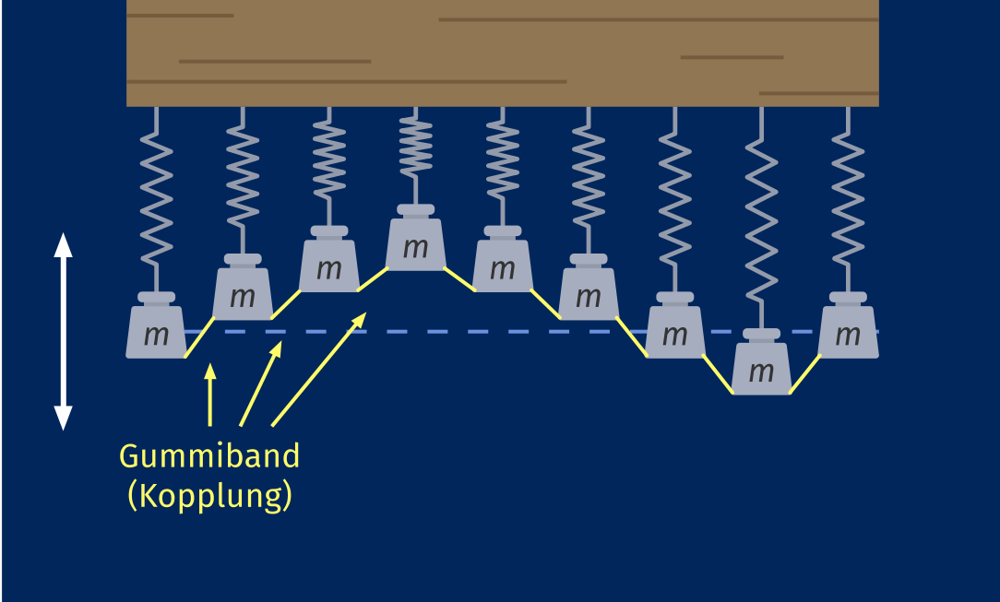

### Einstieg Wellen

Die einzigen Oszillatoren sind die Träger der Wellen und nur durch Kopplung kann Energie übertragen werden und somit entstehen Wellen.

#### Grundlegende Begriffe

- **Wellenlänge (λ)**: Der Abstand zwischen zwei aufeinanderfolgenden Bergen oder Tälern einer Welle; entspricht der Strecke, die eine Welle während einer vollständigen Schwingung zurücklegt.
- **Periodendauer (T)**: Die Zeit, die für eine vollständige Schwingung eines Oszillators benötigt wird.
- **Frequenz (f)**: Anzahl der Schwingungen pro Zeiteinheit; umgekehrt proportional zur Wellenlänge (λ ~ 1/f).
- **Ausbreitungsgeschwindigkeit (c)**: Geschwindigkeit, mit der sich die Wellenform im Medium fortbewegt; hängt von der Kopplung bzw. Härte des Mediums ab. Stärkere Kopplung führt zu höherer Ausbreitungsgeschwindigkeit, da Energie effizienter übertragen wird.
- **Schnelle (v)**: Beschreibt die Geschwindigkeit die einzelnen Oszillatoren innerhalb einer Welle (nicht zu verwechseln mit der Ausbreitungsgeschwindigkeit).
- **Beugung:** Die Ablenkung einer Welle an einem Hindernis.
- **Phase:** wie weit ein Punkt auf der Welle in seinem Muster fortgeschritten ist. Sie wird in Winkel angegeben.
	- *Phasendifferenz (Δφ)*: Unterschied der Phasen zweier Punkte. Wenn zwei Wellen gleicher Frequenz unterschiedliche Phasen haben, dann ist die Phasendifferenz der Winkel, um den eine Welle gegenüber der anderen verschoben ist. $\Delta \phi = \phi_2 - \phi_1$
- **Interferenz**: Überlagerung von Wellen, wobei sich ihre Amplituden addieren (konstruktive Interferenz) oder subtrahieren (destruktive Interferenz).
	- *Konstruktive Interferenz*: Tritt auf, wenn die Phasendifferenz ein ganzzahliges Vielfaches von 2π ist (0°, 360°, 720°, usw.). Die Amplituden der Wellen addieren sich.
    - *Destruktive Interferenz*: Tritt auf, wenn die Phasendifferenz ein ungerades Vielfaches von π ist (180°, 540°, usw.). Die Amplituden der Wellen subtrahieren sich und können sich gegenseitig aufheben.
- **Stehende Wellen**: Entstehen durch Interferenz zweier Wellen gleicher Frequenz und Amplitude, die in entgegengesetzte Richtung laufen. Charakteristisch sind feste Punkte ohne Auslenkung (Knoten) und Punkte maximaler Auslenkung (Bäuche).
	- Die Anzahl der Bäuche und Knoten steht in direktem Zusammenhang mit der Frequenz der Welle.
#### Wellenarten

- **Longitudinalwelle**: Oszillation erfolgt in Ausbreitungsrichtung der Welle (z.B. Schallwellen).
- **Transversalwelle**: Oszillation erfolgt senkrecht zur Ausbreitungsrichtung der Welle (z.B. Wasserwellen, elektromagnetische Wellen).
- **Wellenfront**: Eine Fläche, auf der alle Oszillatoren den gleichen Schwingungszustand aufweisen.
- **Ebene Welle**: Wellenfront bildet eine Ebene.
- **Kreiswelle**: Wellenfront bildet konzentrische Kreise.
#### Reflexion

- **Festes Ende**: Ein Wellenberg wird als Wellental reflektiert und umgekehrt; es kommt zu einer Phasenverschiebung um 180° (Phasensprung).
- **Freies Ende**: Ein Wellenberg wird als Wellenberg reflektiert; die Auslenkung wird ohne Phasenverschiebung reflektiert.
#### Beugung und Huygens-Prinzip

- **Beugung**: Ablenkung einer Welle an einem Hindernis, wodurch die Welle in den geometrischen Schattenraum gelangt.
- **Elementarwelle**: Kreiswelle, die von einer schmalen Öffnung erzeugt wird.
- **Huygens-Prinzip**: *Jeder Punkt einer Wellenfront* kann als *Ausgangspunkt* einer neuen *Elementarwelle* betrachtet werden. Die *Einhüllende* aller Elementarwellen bildet die *neue Wellenfront*.
#### Praktische Hinweise

* **Harmonische Wellen** zeichnen sich durch *harmonische Schwingung der einzelnen Oszillatoren* sowie durch *konstante Amplitude und Frequenz* aus; ihre Oszillatoren schwingen meistens sinusförmig. 
* Die Messgenauigkeit der Wellenlänge erhöht sich mit der Anzahl der gemessenen Wellen. Eine präzise Messung erfolgt durch Zählen der Maxima und anschließende Division durch deren Anzahl.

### Ausbreitungsgeschwendigkeit und Auslenkung - Formeln

Ausbreitungsgeschwendigkeit und Wellenlänge $$c=\frac{\lambda}T=\lambda\cdot f$$
- $c$ -> Ausbreitungsgeschwindigkeit
- $λ$ -> Wellenlänge
- $T$ -> Schwingungsdauer 
$$s\left(X,t\right)=A\cdot\sin\left\lbrack2\pi\left(\frac{t}{T}-\frac{X}{\lambda}\right)\right\rbrack$$
- $s(X,t)$ -> Auslenkung
- $A$ -> Amplitude der Welle
- $t$ -> Zeit
- $X$ -> Ort bzw. Position

*Hints:*
- Ein Vergleich zweier Oszillatoren kann durch die Bestimmung der Phasenverschiebung durchgeführt. Dazu wählt mann einen Punkt auf einem Graph und schaut wie viel ist der anderen Graph vom ersten zeitlich verschoben und dann teilt diesen Wert durch die Schwingungsdauer der ersten und dann mal $2 \cdot \pi$. (In Winkel angeben)

### Polarisation

Polarisation bedeutet eine Welle *auf eine Ebene zu schränken*.

| **Eigenschaft**                                                           | **Longitudinale Wellen**                             | **Transversale Wellen**                                                                                                                                                                                                            |
| ------------------------------------------------------------------------- | ---------------------------------------------------- | ---------------------------------------------------------------------------------------------------------------------------------------------------------------------------------------------------------------------------------- |
| **Schwingungsrichtung**                                                   | Parallel zur Ausbreitungsrichtung                    | Senkrecht zur Ausbreitungsrichtung                                                                                                                                                                                                 |
| **Beispiele**                                                             | Schallwellen, Druckwellen in Flüssigkeiten und Gasen | Lichtwellen, elektromagnetische Wellen, Wasserwellen                                                                                                                                                                               |
| **Polarisierbarkeit**                                                     | Nicht möglich                                        | Möglich, da Schwingungen in verschiedenen Ebenen erfolgen.                                                                                                                                                                         |
| **Intensitätsänderung bei Polarisationswinkeln**                          |                                                      | Hängt vom Winkel zwischen zwei Polarisatoren ab: $I = I_0 \cos^2(\theta)$                                                                                                                                                          |
| **Winkelabhängigkeit der Intensität (Experiment mit zwei Polarisatoren)** |                                                      | $0°: Maximale Intensität I = I_0$  $30°: I = I_0 \cos^2(30^\circ) \approx 0.75 I_0$  $45°: I = I_0 \cos^2(45^\circ) \approx 0.5 I_0$ $60°: I = I_0 \cos^2(60^\circ) \approx 0.25 I_0$  $90°: Keine Intensität (I = 0)$ |
| **Mathematische Interpretation der Intensität**                           |                                                      | $I \propto A^2$ → Intensität ist das Quadrat der Amplitude der Welle                                                                                                                                                               |
| **Physikalische Erklärung**                                               | Energie breitet sich durch Druckunterschiede aus     | Polarisationsfilter reduzieren die Amplitude je nach Winkel                                                                                                                                                                        |

## Stehende Wellen

Wenn eine Welle auf ein festes Ende trifft, wird sie reflektiert. Dabei kehrt die Welle ihre Ausrichtung um. Das bedeutet, dass ein Berg (ein Punkt der Welle mit maximaler positiver Amplitude) als Tal (ein Punkt der Welle mit maximaler negativer Amplitude) reflektiert wird und umgekehrt. Wenn die ursprüngliche Welle und die reflektierte Welle aufeinandertreffen, überlagern sie sich. Dieser Prozess wird als **Interferenz** bezeichnet. Die Interferenz von zwei Wellen gleicher Frequenz und Amplitude, die in entgegengesetzte Richtungen laufen, führt zur Bildung von **stehenden Wellen**.
Bei stehenden Wellen wechseln sich Bereiche minimaler Amplitude (**Knoten**) und maximaler Amplitude (**Bäuche**) ab. Wenn beide Wellen zur gleichen Zeit dieselbe Ausrichtung haben, entsteht an dieser Stelle ein Extrempunkt der Gesamtwelle (**Bauch**). Wenn beide Wellen zur gleichen Zeit entgegengesetzte Ausrichtungen haben, liegt an dieser Stelle eine **Nullstelle der Gesamtwelle (Knoten)** vor.
Stehende Wellen transportieren **keine Nettoenergie durch das Medium**, da sich die Energie zwischen Knoten und Bäuchen lokal speichert und hin- und herpendelt. In einem idealen, verlustfreien System würde eine stehende Welle unendlich lange bestehen. In realen Systemen treten jedoch Dämpfungseffekte wie Reibung und Luftwiderstand auf, wodurch Energie allmählich verloren geht.

### Reflexion am festen Ende

Bei Reflexion am festen Ende bilden sich stehende Wellen aus, wenn die Länge l des Mediums ein vielfaches der halben Wellenlänge:
$$l=n\cdot\frac{\lambda}{2}$$
Der Abstand zweier Knoten beträgt immer: 
$$\frac{\lambda}{2}$$

### Reflexion am losen Ende
Bei Reflexion am losen Ende bilden sich stehende Wellen aus, wenn die l des Mediums ein ungerades Vielfaches der viertel Wellenlänge aufweist:
$$l=\left(2n-1\right)\cdot\frac{\lambda}{4}$$

Der Abstand zweier Knoten beträgt immer: 
$$\frac{\lambda}{2}$$

*Hint:*
Wenn sich eine stehende Welle bildet, nennt man die einfachste Schwingungsform **die Grundschwingung**. Die Frequenz dieser Schwingung heißt **Grundfrequenz**. Alle höheren Frequenzen, die ganzzahlige Vielfache der Grundfrequenz sind, werden **Oberfrequenzen** genannt. Sowohl die Grundfrequenz als auch die Oberfrequenzen werden als **Eigenfrequenzen** des Systems bezeichnet.

## Interferenzphänomene

### Grundprinzipien

- Mechanische Wellen breiten sich aus, ohne einander zu beeinflussen
- An Überlagerungspunkten kommt es zu:
    - **Konstruktive Interferenz**: Wellen verstärken sich
    - **Destruktive Interferenz**: Wellen löschen sich aus

#### Huygens-Prinzip

- Jeder Punkt einer Wellenfront ist Ausgangspunkt einer kreis- oder kugelförmigen Elementarwelle
- Die Überlagerung (Einhüllende) aller Elementarwellen ergibt die neue Wellenfront

### Allgemeine Bedingungen für Interferenz

- Für zwei phasengleiche Sender gilt:
    - **Maximum**: Wegunterschied ist Vielfaches der Wellenlänge: $$\Delta s = n \cdot \lambda$$ $n$ = Ordnungszahl [1, 2, 3, ...] $\lambda$ = Wellenlänge [m]
    
    - **Minimum**: Wegunterschied ist ungerades Vielfaches der halben Wellenlänge: $$\Delta s = \frac{(2n-1) \cdot \lambda}{2}$$ $n$ = Ordnungszahl [1, 2, 3, ...] $\lambda$ = Wellenlänge [m]
    
    - **Hauptmaximum** (0. Ordnung): $$\Delta s = 0$$

### Interferenz am Doppelspalt

#### Beobachtung

- Abwechselnde helle und dunkle Streifen auf dem Schirm
- Hauptmaximum (0. Ordnung) in der Mitte
- Symmetrische Anordnung der Maxima und Minima
- *Bei Licht:* Drei rote Streifen sind am Schirm zusehen. Zwischen den Streifen ist eine schwarze Fläche. Der mittlere Streifen ist länger und heller als die beiden äußeren Streifen. Die beiden äußeren Streifen sind gleich weit vom mittleren Streifen entfernt. Die Streifen sind vertikal ausgerichtet. 
- *Bei weißem Licht (z. B. einer Glühlampe):* Das Maximum 0.Ordnung erscheint als heller weißer Streifen, da dort der Gangunterschied null ist und alle Wellenlängen konstruktiv interferieren. Das Maximum 1.Ordnung zeigt ein Spektrum, das nach Wellenlängen geordnet ist: Blau liegt näher am Maximum 0.Ordnung, während Rot weiter entfernt ist. Das Maximum zweiter Ordnung zeigt dasselbe Farbspektrum, aber der Farbverlauf ist weiter gestreckt. Alle Maxima sind symmetrisch und gleich voneinander entfernt.
	- Der Farbverlauf ist da und gestreckt, weil der Winkel für größere Wellenlängen mit zunehmender Beugungsordnung größer wird, sodass die Farben unterschiedlich gebeugt und somit kein weißes Licht zu sehen ist und gleichzeitig mit höherer Ordnung stärker auseinandergezogen erscheinen. (Differenz zwischen gleicher Wellenlänge bei höherer Ordnung größer)
	- Die Intensität nimmt mit steigender Ordnung ab, weil die Energie auf eine größere Fläche bzw. mehrere Maxima verteilt wird.
	- Der Farbverlauf läuft von Blau (kleinere Wellenlänge) zu Rot (größere Wellenlänge), da Wellenlänge proportional zum Beugungswinkel ist.

#### Erklärung

- Die Spalte wirken wie zwei reale Sender
- Elementarwellen werden in der Mitte jedes Spalts erzeugt und schwingen in Phase
- Interferenzmuster entsteht durch Überlagerung der Wellen

#### Übergang vom Doppelspalt zum Gitter

Die Hauptunterschiede zwischen Doppelspalt und Gitter sind:

1. **Schärfe der Maxima**: Beim Gitter werden die Hauptmaxima sehr viel schärfer und Heller als beim Doppelspalt.
2. **Nebenstrukturen**: Ein Gitter mit N Spalten erzeugt zwischen zwei Hauptmaxima (N-2) Nebenmaxima und (N-1) Minima, die beim Doppelspalt nicht vorhanden sind.
	1. Je mehr Spalten desto mehr Nebenmaxima, aber die verlieren an Intensität!
	2. Nebenmaxima treten auf, da die Wellen an dieser Position teilweise interferieren, also nicht vollkommen in Phase, aber nicht außer Phase

**Objektive Beobachtungsmethode**: Ein **Schirm** wird verwendet, um das Interferenzmuster darzustellen, und die Messung erfolgt mit Instrumenten.
**Subjektive Beobachtungsmethode**: Der Beobachter schaut direkt durch das **Gitter**, und ein Maßstab wird hinter das Muster gesetzt, um die Abstände grob zu messen.
### Geometrische Beziehungen (Für kleine Winkel $\alpha$)

Für kleine Winkel gilt: $\tan(\alpha) \approx \sin(\alpha)$

- Zusammenhang zwischen Winkel und Position: $$\tan(\alpha) = \frac{a}{L}$$ $a$ = Abstand des Maximums/Minimums zum Hauptmaximum [m] 
  $L$ = Abstand zum Schirm [m]

- Zusammenhang zwischen Winkel und Gangunterschied: $$\sin(\alpha) = \frac{\Delta s}{g}$$$\Delta s$ = Gangunterschied [m] 
  $g$ = Spaltabstand, (für Gitter ist es die Gitterkonstante) [m]

Somit gilt:

- **Maxima** (n. Ordnung): $$n \cdot \lambda = g \cdot \sin(\alpha) = g \cdot \frac{a_n}{L}$$
- **Minima** (n. Ordnung): $$\frac{(2n-1) \cdot \lambda}{2} = g \cdot \sin(\alpha) = g \cdot \frac{a_n}{L}$$wobei: 
  $n$ = Ordnungszahl [1, 2, 3, ...] 
  $\lambda$ = Wellenlänge [m]
   $g$ = Spaltabstand, (für Gitter ist es die Gitterkonstante ) [m] 
   $a_n$ = Abstand des n-ten Minimums zum Hauptmaximum [m] 
   $L$ = Abstand zum Schirm [m]

### Allgemeine Formel

Für Spaltabstand $g$ viel kleiner als Abstand zum Schirm $L$ gilt:
- **Maxima**: $$n \cdot \frac{\lambda}{g} = \sin\left[\arctan\left(\frac{a_n}{L}\right)\right]$$
- **Minima**: $$\frac{2n-1}{2} \cdot \frac{\lambda}{g} = \sin\left[\arctan\left(\frac{a_n}{L}\right)\right]$$wobei: 
  $n$ = Ordnungszahl [1, 2, 3, ...]
   $\lambda$ = Wellenlänge [m] 
   $g$ = Spaltabstand [m] 
   $a_n$ = Abstand des n-ten Maximums zum Hauptmaximum [m] 
   $L$ = Abstand zum Schirm [m]

#### *Herleitung:*

### Bragg-Reflexion

- Reflexion von Wellen an Netzebenen eines Kristalls
- Bragg-Bedingung: $$2 \cdot d \cdot \sin(\theta) = k \cdot \lambda$$ $d$ = Netzebenenabstand [m] 
  $\theta$ = Glanzwinkel [rad] 
  $k$ = Ordnung der Reflexion [1, 2, 3, ...] 
  $\lambda$ = Wellenlänge [m]

#### *Herleitung*

Durch die Skizze:
$\sin(\alpha) = \frac{\Delta s}{d}$
Dabei ist $\Delta s = 0.5 \lambda$, also gilt:
$\sin(\alpha) = \frac{0.5 \lambda}{d}$
Um $\lambda$ zu isolieren, multiplizieren wir beide Seiten der Gleichung mit d:
$0.5 \lambda = d \cdot \sin(\alpha)$
Nun multiplizieren wir beide Seiten mit 2, um $\lambda$ zu erhalten:
$\lambda = 2 \cdot d \cdot \sin(\alpha)$

Somit gilt:
$2 \cdot d \cdot \sin(\theta) = k \cdot \lambda$

### Brechungsprinzip & Brechungsgesetz

- Richtungsänderung von Wellen beim Übergang zwischen Medien mit unterschiedlichen Ausbreitungsgeschwindigkeiten
- Beim Übergang ändern sich Wellenlänge ($\lambda$) und Phasengeschwindigkeit ($c$)
- Frequenz ($f$) und Periodendauer ($T$) bleiben konstant
$$\frac{\sin(\alpha)}{\sin(\beta)} = \frac{c_{ph,1}}{c_{ph,2}}$$ $\alpha$ = Einfallswinkel [rad] 
$\beta$ = Brechungswinkel [rad] 
$c_{ph,1}$ = Phasengeschwindigkeit im Medium 1 [m/s] 
$c_{ph,2}$ = Phasengeschwindigkeit im Medium 2 [m/s]

### Hinweise

- Der Laser ist genauer als eine LED, da die Maxima schmaler und die Grenzen zu den Minima deutlicher sind.
- experimentelle Maßnahmen, mit denen die Messunsicherheit für den Spaltmittenabstand reduziert werden kann.
	- Abstand zwischen Schirm und Doppelspalt erhöhen.
	- Ablesen von Maxima höherer Ordnung
- Wenn der Abstand zwischen dem Schirm und dem Spalt vergrößert wird, dann sinkt die Intensität bzw. die Amplitude, da das Licht sich über eine größere Fläche verteilt und der Abstand zwischen den Maxima wird größer. 
## Aufgaben

[[Materiellen/Übungsaufgaben zur Ausbreitung von Wellen2020.pdf]]

[[Materiellen/Ultraschall.pdf]]
