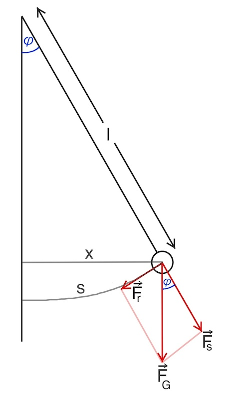

# Schwingungen

## Grundlagen der Schwingungen

### Wichtige Begriffe

- **Die Ruhelage**: Die Gleichgewichtsposition des Oszillators.
- **Die Amplitude ($A$)**: Die maximale Auslenkung (obere oder untere) von der Ruhelage.
- **Die Elongation ($y$)**: Alle Positionen außer der maximalen Auslenkung, bzw. der Abstand von der Ruhelage.
- **Die Periodendauer ($T$)**:
  - Die Zeit für eine vollständige Hin- und Herbewegung.
  - Sie ist konstant bei einem harmonischen Oszillator.
  - Sie wird kleiner bei einem gedämpften Oszillator.
- **Die Masse ($m$)**: Die Masse in Kilogramm ($kg$).
- **Die Richtgröße ($D$)**: $D=m\cdot\omega^2$ ist eine Proportionalitätskonstante wie Federkonstante
- **Die Frequenz ($f$)**:
  - Definiert als $f = \frac{1}{T}$.
  - Die Anzahl der Schwingungen pro Sekunde in Hertz ($Hz$).
- **Phasenwinkel:**
   - Definiert als $ϕ=ω⋅t$
   - Wie weit eine Schwingung zeitlich verschoben ist. Winkel zur einer Zeit in Radiant $rad$
- **Die Winkelgeschwindigkeit ($\omega$)**:
  - Definiert als $\omega = \frac{2\pi}{T} = 2 \cdot \pi \cdot f =\frac{ϕ}{t}$
  - Die Einheit: Radiant pro Sekunde ($rad/s$).
- **Die Länge des Fadenpendels ($l$)**: Die Länge des Pendels in Metern ($m$)
- **Der Ortsfaktor ($g$)**:
  - Die Beschleunigung aufgrund der Schwerkraft.
  - Auf der Erde: $g = 9,81 \, m/s^2$

### Dämpfung und erzwungene Schwingungen

> **Zusammenhang zwischen Dämpfung, Abklingen und Periodendauer**
> - **Stärkere Dämpfung** → **schnelleres Abklingen** der Amplitude → größere Periodendauer
> - **Schwächere Dämpfung** → **langsameres Abklingen** der Amplitude → nahezu gleiche Periodendauer

**Erzwungene Schwingung:**
- Kontinuierliche Energiezufuhr von außen, um Energieverluste (z. B. durch Dämpfung) auszugleichen.
- wird als **Sinuskurve** dargestellt, da die Amplitude konstant bleibt.
- und als **harmonische Schwingung** bezeichnet, wenn die äußere Kraft sinusförmig ist.

### Warum eine Sinuskurve?

Die Bewegung eines harmonischen Oszillators kann als **Sinuskurve** dargestellt werden, weil sie die **Projektion einer seitlich betrachteten Kreisbewegung** entspricht.

**Versuch dazu:** Wird eine rotierende Masse von einer Lampe von der Seite aus angestrahlt, so gleicht die dann die eindimensionale Bewegung der Bewegung des harmonischen Oszillators. Somit ist es auch zulässig, dass der harmonische Oszillator (schwingungsfähiges System) als rotierender Zeiger oder als eine Sinus kurve betrachtet wird.

### Die Drei-Regel zur harmonischen Schwingung

%20Diagramme%20und%20Winkelgeschwindigkeit.png)

Die **Rückstellkraft** $F(t)=−D⋅s(t)$ beschreibt die Kraft, die ein schwingungsfähiges System zurück in die Ruhelage bringt ($D=m\cdot\omega^2$ ist Richtgröße bzw. Proportionalitätskonstante wie Federkonstante). Sie ist **proportional** zur Auslenkung. Die Kraft muss immer zur Ruhelage zurückführen (Bedingung einer mechanischen harmonischen Schwingung).

Diese Kraft führt zu einer **Beschleunigung** des Körpers, die durch das $F=m⋅a$ beschrieben wird. Somit kann man beide Kräfte gleichsetzen und erhält die **Differentialgleichung der harmonischen Schwingung:**

- **Zeit-Weg-Gesetz**: $$\boxed{s(t)=A \cdot \sin(\omega\cdot t)}$$
- **Zeit-Geschwindigkeit-Gesetz**: $$\boxed{v(t)=A \cdot \omega \cdot \cos(\omega\cdot t)}$$
- **Zeit-Beschleunigung-Gesetz**: $$\boxed{a(t)=-\omega^2\cdot A\cdot\sin(\omega\cdot t)=-\omega^2\cdot s(t)}$$

## Harmonische Schwingung am Federpendel

![Vertical-mass-on-spring.svg | 500]

Das Federpendel ist ein klassisches Beispiel für harmonische Schwingungen. Die Proportionalitätskonstante kann durch Linearisierung bestimmt werden - durch einen $t$-$\sqrt{\frac{m}{D}}$ Graph und anschließende Steigungsbestimmung oder durch Einsetzen in die Formel mit verschiedenen $T$-Werten und Durchschnittsbildung.

### Eigenschaften des Federpendels

- Die **Amplitude** hat keinen Einfluss auf die Periodendauer
- **$T \propto \sqrt{m}$**: Je größer die Masse, desto länger die Periodendauer.
- **$T \propto \frac{1}{\sqrt{D}}$**: Je größer die Federkonstante, desto kürzer die Periodendauer.

### Federpendel-Formel

$$\boxed{T = 2\pi \sqrt{\frac{m}{D}}}$$

> **Besonderheit beim Federpendel**
> Der Ortsfaktor $g$ spielt beim Federpendel keine Rolle, weil sich die Gravitationskraft $F_g = m \cdot g$ und die Federkraft $F_F = D \cdot s_0$ im Gleichgewicht ausgleichen.

## Harmonische Schwingung am Fadenpendel

### Kräfte beim Fadenpendel

- **Gewichtskraft** $F_G = m\cdot g$ (zeigt nach unten und sorgt für Bewegung, aber nur zum Teil)
- **Seilspannung** $F_s$ (Parallel zum Faden und sorgt für Spannung des Seils)
- **Rückstellkraft** $F_r = -m\cdot g\cdot \sin(\theta)$ (verantwortlich für die Schwingung, zeigt immer zur Ruhelage hin und zeigt tangential zum Kreisbogen hin)

### Eigenschaften des Fadenpendels

- Die **Amplitude** hat keinen Einfluss auf die Periodendauer
- **$T \propto \sqrt{l}$**: Je größer die Pendellänge, desto länger die Periodendauer.
- **$T \propto \frac{1}{\sqrt{g}}$**: Je größer die Erdbeschleunigung, desto kürzer die Periodendauer.

### Fadenpendel-Formel

Für kleine Auslenkungen folgt eine harmonische Schwingung mit der Näherung:

$$\boxed{T = 2\pi \sqrt{\frac{l}{g}}}$$

wobei:

- $T$: Periodendauer in $s$
- $l$: Pendellänge in $m$
- $g$: Erdbeschleunigung in $9,81 m/s²$

### Bedingungen

- Die Schwingungsdauer hängt nicht von der Masse des Pendels.
- Bei größerem $l$ ist $T$ größer.
- Die Formel gilt nur für kleine Winkel ($\theta < 10^\circ$), da sonst keine harmonische Schwingung mehr vorliegt.

## Resonanz, Energie und gedämpfte Schwingung

### Energie der harmonischen Schwingung

Die Energie einer harmonischen Schwingung ist bei Vernachlässigung von Reibungskräften konstant und besteht aus potenzieller und kinetischer Energie:

$$\boxed{E=E_{pot}+E_{kin}=m\cdot g\cdot h+\frac{1}{2}m\cdot v^2}$$

Sie lässt sich anhand von $t$-$s$ & $t$-$v$ Diagrammen ableiten.

> **Hinweis zu gedämpften Schwingungen**
> Bei gedämpften Schwingungen geht bei jeder Umwandlung zwischen $E_{kin}$ und $E_{pot}$ Energie in Form von Wärme verloren.

### Gedämpfte Schwingung

Bei gedämpften Schwingungen nimmt die Amplitude exponentiell ab, wobei das Verhältnis zweier aufeinanderfolgender Amplituden konstant ist. Die Abnahme der Amplitude lässt sich durch folgende Formel beschreiben:

$$\boxed{A(t) = A_0 e^{-\gamma \cdot t}}$$

wobei $\gamma$ die Dämpfungskonstante in $\frac{1}{s}$ ist.

Die blaue Kurve zeigt den Verlauf der Auslenkung $s(t)$ einer gedämpften Schwingung in Abhängigkeit von der Zeit. Anfangs hat das System eine maximale Amplitude, aber aufgrund der Dämpfung nimmt die Amplitude mit der Zeit exponentiell ab.

Die rote Kurve zeigt die Geschwindigkeit $v(t)$ der Schwingung in Abhängigkeit von der Zeit. Da die Geschwindigkeit die Ableitung des Weges ist, erreicht sie ihr Maximum immer dann, wenn die Auslenkung die Nullstelle passiert.

### Resonanz

- Die **Eigenfrequenz** eines Systems ist die Frequenz, mit der es natürlich schwingt, wenn es angestoßen wird.
- Die **Resonanzfrequenz** hingegen ist die Frequenz, bei der ein externer Antrieb die größte Amplitude in einem schwingenden System erzeugt.

### Resonanzphänomen

Schwingende Körper können durch eine **äußere Kraft** zu **erzwungenen Schwingungen** angeregt werden. Wenn die **Frequenz** dieser äußeren **Erregerkraft** mit der **Eigenfrequenz** des Schwingers **übereinstimmt**, erreicht die **Amplitude** der Schwingung ihr **Maximum** – dieser Zustand wird als **Resonanz** bezeichnet.

### Eigenschaften der Resonanz

- Bei Resonanzfrequenz sind die erregende **äußere Kraft** und die **Geschwindigkeit des Pendels** in **Phase**. Somit folgt eine **maximale Energieübertragung**.
- Wenn die Anregungsfrequenz kleiner oder größer als die Eigenfrequenz ist, sind die erregende äußere Kraft und die Geschwindigkeit des Pendels nicht in Phase.
- **Dämpfung** ist antiproportional zur Amplitude
- Bei $f$-$\Delta ϕ$ (Frequenz-Phasendifferenz) Graph ist Resonanz bei einer Phasendifferenz von $\frac{\pi}{2}$ (ein Viertel-Periode) zu erkennen.

### Alltägliche Beispiele

**Schaukel**: Wenn Sie in der richtigen Frequenz (der Eigenfrequenz der Schaukel) schwingen, erreichen Sie die größte Höhe. Das ist die Resonanz.

**Zerbrechen eines Glases durch einen Ton**: Wenn der Ton die Eigenfrequenz des Glases trifft (die Resonanzfrequenz), kann das Glas zerbrechen, weil die Schwingungen so stark sind.

## Elektromagnetische Schwingung

### Aufbau und Funktionsweise

Ein **Stromkreis**, der aus einem **Kondensator** und einer **Spule** besteht, wird als **elektrischer Schwingkreis** bezeichnet. In ihm kommt es **während der Entladung** zu **Schwingungen** der **Spannung am Kondensator** sowie der **Stromstärke in der Spule**. Beide Schwingungen sind um 90° gegeneinander versetzt.

### Warum die 90° Versetzung?

Nachdem der **Kondensator vollständig geladen** wurde, beginnt die Schwingung. In diesem Moment ist die **Spannung am Kondensator maximal**, da er die gesamte elektrische Energie gespeichert hat. Da kaum Ladung fließt, ist die **Stromstärke nahezu null**.

Sobald der Kondensator beginnt, sich zu entladen, bewegt sich Ladung durch den Schaltkreis. Dadurch steigt die **Stromstärke**, während die Spannung am Kondensator abnimmt. Gleichzeitig entsteht in der **Spule ein Magnetfeld**, da durch sie nun ein wachsender Strom fließt.

Da sich das Magnetfeld aufbaut, tritt eine **Selbstinduktion** auf: Ein sich änderndes Magnetfeld erzeugt eine Gegenkraft, die den Stromfluss verzögert. Diese Verzögerung bewirkt, dass die **Stromstärke nicht gleichzeitig mit der Spannung ihr Maximum** erreichen kann.

> **Hinweis zur Dämpfung**
> Ein Widerstand sorgt für Dämpfung der Schwingung durch Energieverlust, indem er die elektrische Energie in Wärmeenergie umwandelt.

### Erklärung des Spannungs- und Stromverlaufs

**Phase 1**: Vollständig geladener Kondensator
- **Spannung am Kondensator**: maximal
- **Stromstärke**: nahezu null
- Gesamte Energie im elektrischen Feld gespeichert

**Phase 2**: Entladung beginnt
- Stromstärke steigt, Spannung fällt
- Magnetfeld wird in der Spule erzeugt
- Elektrische Energie wird in magnetische Energie umgewandelt

**Phase 3**: Kondensator vollständig entladen
- Stromfluss erreicht Maximum
- Spannung am Kondensator ist null
- Gesamte Energie im Magnetfeld gespeichert

**Phase 4**: Umkehrung der Polarität
- Kondensator wird mit umgekehrter Polarität aufgeladen
- Stromstärke nimmt ab
- Magnetfeld baut sich ab

**Phase 5**: Erneut vollständig geladen
- Stromfluss stoppt vollständig
- Kondensator erreicht maximale Ladung mit umgekehrter Polarität
- Gesamte Energie wieder im elektrischen Feld

**Phase 6**: Zyklus wiederholt sich
- Der Vorgang beginnt von Neuem in entgegengesetzter Richtung

### Frequenz, Kapazität und Induktivität im Schwingkreis

Zusammenhang zwischen der Frequenz $f$ und den Größen $L$ & $C$:

$$f \propto \frac{1}{\sqrt{L}}$$

$$f \propto \frac{1}{\sqrt{C}}$$

### Thomsonsche Gleichung

$$\boxed{f = \frac{1}{2\pi} \cdot \frac{1}{\sqrt{L \cdot C}}}$$

$$\boxed{T = 2 \cdot \pi \cdot \sqrt{L \cdot C}}$$

